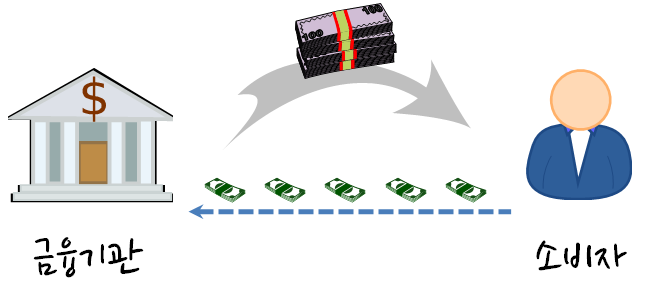

```{r setup, include=FALSE}
knitr::opts_chunk$set(echo = TRUE, message=FALSE, warning=FALSE,
                      comment="", digits = 3, tidy = FALSE, prompt = FALSE, fig.align = 'center')

library(reticulate)
use_condaenv("anaconda3")
# reticulate::repl_python()
```

신용평가모형은 신용위험모델(credit risk modeling)으로도 볼 수 있으며 
가계대출을 주업으로 하는 금융기관에서 **수익을 극대화** 하고, **신용위험을 최소화** 하는 신용평점모형을 개발을 목표로하는데, 
전통적으로 일반화 선형 모형 즉, 로지스틱 회귀모형아나 
이해하고 설명하기 쉬운 의사결정나무 모형을 많이 사용했으나, 
최근에서는 XGBoost 앙상블 모형을 적극 도입하여 금융기관의 목적을 공격적으로 달성하기 위해서 경주하고 있다. 랜딩클럽 데이터 등 공개된 대출데이터가 많아 실제 데이터를 가지고 신용평점모형을 개발해 보자.

# 신용평점모형 [^ml-credit-scoring-sharma] {#credit-risk-model}

[^ml-credit-scoring-sharma]: [Guide to Credit Scoring in R](https://cran.r-project.org/doc/contrib/Sharma-CreditScoring.pdf)

대한민국에서 이영애 누님께서 IMF를 극복하고 2000년대 초반에 신용카드로 행복한 삶을 사는 모습을 러닝머신을 타면서 보여주면서 신용카드의 전성기가 도래했지만, 
소수의 사람을 빼고 신용카드가 결국 미래 소비를 현재로 앞당겨서 돈을 쓰는 것에 불과하다는 것은 
그로부터 몇년 뒤에 명확해졌고, 이를 신용대란이라고 불렀다. 
이후 기업금융과 마찬가지로 소매금융도 위험관리가 중요해졌으며, 
소매금융에 있어 위험관리 기법으로 신용평점에 따라 엄격하게 관리하는 것이 필요해졌고, 
이에 [신용평점모형(Credit Scoring Model)](https://ko.wikipedia.org/wiki/신용_위험)과 더불어 이를 자동화한 금융시스템이 각광을 받기 시작했다. 

파이썬은 과학컴퓨팅에 많은 경험과 라이브러리가 구축되어 있는 반면, 
R은 상대적으로 통계학기반이라 통계학이 많이 사용되는 금융위험관리 분야에 구축된 
블로그, 논문, 기고문, 라이브러리가 많다. 
현실과 밀접한 신용할당문제를 기계학습에서 대규모 적용할 경우 풀어가는 방식을 R로 살펴보고, 
추후 파이썬으로 확장도 고려해 본다. [^credit-scoring-101] [^credit-scoring-woe] [^credit-scoring-binning]

[^credit-scoring-101]: [Credit Scoring in R 101](http://www.r-bloggers.com/credit-scoring-in-r-101/)
[^credit-scoring-woe]: [R Credit Scoring – WoE & Information Value in woe Package](http://www.r-bloggers.com/r-credit-scoring-woe-information-value-in-woe-package/)
[^credit-scoring-binning]: [R Package 'smbinning': Optimal Binning for Scoring Modeling](http://www.r-bloggers.com/r-package-smbinning-optimal-binning-for-scoring-modeling/)

## 신용평점 개요 {#credit-overview}

기본적으로 금융기관에서는 한국은행을 비롯한 다양한 곳에서 자금을 조달하여 이를 관리하고 있다가 자금을 필요로 하는 곳에 자금을 빌려주고 이에 상응하는 이자를 받아 수익을 얻는 것으로 볼 수 있다. 근본적으로 많은 금액을 빌려주고 이를 나누어서 자금을 사용한 곳에서 갚아 나가는 구조다.



물론 다수의 고객에게 자금을 빌려주다보니 제때 돈을 갚지 못하거나, 불의의 사고, 실직 등 다양한 이유로 인해서 돈을 갖지 못하는 위험이 발생된다. 이때 기대손실(Expected Loss)을 다음 구성요소를 가지고 정량화한다.

* 채무 불이행 위험 : Probability of default
* 채무 불이행 노출 : Exposure at default
* 채무 불이행에 대한 손실 : Loss given default

$\text{기대손실} = \text{채무 불이행 위험} \times \text{채무 불이행 노출} \times \text{채무 불이행에 대한 손실}$

따라서 금융기관에서 자금을 빌려주기 전에 다양한 정보를 활용하여 채무 불이행 위험이 적은 고객을 선별하여 가능한 많은 금액을 빌려주어 매출과 수익을 극대화한다.

* Application 정보: 나이, 결혼여부, 소득, 자가/전세 등
* Behaviour 정보: 현재 은행잔고, 연체금액 등


