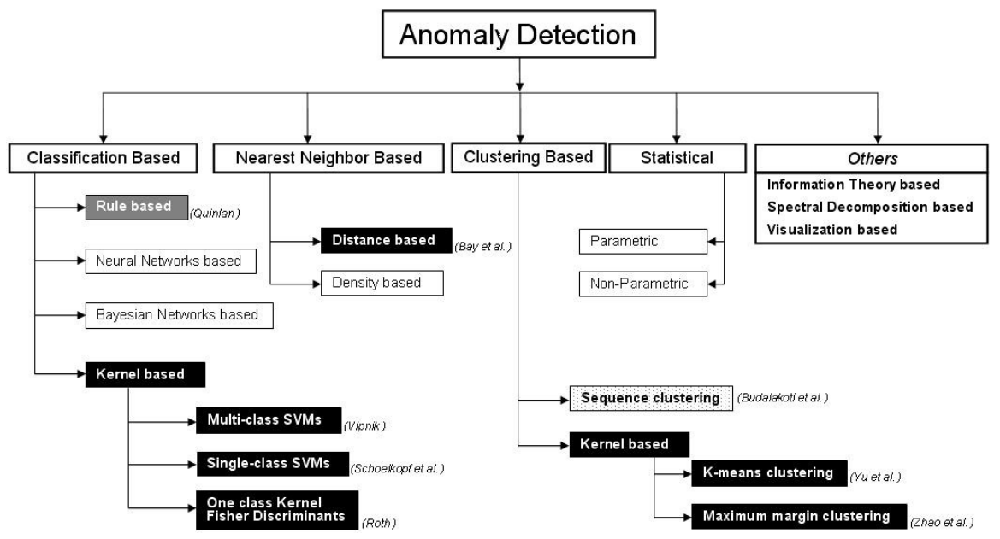

```{r setup, include=FALSE}
knitr::opts_chunk$set(echo = TRUE, message=FALSE, warning=FALSE,
                      comment="", digits = 3, tidy = FALSE, prompt = FALSE, fig.align = 'center')

```

# 어노말리(Anomaly) [^anomaly-detection] {#anomlay-detection}

[^anomaly-detection]: [GRADIENT DESCENT(20 JUN 2017), "이상탐지 Anomaly Detection"](https://h3imdallr.github.io/2017-06-20/anomaly_detection/)

**어노말리(Anomaly)**는 동일한 패턴을 따르지 않거나 나머지 데이터와 동일한 구조를 갖지 않는 관측점을 일컫는다. 혹은, 기존 관측과는 상이하여 다른 생성기제에 의해 생성되었다고 판단할만한 관측값으로 정의할 수 있다. 



## 정규분포 단변량 - Grubbs 검정 {#anomlay-detection-grubbs}

1950년 Frank E. Grubbs은 정규분포를 따르는 모집단에 이상점을 판정하는 통계검정을 제안하였다.

$$
G =  \frac{\displaystyle\max_{i=1,\ldots, N}\left \vert Y_i - \bar{Y}\right\vert}{s}
$$
$\overline{Y}$는 표본평균,  $s$는 표준편차를 나타낸다. $N-2$를 따르는 $t-$분포의 임계점을 기준으로 이상점 여부를 판정한다.


[^wiki-grubbs]: [위키백과, "Grubbs' test for outliers"](https://en.wikipedia.org/wiki/Grubbs%27_test_for_outliers)

Tietjen and Moore [^Grubbs-paper] 논문에 제시된 데이터를 바탕으로 Grubbs 검정을 수행해본다.
분광계(spectrometer)에서 나온 측정치의 이상점을 탐지하게 된다.

[^Grubbs-paper]: Tietjen and Moore (August 1972), Some Grubbs-Type Statistics for the Detection of Outliers, Technometrics, 14(3), pp. 583-597. 

```{r spectrometer-grubbs}
library(tidyverse)
spectrometer <- c(199.31, 199.53, 200.19, 200.82, 201.92, 201.95, 202.18, 245.57)

spec_df <- tibble(
  no = seq(1:length(spectrometer)),
  spectrometer = spectrometer
)

point_g <- spec_df %>% 
  ggplot(aes(x=no, y=spectrometer)) +
    geom_point()

boxplot_g <- spec_df %>% 
  ggplot(aes(y=spectrometer)) +
    geom_boxplot()

cowplot::plot_grid(point_g, boxplot_g)
```

`outliers` 팩키지 `grubbs.test()` 함수를 통해서 정규분포 모집단을 가정하고 나온 단변량 변수로부터 이상점을 탐지해낼 수 있다.

```{r spectrometer-grubbs-testing}
library(outliers)
grubbs.test(spectrometer, type = 10, opposite = FALSE, two.sided = FALSE)
```

## 단변량 시계열 - Seasonal-Hybrid ESD [^fifa-anomaly] {#anomlay-detection-ESD}

[^fifa-anomaly]: [R-posts.com, "Anomaly Detection in R - The World of Anomalies"](https://r-posts.com/anomaly-detection-in-r/)

`wikipediatrend` 팩키지를 통해 위키백과사전 추세(trend) 데이터를 가져온다.
트위터 `AnomalyDetection` 팩키지의 `AnomalyDetectionVec()` 함수로 이상점을 검출하고 시각화한다.


```{r time-series-anomaly}
library(AnomalyDetection)
library(wikipediatrend)

fifa_data_wikipedia  <- wp_trend("fifa", from="2013-03-18", lang = "en")

fifa_data_wikipedia %>% 
  ggplot(aes(x=date, y=views, color=views)) + 
  geom_line()

anomalies <- AnomalyDetectionVec(fifa_data_wikipedia$views, 
                                 direction="both", plot=TRUE,
                                 period = 365)
anomalies$plot

anomalies$anoms %>% 
  tbl_df() %>% 
  DT::datatable()
```


# 다변량 전역/로컬 이상점 {#anomlay-detection-multivariate}

단변량이 아닌 다변량을 동원하여 **이상점(anomaly)**을 식별하는데 다차원 공간에서 전역 이상점을 식별하는 경우와 로컬 이상점을 식별하는 경우로 나눠진다.

## 다변량 전역 이상점 {#anomlay-detection-global-multivariate}

[FNN: Fast Nearest Neighbor Search Algorithms and Applications](https://cran.r-project.org/web/packages/FNN/index.html)

다변량 전역 이상점 탐지를 위해서 [Koncar, Philipp(February 11, 2018), "Dataset Open Access 
Synthetic Dataset for Outlier Detection"](https://zenodo.org/record/1171077#.W_UHTjgzZhE) 데이터를 예제로 삼아 분석을 시작해 나가자.

```{r multivariate-fnn-anomaly}
library(FNN)
library(extrafont)
loadfonts()

outlier_dat <- read_csv("data/synthetic/synthetic_train_3.csv")

outlier_df <- outlier_dat %>% 
  select(x=`4`, y=`5`, outlier) %>% 
  mutate(outlier = factor(outlier, levels = c("yes", "no")))

outlier_df %>% 
  ggplot(aes(x=x, y=y, color=outlier)) +
    geom_point() +
    labs(x="", y="", color="이상점") +
    theme_minimal(base_family = "NanumGothic")
```

### `knn` 알고리즘 {#anomlay-detection-global-multivariate-knn}

`FNN` 팩키지 `get.knn()` 함수를 활용해서 기본디폴트 설정된 인접 10 관측점을 대상으로 `knn` 알고리즘을 적용한다. `names(outlier_knn)` 명령어를 실행하게 되면 `nn.index`, `nn.dist`이 `outlier_knn` 객체에 저정된다. 이를 통해서 `knn_score` 및 해당 인덱스를 추출할 수 있게 된다.

```{r multivariate-fnn-anomaly-knn}
outlier_knn <- get.knn(data = outlier_df[,-3], k = 10)

names(outlier_knn)

outlier_df$knn_score <- rowMeans(outlier_knn$nn.dist)

DT::datatable(outlier_df)

outlier_df %>% 
  ggplot(aes(x=x, y=y, color=outlier)) +
    geom_point(aes(size=knn_score)) +
    labs(x="", y="", color="이상점", size="KNN 점수") +
    theme_minimal(base_family = "NanumGothic")

outlier_df[which.max(rowMeans(outlier_knn$nn.dist)), ]
```


`which.max(rowMeans(outlier_knn$nn.dist))` 명령어를 통해서 `knn_score`가 가장 높은 이상점을 인덱스를 뽑아낼 수도 있다.


## 다변량 지역 이상점 {#anomlay-detection-local-multivariate}

`knn` 알고리즘은 전역(Global) 이상점을 탐지하는데 반면에 `dbscan` 팩키지 `lof()` 함수는 지역(local) 이상점 검출에 도움을 줄 수 있다.

```{r multivariate-dbscan-anomaly-knn-local}
library(dbscan)
outlier_df$lof_score <- lof(scale(outlier_df[,-c(3,4)]), k = 5)

outlier_df <- outlier_df %>% 
  mutate(lof_outlier = ifelse(lof_score > 1, "yes", "no"))

outlier_df %>% 
  ggplot(aes(x=x, y=y, color=outlier)) +
    geom_point(aes(size=lof_score)) +
    labs(x="", y="", color="이상점", size="LOF 점수") +
    theme_minimal(base_family = "NanumGothic")
```


# `random forest` 모형 [^isolation-random-forest] {#anomlay-detection-multivariate-random-forest}

[^isolation-random-forest]: [Eryk Lewinson, "Outlier Detection with Isolation Forest"](https://towardsdatascience.com/outlier-detection-with-isolation-forest-3d190448d45e)

`random forest` 모형을 활용하여 이상점을 검출하는 것도 가능하다.
Isolation Forest는 비지도 어나멀리 검출 알고리즘으로 이상점(Anomaly)는 상대적으로 의사결정나무 분기가 적게 된다는 아이디어에 기초한 모형이다.

```{r multivariate-dbscan-anomaly-random-forest}
library(isofor) # devtools::install_github("Zelazny7/isofor")

outlier_rf  <- iForest(X = outlier_df[,-c(3,4,5,6)], nt=100, phi=100, multicore = TRUE)

outlier_df$rf_score <-  predict(outlier_rf, newdata=outlier_df[,-c(3,4,5,6)])

outlier_df %>% 
  ggplot(aes(x=x, y=y, color=outlier)) +
    geom_point(aes(size=rf_score)) +
    labs(x="", y="", color="이상점", size="RF 점수") +
    theme_minimal(base_family = "NanumGothic")

outlier_df %>% 
  DT::datatable()
```

등고선(contour) 그래프를 통해서 Isolation Forest 모형 예측값과 결합하여 시각화도 가능하다.


```{r multivariate-dbscan-anomaly-random-forest-viz}

x_seq <- seq(min(outlier_df$x), max(outlier_df$x), length.out = 20)
y_seq <- seq(min(outlier_df$y), max(outlier_df$y), length.out = 20)

outlier_grid_df <- expand.grid(x = x_seq, y = y_seq) %>% 
  tbl_df()

outlier_grid_df$z <-  predict(outlier_rf, newdata=outlier_grid_df)

outlier_df$z <-  predict(outlier_rf, newdata=outlier_df[,-c(3,4,5,6)])

outlier_grid_df %>% 
  ggplot(aes(x=x, y=y, fill=z)) +
    geom_contour(aes(z = z, colour = ..level..)) +
    geom_tile(aes(fill = z), alpha = 0.75) +
    labs(x="", y="", color="RF 예측값") +
    theme_minimal(base_family = "NanumGothic") +
     geom_point(data = outlier_df, aes(x = x, y = y), size = 3, shape = 1, color="red") +
     scale_fill_continuous(guide=FALSE)
```


# 범주형 변수 반영 {#anomlay-detection-multivariate-random-forest-categorical}

범주형 변수를 반영하는 측도로 `Gower`를 활용하여 거리를 산출한 후에 `lof()` 함수에 넣어 이상점을 검출해내는 것도 가능하다.

```{r multivariate-dbscan-anomaly-random-forest-categorical}
outlier_m_df <- outlier_df %>% 
  select(x, y, outlier)

library(cluster)
outlier_dist <- daisy(outlier_m_df, metric = "gower")

outlier_m_df$gower_score <- lof(outlier_dist, k = 10)

outlier_m_df %>% 
  ggplot(aes(x=x, y=y, color=outlier)) +
    geom_point(aes(size=gower_score)) +
    labs(x="", y="", color="이상점", size="Gower 점수") +
    theme_minimal(base_family = "NanumGothic")
```


# 예측모형 {#anomlay-detection-multivariate-random-forest-pm}

`caret` 팩키지 프레임워크를 사용해서 Isolation Forest를 예측모형으로 적용할 경우 `Sensitivty(리콜)`이 상당히 높게 나오는 것을 확인할 수 있다.


```{r multivariate-dbscan-anomaly-random-forest-predictive-model}
outlier_m_df <- outlier_df %>% 
  select(x, y, outlier)

# 2. 예측모형 -----
## 2.1. 훈련/시험 데이터 분할 ------
library(caret)

xy_index <- createDataPartition(outlier_m_df$outlier, times =1, p=0.5, list=FALSE)

train_df <- outlier_m_df[xy_index, ]
test_df  <- outlier_m_df[-xy_index, ]

## 2.2. 모형 개발 ------

caret_rf <- iForest(outlier_m_df[, -3], nt = 100)

# 3. 예측모형 성능 -----
## Isolation Forest
rf_pred_df <- predict(caret_rf, newdata=test_df) %>%
  tbl_df %>% 
  rename(score = value) %>% 
  mutate(outlier = factor(ifelse( score > 0.5, "yes", "no"), levels = c("yes", "no")))

confusionMatrix(rf_pred_df$outlier, test_df$outlier, positive = "yes")

```
