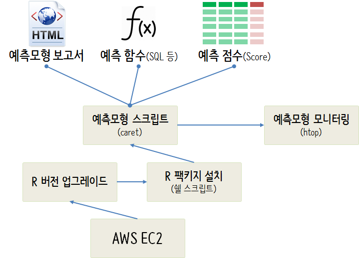

 
``` {r, include=FALSE}
source("tools/chunk-options.R")

knitr::opts_chunk$set(echo = TRUE, message=FALSE, warning=FALSE,
                      comment="", digits = 3, tidy = FALSE, prompt = TRUE, fig.align = 'center')

library(knitr)
library(kableExtra)

```

# AWS EC2 예측모형 환경 {#aws-ec2-env}

로컬컴퓨터에서 예측모형을 개발하는 경우는 특별한 경우 연산량이 많은 상황을 고려하여 권장되지 않는다.
특히 예측모형의 데이터가 큰 경우는 별도 R 서버를 구축하여 이를 대상으로 예측모형 구축작업을 수행하는 것이 큰 도움이 된다.

- AWS EC2 인스턴스 생성: [기계학습 - AWS 우분투 EC2 + S3 버킷 + RStudio 서버](http://statkclee.github.io/ml/ds-aws-rstudio-server.html) 참조
- [R 병렬 프로그래밍 - 기계학습 R 서버 만들기](https://statkclee.github.io/parallel-r/r-caret-parallel-server.html)



# 병렬처리 하드웨어 {#aws-ec2-env-cpu}

병렬처리가 가능한 하드웨어, 특히 멀티코어로 코어갯수가 많은 EC2 인스턴스를 준비한다.
[EC2Instances.info: Easy Amazon EC2 Instance Comparison](https://www.ec2instances.info/) 웹사이트에서 vCPUs가 많은 가성비 좋은 인스턴스를 선택한다.

# R과 팩키지 {#aws-ec2-env-R}

최신 R 엔진을 사용하고 예측모형 구축에 필요한 팩키지를 일괄 설치하여 준비한다.

## 최신 R 엔진 [^aws-ec2-engine] {#aws-ec2-env-R-engine}

[^aws-ec2-engine]: [Stackoverflow, How to upgrade R in linux?](https://stackoverflow.com/questions/46214061/how-to-upgrade-r-in-linux)

`https://cloud.r-project.org` 부분을 CRAN 미러: <https://cran.r-project.org/mirrors.html>에서 찾아 원하는 것으로 채워넣는다.
AWS EC2 인스턴스를 만약 `Community AMI` [RStudio Server Amazon Machine Image (AMI)](http://www.louisaslett.com/RStudio_AMI/)을 사용했을 경우
가장 최신 R 버젼을 사용할 경우 다음 스크립트를 사용해서 업그레이한다.

``` {r latest-r-kernel, eval = FALSE}
sudo apt-key adv --keyserver keyserver.ubuntu.com --recv-keys E084DAB9
sudo echo "deb https://cloud.r-project.org/bin/linux/ubuntu xenial/" | sudo tee -a /etc/apt/sources.list
sudo apt update
sudo apt upgrade r-base r-base-dev
sudo apt update
sudo apt upgrade
```

## 예측모형 R 팩키지 [^aws-ec2-r-package] {#aws-ec2-env-R-package}

파일명 예를 들어 `aws-package-setup.sh`으로 작성한 후에 쉡 스크립트를 실행해서 
AWS EC2 인스턴스 예측모형에 사용될 R 팩키지를 일괄 설치한다.


- recipes: 모형 설계행렬(Design Matrix) 개발
- caret: 예측모형 개발
    - randomForest: Random Forest 알고리즘
    - e1071: SVM 알고리즘
    - xgboost: xgBoost 알고리즘
- DALEX: 모형 이해와 해석
- doParallel: 멀티코어 병렬처리


``` {r latest-r-package, eval = FALSE}
## 파일명: aws-package-setup.sh
#!/bin/bash
# Install R Pacakges for Predictive Model

sudo su - -c "R -e \"install.packages('tidyverse', repos='http://cran.rstudio.com/')\""
sudo su - -c "R -e \"install.packages('skimr', repos='http://cran.rstudio.com/')\""
sudo su - -c "R -e \"install.packages('lubridate', repos='http://cran.rstudio.com/')\""
sudo su - -c "R -e \"install.packages('janitor', repos='http://cran.rstudio.com/')\""
sudo su - -c "R -e \"install.packages('DT', repos='http://cran.rstudio.com/')\""
sudo su - -c "R -e \"install.packages('caret', repos='http://cran.rstudio.com/')\""
sudo su - -c "R -e \"install.packages('recipes', repos='http://cran.rstudio.com/')\""
sudo su - -c "R -e \"install.packages('randomForest', repos='http://cran.rstudio.com/')\""
sudo su - -c "R -e \"install.packages('e1071', repos='http://cran.rstudio.com/')\""
sudo su - -c "R -e \"install.packages('xgboost', repos='http://cran.rstudio.com/')\""
sudo su - -c "R -e \"install.packages('DALEX', repos='http://cran.rstudio.com/')\""
sudo su - -c "R -e \"install.packages('doParallel', repos='http://cran.rstudio.com/')\""
```


# 예측모형 스크립트 {#aws-ec2-env-predictive-model}

`caret` 기반 예측모형을 로컬컴퓨터에서 표본추출 데이터로 돌린 후에 본격적인 예측모형을 구축을 위해서,
FTP로 이동하여 준비된 EC2 인스턴스에서 실행할 수 있도록 준비한다.

만약 윈도우 파일을 바로 우분투 EC2 인스턴스에 올릴 경우 파일형식이 맞지 않아 동작이 되지 않는 경우가 있다.
`.sh file: /bin/bash^M: bad interpreter` 오류가 발생할 경우 두가지 방식이 있다.

1. `sed -i -e 's/\r$//' aws-package-setup.sh`와 같이 `sed`를 이용하는 방법
1. `sudo apt-get install dos2unix`, `sudo apt-get install tofrodos`을 설치하고 나서 `dos2unix aws-package-setup.sh` 방식으로 도구를 사용하는 방법


# 예측모형 학습 {#aws-ec2-env-predictive-model-train}

`doParallel` 팩키지를 활용하여 병렬처리를 통해 신속히 학습시킨다.
기계학습 모형을 데이터에 학습시키는 방식이 문제 자체로 병렬처리에 적합하다.
따라서, 병렬처리를 하지 않고 순차처리를 할 경우 괜히 시간만 많이 사용하게 되는 단점이 있어,
별도 병렬처리 코드를 작성하고 이를 `helper` 스크립트를 사용해서 학습시간도 함께 측정한다.
`system.time({ source("code/predictive-model-source.R") })` 방식도 좋은 방식이다.

```{r predictive-ec2-instance, eval=FALSE}
# 0. Run Predictive model -----

start_time <- Sys.time()

source("code/predictive-model-source.R")

end_time <- Sys.time()

end_time - start_time

# Time difference of 2.70212 mins
```

# 모니터링 {#aws-ec2-env-predictive-model-htop}

`htop` 도구를 사용해서 병렬처리가 제대로 되는지 모니터링한다.
상기 예측모형 학습을 실행시키게 되면 8개에서 16개 코어가 동시에 작업하는지 메모리 상황을 어떤지 모니터링한다.
경우에 따라서 메모리가 부족한 문제로 특정 알고리즘(`svm`)을 돌리지 못하는 경우도 있다.

# 배포 {#aws-ec2-env-predictive-model-htop-deploy}

예측모형 보고서, 예측점수 스코어, 예측함수를 예측모형 학습결과로 뽑아낸다.
예측모형이 학습되면 예측모형의 이해와 해석을 위해서 `DALEX` 팩키지와 `.Rmd` 보고서를 사용해서 
예측모형 보고서도 자동화해서 뽑아낸다. 물론 예측점수 및 예측모형도 별도 데이터와 객체로 관리해서 실무에 
적극 활용한다.


