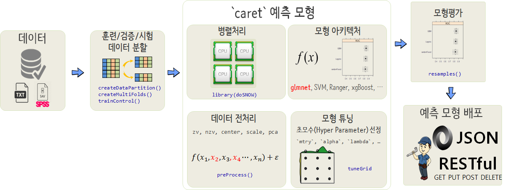
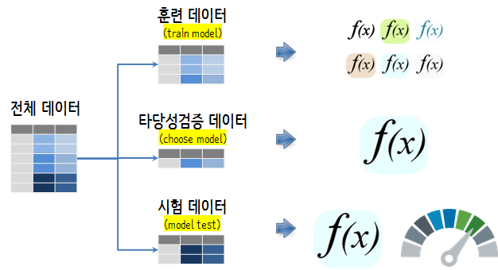

```{r setup, include=FALSE}
knitr::opts_chunk$set(echo = TRUE, message=FALSE, warning=FALSE,
                      comment="", digits = 3, tidy = FALSE, prompt = FALSE, fig.align = 'center')

```


# 기계학습 예측모형 기본기 [^best-algorithm] [^applied-predictive-modeling] {#predictive-model}

## `caret` 팩키지 {#predictive-model-caret}

`caret` 팩키지는 10년이 넘는 기간에 걸쳐 꾸준히 개발되면서 인기를 얻어 안정성이 검증된 팩키지로 
예측모형에 있어 독보적인 영역을 구축하고 있는 팩키지다. 
`caret`을 잘 사용하기 위해서는 기계학습 예측모형에 대한 기본기와 함께 모형개발에 대한 경험도 필요하다.
오로지 예측성능을 극대화하는데 초점을 맞춰 개발되었기 때문에 이를 항상 염두에 두고 팩키지를 사용한다.
예측데이터를 `basetable` 형태로 맞는 다음에 `createDataPartition()`, `createMultiFolds()`, `trainControl()`을 사용해서 
데이터와 초모수(hyper parameter)에 대한 준비를 한 후에 예측모형으로 `glmnet`, `SVM`, `ranger`, `gbm`, `xgBoost`를 
핵심 모형 아키텍처로 지정하여 가장 성능이 뛰어난 예측모형을 구축한다. 
이 과정에서 당연히 CV를 통해 잡아내지 못하는 초모수도 모형튜닝을 통해서 함께 `tuneGrid`에 지정하여 찾아낸다.
그리고 나서 `resamples()` 함수를 사용해서 가장 예측력이 뛰어난 예측모형을 개발하고 이를 `plumber`를 통해 배포한다.



## 기계학습 예측모형 선택 [^best-algorithm] [^applied-predictive-modeling] {#predictive-model}

[^applied-predictive-modeling]: [Kuhn, Max, and Kjell Johnson. Applied predictive modeling. New York: Springer, 2013.](http://link.springer.com/book/10.1007/978-1-4614-6849-3)

[^best-algorithm]: [Randal S. Olson, William La Cava, Zairah Mustahsan, Akshay Varik, Jason H. Moore(2018), "Data-driven Advice for Applying Machine Learning to Bioinformatics Problems"](https://arxiv.org/abs/1708.05070v1)

기계학습 모형을 선정할 때, 인간이 사용하는 경우 **성능 상한(Performance Ceiling)** 을 가장 복잡한 모형으로 잡고, 
컴퓨팅 복잡성, 예측 용이성, 해석 편이성을 고려하여 모형을 선정한다. 
예를 들어, 비선형 지지도 벡터 머신(Nonlinear SVM) 혹은 확률숲(Random Forest)의 경우 데이터에 대한 접합은 좋지만, 
실제 운영환경으로 배포하기가 그다지 좋지는 못하다.

1. 분류문제(classification) 이항회귀모형과 연속형 예측 선형회귀모형은 최종적으로 선정되는 예측모형과 벤치마크 성능을 비교하는 지표로 필히 실행하여 선정한다.
1. 기계학습 모형을 최종 모형으로 선정할 때 해석용이성은 떨어지지만, 가장 성능이 좋은 모형으로 선정한다.
예를 들어, 부스팅 나무모형(Boosting Tree Models), 지지도 벡터 머신(Support Vector Machine, SVM)으로 시작하는데 이유는 가장 정확한 최적의 결과를 제공하기 때문이다.
1. 최적의 모형이 어떻게 보면 가장 좋은 성능의 상한을 제시하게 되고, 이를 기반으로 최적의 성능에 버금가는 해석이 용이한 모형을 탐색한다. 
예를 들어, multivariate adaptive regression splines (MARS), partial least squares, generalized additive models, 나이브 베이즈 모형이 대표적이다.
1. 성능은 복잡성이 높은 모형이 기준이 되고, 검토하는 모형은 가장 단순한 모형으로 선정한다.

## 각 단계별 데이터셋 [^applied-predictive-modeling] {#predictive-model-dataset}

데이터셋을 훈련(train), 타당성검증(validation), 시험(test) 데이터셋을 나누고 
데이터의 역할에 맞게 기계학습 모형 선정에 필요한 기능을 갖추는데 활용한다.
훈련 데이터, 타당성검증 데이터, 시험 데이터는 많은 경우 6:2:2 비율로 나누는 방법이 과거 많이 사용되었다.
현재는 타당성검증 데이터를 활용하여 모형을 하나만 개발하는 것이 아니라 10-fold 교차검증을 5번 반복하는 것이 좋은 성능을 낸다는 연구결과도 있어서
이를 통해서 최적의 모형을 발견한 후에 시험 데이터셋으로 예측모형의 성능을 확정한다.




# 예측모형 맛보기 {#german-credit-data-simple}


독일신용평가 데이터를 `caret` 팩키지에 포함된 것을 사용한다. 
먼저 데이터가 완전히 정제되었다고 가정하고 신용카드 부도예측을 위해서 GLM 모형을 적합하자.
그리고 나서 `predict`함수로 예측모형을 예측한다. 그리고 나서, 부실(Bad)과 정상(Good)판정을 위해서 예측함수에서 신용이 나쁜 고객의 기준을 0.5로 잡아 부실예측 확률이 50%를 넘어갈 경우 "Bad"로 그렇지 않을 경우 "Good"으로 놓고 이를 내표본(in-sample) 라벨정보와 교차하여 모형정확도를 계산한다. 정확도(Accuracy)를 기준으로 삼으면 $\frac{140+74}{140+160+626+74} = 21.4%$ 모형정확도를 보이고 있다.

```{r taste-predictive-model}
# 0. 환경설정 ------
library(caret)
library(tidyverse)
library(yardstick)
library(janitor)

# 1. 데이터 ------
data(GermanCredit)

# 2. 데이터 전처리 ------
credit_df <- GermanCredit %>% 
  clean_names() %>% 
  tbl_df

# 3. 모형적합 -----
gc_model <- glm(class ~., data=credit_df, family="binomial")

# 4. 모형예측 -----
gc_pred <- predict(gc_model, type = "response")

# 5. 모형성능 평가 -----
gc_class <- ifelse(gc_pred > 0.5, "Bad", "Good")

## 오차 계산
table(gc_class, credit_df$class)
```


# 모형 평가 일반화 &rarr; 외표본 {#german-credit-data-split}

예측모형 개발 앞쪽 부분에 데이터를 쪼개는 과정이 추가되었다.
즉, 7:3으로 `credit_df` 데이터프레임을 훈련(`train`), 시험(`test`) 데이터로 나눈다. 그리고 훈련데이터만 기계학습 예측모형개발에 사용하고, 이를 통해서 개발된 예측모형의 성능은 지금까지 예측모형 개발에 전혀 사용되지 않은 `test` 데이터프레임을 사용해서 모형 성능을 평가했다. $\frac{41+27}{14+45+187+27} = 22.7%$으로 앞선 모형과 비교하여 다소 차이가 나지만 진정한 예측모형의 정확도로 볼 수 있다.

```{r taste-predictive-model-out-sample}
# 3. 모형적합 -----
## 3.1. 예측데이터 쪼개기
### 재현가능하도록 난수 초기화 설정
set.seed(777)

### `credit_df` 뒤섞어 난수화
shuffle_index <- sample(nrow(credit_df))
credit_df <- credit_df[shuffle_index, ]

### 행기준 데이터 훈련/시험 데이터로 쪼개기
split <- round(nrow(credit_df) * 0.7)

train <- credit_df[1:split, ]
test  <- credit_df[(split+1):nrow(credit_df), ]

## 3.2. 예측모형 적용
gc_model <- glm(class ~., data=train, family="binomial")

# 4. 모형예측 -----
gc_pred <- predict(gc_model, newdata=test, type = "response")

# 5. 모형성능 평가 -----
gc_class <- ifelse(gc_pred > 0.5, "Bad", "Good")

## 오차 계산
table(gc_class, test$class)
```

# 예측모형의 신뢰도 향상 &rarr; 다수 모형 {#german-credit-data-improve-credibility}

앞선 모형의 문제점은 데이터셋(`credit_df`)에 단 하나의 모형을 사용해서 개발했다는 점이 문제가 될 수 있다. 즉, `set.seed(777)`으로 초기 난수를 지정하여 훈련/시험 데이터로 7:3으로 나누었는데 다른 난수를 사용할 경우 다른 예측성능과 특성을 갖는 예측모형이 개발될 수는 개연성이 크다. 이에 대한 도입되는 개념이 교차검증(cross-validation)이다. 예를 들어, 모형을 10번 개발하여 가장 좋은 성능을 갖는 모형을 찾아내고, 이를 최종모형으로 선정하여 예측에 사용하자는 개념이다.

앞선 `sample` 함수를 사용해도 좋지만, `caret` 팩키지에서 `createDataPartition` 함수를 사용해서 쉽게 적용할 수 있다. 
`createDataPartition()` 함수를 사용해서 데이터를 훈련과 시험데이터로 나누고,
`createMultiFolds()` 함수를 사용해서 훈련데이터를 다시 모형개발에 사용되는 데이터와 모형 검증에 사용되는 CV 데이터로 나누는 역할을 수행한다.

`glm`을 계속 사용할 경우 모형을 반복하는 복잡한 반복문이 포함된 함수를 작성해야 되는데 다행히 `caret`의 `train()`함수가 이런 작업을 대행해 준다. 따라서, `caret` 팩키지 `train()`함수 사용법에따라 원하는 바를 지정하여 넣게 되면 예측모형 결과를 얻게 된다.

1. `createDataPartition()` 함수를 사용하게 되면 층화추출법을 사용하여 훈련/시험 데이터의 예측범주 클래스를 원본데이터와 같도록 유지시켜준다는 측면에서 `sample`을 사용하는 것과 비교하여 잇점이 있다.
1. 훈련데이터에 교차검증(CV)을 적용시킬 수 있도록 훈련데이터를 10개로 쪼개 9개는 모형개발 1 조각은 모형성능평가를 위해 활용될 수 있도록 준비해 둔다. `createMultiFolds()`, `trainControl()` 함수를 활용한다.
1. `train` 함수내부에 `method = "glm"`, `family="binomial"`을 인자로 넣어 `glm()` 예측모형 적합할 수 있도록 지정한다. 이를 통해 다양한 예측모형 아키텍처를 인자만 바꿔넣어 개발할 수 있도록 하는 역할을 한다.
1. `predict()` 함수에 `caret` 객체가 들어가면 예측 확률인지 예측 범주인지를 지정하면 바로 예측모형의 성능을 평가할 수 있게 되는 체계가 마련된다.

`trainControl()` 함수에 `method = 'cv'`로 설정하게 되면 10-fold 가 지정된다.
이를 반복해서 5회하는 것이 성능이 좋은 것으로 알려져 있다. 교차검증(CV) 개념을 도입하여 예측모형의 성능이 $\frac{47+169}{47+43+41+169}= 74%$까지 올라갔다.

```{r german-credit-data-split-cv}
## 3.1. 데이터 분할: 훈련, 타당성검증, 시험
### 훈련 vs 검증/시험
train_test_index <- createDataPartition(credit_df$class, p = 0.7, list = FALSE)

train <- credit_df[train_test_index, ]
test <- credit_df[-train_test_index, ]

### 모형 개발/검증 데이터셋 준비 ------
cv_folds <- createMultiFolds(train$class, k = 5, times = 3)

cv_ctrl <- trainControl(method = "cv", number = 5,
                         repeats = 3, 
                         index = cv_folds, 
                         verboseIter = TRUE)

## 3.2. 예측모형 적용
gc_model <- train(class ~., train,
                  method = "glm",
                  family="binomial",
                  trControl = cv_ctrl)

# 4. 모형예측 -----
gc_pred_class <- predict(gc_model, newdata=test, type = "raw")

# 5. 모형성능 평가 -----
## 오차 계산
table(gc_pred_class, test$class)
```


# 성능지표 최적화 &rarr; AUC {#german-credit-data-auc}

## 예측모형 성능평가 &rarr; `confusionMatrix` {#german-credit-data-auc-performance}

예측모형에서 정확도만이 유일한 척도가 되지 않는다. 이유는 예측확률의 절단값(cut-off)을 어디로 잡느냐에 따라 정확도가 달라지기 때문이다. 쉽게 생각하면 모든 범주를 신용불량, 혹은 모든 범주를 정상으로 둘 경우 예를 들어 모두 정상으로 예측할 경우 정확도는 70%에 이른다. 하지만 이것은 원하는 바가 아니다. 따라서 이에 대한 연구가 많이 진행되었고 `confustionMatrix`를 사용해서 예측모형에 대해서 객관적이고 유용한 성능평가정보를 얻을 수 있다.

특히, `caTools` 팩키지 `colAUC()` 함수는 직관적인 설명이 가능하게 예측모형 설명을 시각적으로 제시하고 있다.

```{r german-credit-data-performance}
## 혼동행렬 -----
confusionMatrix(gc_pred_class, test$class)

## AUC -----
gc_pred <- predict(gc_model, newdata=test, type = "prob")

library(caTools)
colAUC(gc_pred, test[["class"]], plotROC = TRUE, alg=c("ROC"))
```

## 성능지표 반영 최적 예측모형 {#german-credit-data-auc-apply}

범주형 예측모형을 개발하는 경우 정확도(accuracy) 지표가 예측모형 최적화의 목표가 되는데 경우에 따라서 "Sen", "ROC"등도 경우에 따라 실무적으로 많이 사요되는 지표다.

```{r german-credit-data-auc-apply}
### 모형 개발/검증 데이터셋 준비 ------
cv_folds <- createMultiFolds(train$class, k = 10, times = 3)

cv_ctrl <- trainControl(method = "cv", number = 10,
                        repeats = 3, 
                        index = cv_folds, 
                        summaryFunction = twoClassSummary,
                        classProbs = TRUE, # 매우 중요
                        verboseIter = FALSE)

## 3.2. 예측모형 적용
gc_model <- train(class ~., train,
                  method = "glm",
                  family = "binomial",
                  metric = "ROC",
                  trControl = cv_ctrl)

# 4. 모형예측 -----
gc_pred_class <- predict(gc_model, newdata=test, type = "raw")

# 5. 모형성능 평가 -----
## 혼동행렬 -----
confusionMatrix(gc_pred_class, test$class)

## AUC -----
gc_pred <- predict(gc_model, newdata=test, type = "prob")

library(caTools)
colAUC(gc_pred, test[["class"]], plotROC = TRUE, alg=c("ROC"))
```


# 예측모형의 제왕 &rarr; `ranger` {#german-credit-model-architecture-run}

일반화선형모형(GLM)을 벤치마킹 기본 모형으로 잡고, 
독일신용평가 데이터는 분류문제로 CART 모형도 예측모형에 포함하고 
`Random Forest`, GBM, xgBoost를 선택해야하는 모형 아키텍처에 포함시킨다. 
모형을 차례로 적합시켜 **성능**은 가장 뛰어나면서, 

1. 가장 단순한 모형
1. 가장 이해하기 쉬운 모형
1. 가장 실운영환경에 배포하기 좋은 모형

이런 모형을 선정한다. 이를 위한 판단기준으로 타당성검증(validation) 데이터를 활용한다.
타당성검증(validation) 데이터는 물론 훈련과정에 포함된 적은 없다.
`Random Forest` 예측모형 두가지 구현 팩키지가 많이 사용되는데 과거 `randomForest` 팩키지가 많이 사용되었다면 최근에는 `ranger` 팩키지가 속도면에서 월등한 성능을 보여 많이 사용되고 있다.


```{r german-credit-model-ranger}
### 모형 개발/검증 데이터셋 준비 ------
cv_folds <- createMultiFolds(train$class, k = 5, times = 3)

cv_ctrl <- trainControl(method = "cv", number = 5,
                        repeats = 3, 
                        index = cv_folds, 
                        summaryFunction = twoClassSummary,
                        classProbs = TRUE, # 매우 중요
                        verboseIter = FALSE)

## 3.2. 예측모형 적용
gc_model <- train(class ~., train,
                  method = "ranger",
                  metric = "Sens",
                  tuneLength = 3,
                  trControl = cv_ctrl)

### 예측모형 살펴보기
gc_model

plot(gc_model)

# 4. 모형예측 -----
gc_pred_class <- predict(gc_model, newdata=test, type = "raw")

# 5. 모형성능 평가 -----
## 혼동행렬 -----
confusionMatrix(gc_pred_class, test$class)
```

## 예측모형 추가 성능향상 &rarr; `ranger` 초모수 {#german-credit-model-tuning}

`Random Forest` 예측모형을 개발할 때 GLM 계열과 다른 점은 초모수(hyper parameter)를 설정해야 된다는 점이 차이가 난다. GLM 계열은 그냥 놔둬도 되는 반면에 `ranger`에서 초모수 설정을 통해서 기본디폴트 설정된 값을 기본으로 할 때와 비교하여 추가적으로 예측모형 성능을 이끌어 낼 수 있다.

```{r german-credit-model-ranger-tuning}
### 모형 개발/검증 데이터셋 준비 ------
cv_folds <- createMultiFolds(train$class, k = 5, times = 3)

cv_ctrl <- trainControl(method = "cv", number = 5,
                        repeats = 3, 
                        index = cv_folds, 
                        summaryFunction = twoClassSummary,
                        classProbs = TRUE, # 매우 중요
                        verboseIter = FALSE)

tune_grid <- data.frame(
  .mtry = c(2,16,31,46),
  .splitrule = c("gini","extratrees"),
  .min.node.size = c(1, 10)
)

## 3.2. 예측모형 적용
gc_model <- train(class ~., train,
                  method = "ranger",
                  metric = "Sens",
                  tuneGrid = tune_grid,
                  trControl = cv_ctrl)

### 예측모형 살펴보기
gc_model

plot(gc_model)

# 4. 모형예측 -----
gc_pred_class <- predict(gc_model, newdata=test, type = "raw")

# 5. 모형성능 평가 -----
## 혼동행렬 -----
confusionMatrix(gc_pred_class, test$class)
```


# 예측모형 아키텍처 &rarr; `glmnet`, `ranger` {#german-credit-model-architecture}

## 모형공식 {#german-credit-model-formula}

R에 공식 비공식적으로 10,000개가 넘는 팩키지가 존재하고 각 팩키지마다 모형을 명세하는 방식이 다르다. 크게 `~` 공식을 사용하는 방식과 데이터프레임 `=` 을 사용하는 방식이 있는데 팩키지마다 공식을 명세하는 방식을 준용하면 된다. 
중요한 것은 `~`, `=` 좌측은 종속변수, 우측은 독립변수가 위치해 넣으면 된다.

```{r german-credit-formula}
# 2. 예측모형 개발 ------
## 2.1. 예측모형 공식 

credit_var <- setdiff(colnames(credit_df), list('class'))
credit_formula <- as.formula(paste('class', paste(credit_var, collapse=' + '), sep=' ~ '))
```

## baseline 기준 예측모형 &rarr; `glmnet` {#german-credit-model-glmnet}

예측모형으로 수백개가 존재하지만, 가장 오랜기간동안 사랑받은 모형은 아마도 GLM일 것이다. 그리고 기계학습/AI가 보편화되기 시작한 2015년을 기준으로 이전 시점까지 거의 유일한 승리 예측모형은 GLM이었다. 따라서 GLM을 baseline 기본예측모형으로 삼고 이것보다 우수한 성능이 나는 예측모형을 실전에 적용해야 된다는 것이 나름 업계 원칙이다. 
`lm()`, `glm()`을 확장하여 능선 회귀모형(ridge regression), 라소 회귀모형(lasso regression)을 초모수 선택을 통해 담아낸 `glmnet`을 적용하여 baseline  기본 예측모형을 제작한다.

`expand.grid()` 함수를 사용해서 $\alpha$, $\lambda$ 초모수를 설정하여 `glmnet`을 적용시켜 최적의 초모수를 선택해낸다. 실무에서 `glmnet`을 이기기는 쉽지 않고 장점이 속도가 매우 빠르다는데 있다.

```{r german-credit-basline-predictive-model-glmnet}
### 모형 개발/검증 데이터셋 준비 ------
cv_folds <- createMultiFolds(train$class, k = 5, times = 3)

cv_ctrl <- trainControl(method = "cv", number = 5,
                        repeats = 3, 
                        index = cv_folds, 
                        summaryFunction = twoClassSummary,
                        classProbs = TRUE, # 매우 중요
                        verboseIter = FALSE)

tune_grid <- expand.grid(
  alpha = 0:1,
  lambda = seq(0.0001, 1, length=10)
)

## 3.2. 예측모형 적용
gc_model <- train(class ~., train,
                  method = "glmnet",
                  metric = "Sens",
                  tuneGrid = tune_grid,
                  trControl = cv_ctrl)

### 예측모형 살펴보기
gc_model

plot(gc_model)

# 4. 모형예측 -----
gc_pred_class <- predict(gc_model, newdata=test, type = "raw")

# 5. 모형성능 평가 -----
## 혼동행렬 -----
confusionMatrix(gc_pred_class, test$class)
```


## 모형 아키텍처 선정 {#german-credit-model-choose}

이항회귀모형, 의사결정나무, 확률숲(randomForest), GBM, xgBoost 모형등 다양한 모형을 적합시켜 최고 성능이 나는 예측모형을 식별해보자. 신용평가 예측모형을 개발할 때 아무래도 부실 징후가 높은 고객을 찾아내는 것이라 이에 초점을 두고 모형을 개발해 낸다.

이를 위해서 `glmnet`, `ranger` 두가지 모형 아키텍처를 염두에 두고 초모수 튜닝도 반영하여 최적모형을 선정한다.
특히 "Sens"를 예측모형에서 최적화해야 되는 대상으로 삼아서 최적화한다.
단일 코어를 사용하는 것과 멀티코어 병렬컴퓨팅을 적용하는 것과 비교하기 위해서 예측모형 실행시간 측정도 함께 한다.

```{r german-credit-choose-model}
start_time <- Sys.time()

### 모형 개발/검증 데이터셋 준비 ------
cv_folds <- createMultiFolds(train$class, k = 5, times = 3)

cv_ctrl <- trainControl(method = "cv", number = 5,
                        repeats = 3, 
                        index = cv_folds, 
                        summaryFunction = twoClassSummary,
                        classProbs = TRUE, # 매우 중요
                        verboseIter = FALSE)

ranger_tune_grid <- expand.grid(
  .mtry = c(2,16,31,46),
  .splitrule = c("gini","extratrees"),
  .min.node.size = c(5, 10)
)

glmnet_tune_grid <- expand.grid(
  alpha = 0:1,
  lambda = seq(0.0001, 1, length=10)
)

## 3.2. 예측모형 적용
### glmnet
gc_glmnet_model <- train(class ~., train,
                  method = "glmnet",
                  metric = "Sens",
                  tuneGrid = glmnet_tune_grid,
                  trControl = cv_ctrl)

### ranger
gc_ranger_model <- train(class ~., train,
                  method = "ranger",
                  metric = "Sens",
                  tuneGrid = ranger_tune_grid,
                  trControl = cv_ctrl)

# 4. 모형 비교평가-----
model_list <- list(
  glmnet = gc_glmnet_model,
  rf = gc_ranger_model
)

resamps <- resamples(model_list)

summary(resamps)
dotplot(resamps, metric = "Sens")

# 5. 모형성능 평가 -----
gc_pred_class <- predict(gc_glmnet_model, newdata = test, type="raw")
## 혼동행렬 -----
confusionMatrix(gc_pred_class, test$class)

total_time <- Sys.time() - start_time
total_time
```

사실 모형 아키텍처에 포함된 모든 모형이 동일한 값을 주지는 않는다.
차이가 크다고 하더라도 확률적인 요인에 의한 차이로 밝혀질 수도 있다. 
이런 경우 쌍체 $t$-검증 (paired t-test)을 사용하여 모형간 유의성을 검증한다.
만약 차이점이 없다면 가장 단순한 모형, baseline `glmnet`을 사용한다.
"Sensitivity"관점에서는 큰 차이가 보이지 않고 ROC와 "Specificity"에서 0.05 유의수준에서 차이가 있는 것으로 나타난다.

```{r german-credit-choose-model-test}
diff_test <- resamples(list(glmnet = gc_glmnet_model, 
                            ranger = gc_ranger_model))

diff(diff_test) %>% summary
```

# `basetable` 전처리 &rarr; `preProcess` {#german-credit-model-preprocess}

예측모형을 위해 마련된 특별한 데이터프레임을 `basetable`이라고 일컫는다. 
`basetable`에서 예측정확도 향상에 사용되는 연속형 범주형 변수에 대해서 전처리 작업을 수행할 경우 예측성능 향상을 기대할 수 있다.

이를 위해서 `caret`에서 `preProcess` 기능을 넣게 되면 추가적으로 예측성능 향상과 더불어 예측모형 적합 속도도 높아진다. 이유는 변수들간의 상관관계가 높은 경우 수렴이 늦어지는 문제가 있는데 전처리 기능을 통해서 비유의적인 변수에 대해서 사전에 적절한 조치를 취하여 두면 예측성능도 높아지고 학습에 걸리는 시간도 대폭 줄일 수 있다.

결측값이 있는 경우 "mediaImpute", "knnImpute" &rarr; "zv", "nzv" &rarr; "center", "scale" &rarr; "pca", "spatialSign" 순으로 전처리 과정을 거친다. 이를 통해 다소 "Sens" 값이 올라간 것을 확인할 수 있다.

```{r german-credit-formula-preprocess}
start_time <- Sys.time()

### 모형 개발/검증 데이터셋 준비 ------
cv_folds <- createMultiFolds(train$class, k = 5, times = 3)

cv_ctrl <- trainControl(method = "cv", number = 5,
                        repeats = 3, 
                        index = cv_folds, 
                        summaryFunction = twoClassSummary,
                        classProbs = TRUE, # 매우 중요
                        verboseIter = FALSE)

ranger_tune_grid <- expand.grid(
  .mtry = c(2,16,31,46),
  .splitrule = c("gini","extratrees"),
  .min.node.size = c(5, 10)
)

glmnet_tune_grid <- expand.grid(
  alpha = 0:1,
  lambda = seq(0.0001, 1, length=10)
)

## 3.2. 예측모형 적용
### glmnet
gc_glmnet_model <- train(class ~., train,
                  method = "glmnet",
                  metric = "Sens",
                  preProcess = c("nzv", "center", "scale", "spatialSign"),
                  tuneGrid = glmnet_tune_grid,
                  trControl = cv_ctrl)

### ranger
gc_ranger_model <- train(class ~., train,
                  method = "ranger",
                  metric = "Sens",
                  preProcess = c("nzv", "center", "scale", "pca"),
                  # tuneGrid = ranger_tune_grid,
                  tuneLength = 7,
                  trControl = cv_ctrl)

# 4. 모형 비교평가-----
model_list <- list(
  glmnet = gc_glmnet_model,
  rf = gc_ranger_model
)

resamps <- resamples(model_list)

summary(resamps)
dotplot(resamps, metric = "Sens")

# 5. 모형성능 평가 -----
gc_pred_class <- predict(gc_glmnet_model, newdata = test, type="raw")
## 혼동행렬 -----
confusionMatrix(gc_pred_class, test$class)

total_time <- Sys.time() - start_time
total_time
```

# 예측모형 개발속도 향상 &rarr; `doSNOW` {#german-credit-model-parallel}

동일한 예측모형을 교차검증 데이터를 만들어서 데이터만 달리해서 적합시키는 것이라 멀티코어를 갖춘 최근 컴퓨터 환경에 적합하다. 이를 위해서 멀티코어를 활용하여 병렬컴퓨팅으로 예측모형을 개발하여 예측모형 개발에 소요되는 시간을 대폭 줄인다.

예측모형 `caret` 주요 함수를 실행하기에 앞서 `doSNOW` 팩키지를 사용하는데 우선 코어숫자를 파악해야 되기 때문에 `parallel:::detectCores()` 함수로 예측모형 구축에 활용되는 하드웨어 CPU에서 코어숫자를 파악하고 클러스터를 구축해서 예측모형을 돌리면 된다.


```{r german-credit-formula-preprocess-doSNOW}
library(doSNOW)

num_cores <- parallel:::detectCores()

start_time <- Sys.time()

cl <- makeCluster(num_cores, type = "SOCK")
registerDoSNOW(cl)

### 모형 개발/검증 데이터셋 준비 ------
cv_folds <- createMultiFolds(train$class, k = 5, times = 3)

cv_ctrl <- trainControl(method = "cv", number = 5,
                        repeats = 3, 
                        index = cv_folds, 
                        summaryFunction = twoClassSummary,
                        classProbs = TRUE, # 매우 중요
                        verboseIter = FALSE)

ranger_tune_grid <- expand.grid(
  .mtry = c(2,16,31,46),
  .splitrule = c("gini","extratrees"),
  .min.node.size = c(5, 10)
)

glmnet_tune_grid <- expand.grid(
  alpha = 0:1,
  lambda = seq(0.0001, 1, length=10)
)

## 3.2. 예측모형 적용
### glmnet
gc_glmnet_model <- train(class ~., train,
                  method = "glmnet",
                  metric = "Sens",
                  preProcess = c("nzv", "center", "scale", "spatialSign"),
                  tuneGrid = glmnet_tune_grid,
                  trControl = cv_ctrl)

### ranger
gc_ranger_model <- train(class ~., train,
                  method = "ranger",
                  metric = "Sens",
                  preProcess = c("nzv", "center", "scale", "pca"),
                  # tuneGrid = ranger_tune_grid,
                  tuneLength = 7,
                  trControl = cv_ctrl)

# 4. 모형 비교평가-----
model_list <- list(
  glmnet = gc_glmnet_model,
  rf = gc_ranger_model
)

resamps <- resamples(model_list)

summary(resamps)
dotplot(resamps, metric = "Sens")

# 5. 모형성능 평가 -----
gc_pred_class <- predict(gc_glmnet_model, newdata = test, type="raw")
## 혼동행렬 -----
confusionMatrix(gc_pred_class, test$class)

mc_total_time <- Sys.time() - start_time
mc_total_time
```

`r total_time`와 `r mc_total_time`만큼 멀티코어를 활용하여 예측모형 개발에 소요되는 시간을 줄여 더 많은 모형을 테스트하여 최고 성능 예측모형 개발에 투여되는 시간을 벌어드릴 수 있다.

# 앙상블 예측모형 &rarr; `stacking` {#german-credit-model-parallel}

귀중한 컴퓨팅 자원을 사용해서 예측모형을 개발했는데 이를 사용해서 다시 예측모형을 만드는 것은 `stacking`이라고 한다. 이 기법을 사용하여 예측모형을 추가로 개발한다. `caretEnsemble`을 활용하는 것이 가능하다.

```{r german-credit-formula-caretEnsemble, eval=FALSE}
library(caretEnsemble)

stack <- caretStack(model_list, method="ranger")
summary(stack)
```