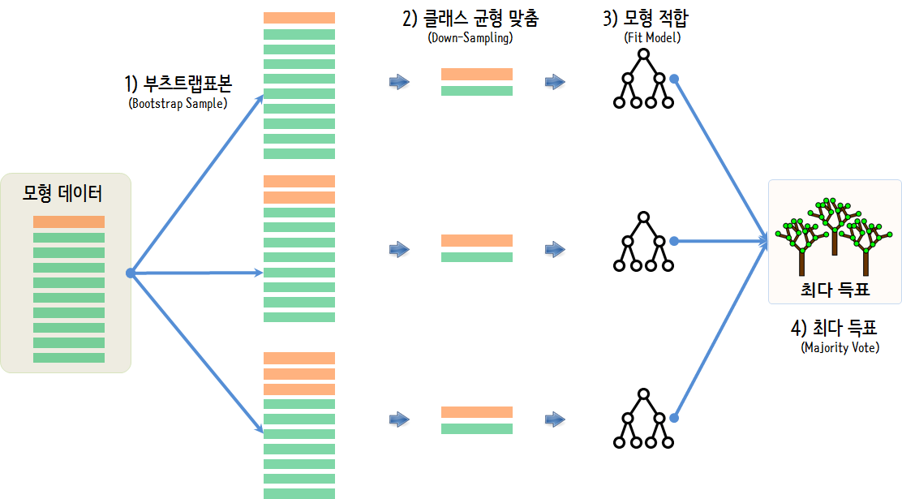

 
``` {r, include=FALSE}
source("tools/chunk-options.R")
knitr::opts_chunk$set(echo = TRUE, warning=FALSE, message=FALSE)

library(igraph)
library(tidyverse)
library(threejs)
library(readxl)
library(ggpubr)
library(forcats)
library(extrafont)
loadfonts()

```

## 기계학습 클래스 불균형 [^ml-class-imbalance-svds] [^freesearch-class-imbalance] [^analytic-vidhya-class-imbalance] {#ml-class-imbalance-problem}

[^freesearch-class-imbalance]: [예측 모형에서의 클래스 불균형(class imbalance) 문제](http://freesearch.pe.kr/archives/4506)

[^analytic-vidhya-class-imbalance]: [Practical Guide to deal with Imbalanced Classification Problems in R](https://www.analyticsvidhya.com/blog/2016/03/practical-guide-deal-imbalanced-classification-problems/)

[^ml-class-imbalance-svds]: [Learning from Imbalanced Classes, AUGUST 25TH, 2016](https://svds.com/learning-imbalanced-classes/)

기계학습에서 관심있는 예측변수의 클래스가 매우 적은 경우가 흔하다. 

- 매년 약 2% 정도 신용카드가 도용되고 있다. 일반적으로 사기탐지(fraud detection) 분야는 2% 보다도 훨씬 적다.
- 의학에서 질병검사도 건강한 일반인을 대상으로 하기 때문에 희귀하다. 예를 들어 미국에서 후천성면역결핍증(HIV) 발병율은 0.4% 정도에 불과하다.
- 하드 디스크 고장율도 매년 약 1% 정도된다.
- 온라인 광고의 전환율은 대략 $10^{-3} ~ 10^{-6}$ 정도 된다.
- 자동화된 생산공장의 불량율도 대략 0.1% 정도다.

이와 같이 관심을 갖고 예측하고자 하는 것이 매우 드문 경우가 빈번하기 때문에 지난 수십년동안 수많은 기계학습 분야에서 
수많은 석박사를 배출했고, 따라서 예측에 빈번히 발생하는 **클래스 불균형(class imbalance)** 문제를 처리할 수 있는 방법이 많이 소개되었다.

대응방법은 다음과 같다.

- 아무 것도 하지 않는다.
- 훈련 데이터를 보정한다.
    - 과대표집(Over-Sampling)
    - 과소표집(Under-Sampling)
    - 소수 표본 데이터를 조합해서 생성시킴
- 소수 표본 데이터를 버리고 비정상행위 탐지(anomaly detection framework)로 문제를 바꿔 접근한다.
- 알고리즘 수준에서 미세 조정을 취한다.
    - 클래스 가중치(오분류 비용)를 조정
    - 컷오프 기준을 조정
    - 소수 표본 데이터에 좀더 예민하게 반응하도록 알고리즘을 조정

## 환경설정 {#class-imbalance-import-setup}

[Practical Guide to deal with Imbalanced Classification Problems in R](https://www.analyticsvidhya.com/blog/2016/03/practical-guide-deal-imbalanced-classification-problems/)에서 소개된 방법을 따라 
환경을 설정히고 `hacide` 데이터를 준비한다. `ROSE` 팩키지에 포함되어 있는 가공된 데이터로 클래스 불균형 문제를 시작하는데 적절한 데이터로 사료된다.

``` {r class-imbalance-setup}
# 0. 환경설정 --------------

library(ROSE)
library(tidyverse)
library(rpart)
library(caret)
library(ggpubr)
library(extrafont)
loadfonts()
library(plotROC)

# 1. 데이터 가져오기 --------

data(hacide)

hacide.train <- hacide.train %>% 
    mutate(cls = factor(cls, labels= c("no", "yes")))

hacide.test <- hacide.test %>% 
    mutate(cls = factor(cls, labels= c("no", "yes")))
```

## 데이터 살펴보기 {#class-imbalance-EDA}

`hacide` 데이터를 시각화를 통해 이해한다. 
데이터는 `cls`가 0과 1일 경우 다른 방식으로 생성되었는데 자세한 내용은 
[hacide - Half Circle Filled Data](https://www.rdocumentation.org/packages/ROSE/versions/0.0-3/topics/hacide) 웹사이트를 참고한다.


``` {r class-imbalance-EDA}
# 2. 탐색적 데이터 분석 --------
## 2.1. 데이터 시각화
hacide.train %>% 
    ggplot(aes(x=x1, y=x2, color=cls)) +
      geom_point() +
      theme_pubr(base_family = "NanumGothic") +
      theme(legend.position = "top") +
      labs(color = "종속변수(cls)") +
      scale_color_manual(values = c("lightblue", "red"))

## 2.2. 데이터 장표
hacide.train %>% count(cls) %>% 
    mutate(비율 = scales::percent(n/ sum(n))) 
```    


# 클래스 불균형 극복전략 {#class-imbalance-countermeasure}

클래스 불균형 문제에 대한 극복방법에 대해서 크게 4가지 방법이 제시되고 있다. 물론 `ROSE` 방법론을 옹호하는 입장에서 그렇다.
클래스 불균형 문제를 인식하고 이에 대해 체계적으로 접근할 수 있는 가장 손쉬운 시작점으로 이해하면 좋다.

- 과대표집(Over-Sampling)
- 과소표집(Under-Sampling)
- 양쪽 표집(Both-Sampling)
- 로즈 표집(ROSE Sampling)

클래스 불균형 극복전략을 예측모형과 연관하여 부츠트랩 표본을 생성하고 나서 각 부츠트랩 표본에서 과소표집(Down-sampling)을 통해 클래스 불균형을 해소하고 
단순한 예측모형을 적합시킨 후에 다수결 원칙에 의거하여 최종 예측모형을 완성하는 과정을 거친다.



``` {r class-imbalance-countermeasure}
# 3. 클래스 불균형(class imbalance) 극복전략 -----

balanced_over_sampling_df  <- ovun.sample(cls ~ ., data = hacide.train, method = "over", N = 1960)$data
balanced_under_sampling_df <- ovun.sample(cls ~ ., data = hacide.train, method = "under", N = 40, seed = 1)$data
balanced_both_sampling_df <- ovun.sample(cls ~ ., data = hacide.train, method = "both", p=0.5,                             N=1000, seed = 1)$data
rose_df <- ROSE(cls ~ ., data = hacide.train)$data
```

# 클래스 불균형 극복전략 성능비교 {#class-imbalance-countermeasure-performance}

과대표집(Over-Sampling), 과소표집(Under-Sampling), 양쪽 표집(Both-Sampling), 로즈 표집(ROSE Sampling) 그리고 클래스 불균형 극복전략이 없는 
경우 포함하여 총 5가지 전략에 대해서 성능을 비교해 보자.


## AUC 성능비교 {#class-imbalance-countermeasure-performance-auc}

AUC 곡선 비교하면 `hacide` 데이터에는 로즈 방법론이 가장 좋은 성능을 나타내고 있다.

``` {r class-imbalance-countermeasure-auc}
# 4. 재귀분할(rpart) 나무모형 적합 --------

raw_rpart   <- rpart(cls ~ ., data = hacide.train)
over_rpart  <- rpart(cls ~ ., data = balanced_over_sampling_df)
under_rpart <- rpart(cls ~ ., data = balanced_under_sampling_df)
both_rpart  <- rpart(cls ~ ., data = balanced_both_sampling_df)
rose_rpart  <- rpart(cls ~ ., data = rose_df)

# 5. 클래스 불균형 재귀분할(rpart) 나무모형 평가 --------
## 5.1. 검증데이터 적용 예측
pred_raw_rpart    <- predict(raw_rpart  , newdata = hacide.test)
pred_over_rpart   <- predict(over_rpart , newdata = hacide.test)
pred_under_rpart  <- predict(under_rpart, newdata = hacide.test)
pred_both_rpart   <- predict(both_rpart , newdata = hacide.test)
pred_rose_rpart   <- predict(rose_rpart , newdata = hacide.test)

## 5.2. AUC
roc.curve(hacide.test$cls, pred_raw_rpart[,2], plot=FALSE)
roc.curve(hacide.test$cls, pred_over_rpart[,2], plot=FALSE)
roc.curve(hacide.test$cls, pred_under_rpart[,2], plot=FALSE)
roc.curve(hacide.test$cls, pred_both_rpart[,2], plot=FALSE)
roc.curve(hacide.test$cls, pred_rose_rpart[,2], plot=FALSE)
```


## AUC 성능비교 `plotROC` 시각화 {#class-imbalance-countermeasure-performance-auc-plot}

`ggplot`을 통해 5가지 예측모형의 성능을 살펴본다.

``` {r class-imbalance-countermeasure-auc-plot}
## 5.3. ggplot ROC 데이터 

raw_roc_df  <- tibble(cls = hacide.test[,1], pred=pred_raw_rpart[,2],   sampling="원데이터")
over_roc_df <- tibble(cls = hacide.test[,1], pred=pred_over_rpart[,2],  sampling="과대 표집")
under_roc_df <- tibble(cls = hacide.test[,1], pred=pred_under_rpart[,2], sampling="과소 표집")
both_roc_df <- tibble(cls = hacide.test[,1], pred=pred_both_rpart[,2],  sampling="양쪽 표집")
rose_roc_df <- tibble(cls = hacide.test[,1], pred=pred_rose_rpart[,2],  sampling="ROSE 표집")

hacide_roc_df <- bind_rows(raw_roc_df, over_roc_df) %>% 
    bind_rows(under_roc_df) %>% 
    bind_rows(both_roc_df) %>% 
    bind_rows(rose_roc_df)

## 5.4. ggplot ROC 시각화

ggplot(hacide_roc_df, aes(d = cls, m = pred, color=sampling)) + 
    geom_roc(labels =FALSE)  +
    style_roc() +
    theme_pubr(base_family="NanumGothic") +
    theme(legend.position = "top") +
    labs(color="클래스 불균형 해소방법: ")
```    


# `caret` 구현 [^ml-class-imbalance-shiring] {#ml-class-imbalance-problem-caret}

[^ml-class-imbalance-shiring]: [Shiring, Dealing with unbalanced data in machine learning](https://shiring.github.io/machine_learning/2017/04/02/unbalanced)


## `caret` 클래스 불균형 대응 {#ml-class-imbalance-caret-counter-measure}

`caret` 팩키지 클래스 불균형 대응 구현된 기능을 활용하여 예측모형 성능을 비교평가한다.
예측모형은 동일하게 `randomForest`를 사용하고 앞서 언급된 클래스 불균형 대응 알고리즘을 반영한다.


``` {r class-imbalance-countermeasure-caret-fit, warning=FALSE, message=FALSE}
# 2. 모형 적합 --------
## 2.1. 원데이터 ------
hacide_ctrl <- trainControl(method = "repeatedcv", 
                            number = 5, 
                            repeats = 5, 
                            verboseIter = FALSE)

model_rf <- train(cls ~ .,
                  data = hacide.train,
                  method = "rf",
                  preProcess = c("scale", "center"),
                  trControl = hacide_ctrl)

## 2.2. Under-sampling ------
hacide_under_ctrl <- trainControl(method = "repeatedcv", 
                            number = 5, 
                            repeats = 5, 
                            verboseIter = FALSE,
                            sampling = "down")

model_under_rf <- train(cls ~ .,
                  data = hacide.train,
                  method = "rf",
                  preProcess = c("scale", "center"),
                  trControl = hacide_under_ctrl)

## 2.3. Up-sampling ------
hacide_up_ctrl <- trainControl(method = "repeatedcv", 
                                  number = 5, 
                                  repeats = 5, 
                                  verboseIter = FALSE,
                                  sampling = "up")

model_up_rf <- train(cls ~ .,
                        data = hacide.train,
                        method = "rf",
                        preProcess = c("scale", "center"),
                        trControl = hacide_up_ctrl)

## 2.4. ROSE ------
hacide_rose_ctrl <- trainControl(method = "repeatedcv", 
                               number = 5, 
                               repeats = 5, 
                               verboseIter = FALSE,
                               sampling = "rose")

model_rose_rf <- train(cls ~ .,
                     data = hacide.train,
                     method = "rf",
                     preProcess = c("scale", "center"),
                     trControl = hacide_rose_ctrl)

## 2.5. SMOTE ------
hacide_smote_ctrl <- trainControl(method = "repeatedcv", 
                                 number = 5, 
                                 repeats = 5, 
                                 verboseIter = FALSE,
                                 sampling = "smote")

model_smote_rf <- train(cls ~ .,
                       data = hacide.train,
                       method = "rf",
                       preProcess = c("scale", "center"),
                       trControl = hacide_smote_ctrl)
```

## `caret` 클래스 불균형 성능평가 {#ml-class-imbalance-caret-counter-measure-performance}

`AUC` 값을 성능평가 기준으로 삼아 예측모형 성능을 비교한다.

``` {r class-imbalance-countermeasure-caret-performance}
# 3. 성능 비교 ------
## 3.1. 일반적인 성능 평가 지표
hacide_models <- list(original = model_rf,
                      under    = model_under_rf,
                      over     = model_up_rf,
                      smote    = model_smote_rf,
                      rose     = model_rose_rf)

hacide_resampling <- resamples(hacide_models)
bwplot(hacide_resampling)

## 3.2. AUC 지표
pred_rf           <- predict(model_rf,       newdata = hacide.test)
pred_under_rf     <- predict(model_under_rf, newdata = hacide.test)
pred_up_rf        <- predict(model_up_rf,    newdata = hacide.test)
pred_smote_rf     <- predict(model_smote_rf, newdata = hacide.test)
pred_rose_rf      <- predict(model_rose_rf,  newdata = hacide.test)

roc.curve(hacide.test$cls, pred_rf, plot=FALSE)
roc.curve(hacide.test$cls, pred_under_rf, plot=FALSE)
roc.curve(hacide.test$cls, pred_up_rf, plot=FALSE)
roc.curve(hacide.test$cls, pred_smote_rf, plot=FALSE)
roc.curve(hacide.test$cls, pred_rose_rf, plot=FALSE)
```

## `caret` 클래스 불균형 성능평가 시각화 {#ml-class-imbalance-caret-counter-measure-viz}

`ggplot`으로 ROC 곡선을 도식화하여 성능을 비교한다.

``` {r class-imbalance-countermeasure-caret-performance-viz}
## 3.3. ggplot ROC 데이터 
pred_rf           <- predict(model_rf,       newdata = hacide.test, type="prob")
pred_under_rf     <- predict(model_under_rf, newdata = hacide.test, type="prob")
pred_up_rf        <- predict(model_up_rf,    newdata = hacide.test, type="prob")
pred_smote_rf     <- predict(model_smote_rf, newdata = hacide.test, type="prob")
pred_rose_rf      <- predict(model_rose_rf,  newdata = hacide.test, type="prob")


raw_roc_df   <- tibble(cls = hacide.test$cls, pred= pred_rf[,2],   sampling="원데이터")
under_roc_df <- tibble(cls = hacide.test$cls, pred=pred_under_rf[,2],  sampling="과소 표집")
up_roc_df    <- tibble(cls = hacide.test$cls, pred=pred_up_rf[,2], sampling="과대 표집")
smote_roc_df <- tibble(cls = hacide.test$cls, pred=pred_smote_rf[,2],  sampling="SMOTE 표집")
rose_roc_df  <- tibble(cls = hacide.test$cls, pred=pred_rose_rf[,2],  sampling="ROSE 표집")

hacide_caret_roc_df <- bind_rows(raw_roc_df, under_roc_df) %>% 
    bind_rows(up_roc_df) %>% 
    bind_rows(smote_roc_df) %>% 
    bind_rows(rose_roc_df)

## 4.4. ggplot ROC 시각화

ggplot(hacide_caret_roc_df, aes(d = cls, m = pred, color=sampling)) + 
    geom_roc(labels =FALSE)  +
    style_roc() +
    theme_pubr(base_family="NanumGothic") +
    theme(legend.position = "top") +
    labs(color="클래스 불균형 해소방법: ")
```

# 향상도(Lift) [^caret-lift] {#ml-class-imbalance-problem-lift}

[^caret-lift]: [caret 17 Measuring Performance, lift](https://topepo.github.io/caret/measuring-performance.html#lift)

향상도(Lift)를 통해 희소한, 관심있는 클래스를 탐지하는데 예측모형에서 나온 표본 중 얼마를 탐지해야 유의미한지 확인한다.

``` {r ml-class-imbalance-lift}
# 5. lift ------------

hacide.test$pred <- predict(model_rose_rf,  newdata = hacide.test, type="prob")[, "yes"]

hacide_lift <- caret::lift(cls ~ pred,  data = hacide.test, cuts = 100, class="yes")

ggplot(hacide_lift, values=80) +
    geom_line(color="blue") +
    theme_pubr(base_family = "NanumGothic") +
    labs(title = "hacide 데이터에 대한 향상도(lift)", 
         subtitle = "희귀한 2% 사례 80%를 탐지하기 하는데 약 5% 정도 노력만 필요",
        x="탐색해야 될 표본비율(% Samples Tested)", y="탐색된 표본비율(% Samples Found)") +
    scale_x_continuous(breaks = seq(0,100,10)) +
    scale_x_continuous(breaks = seq(0,100,10))
```


