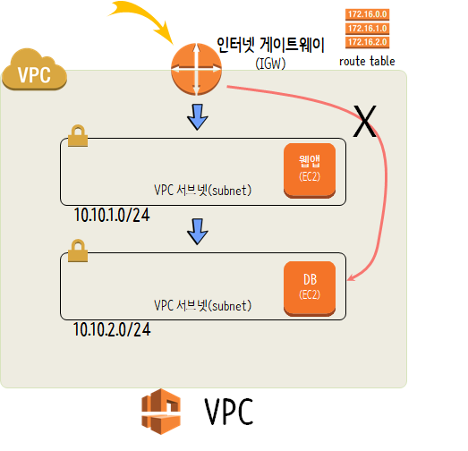
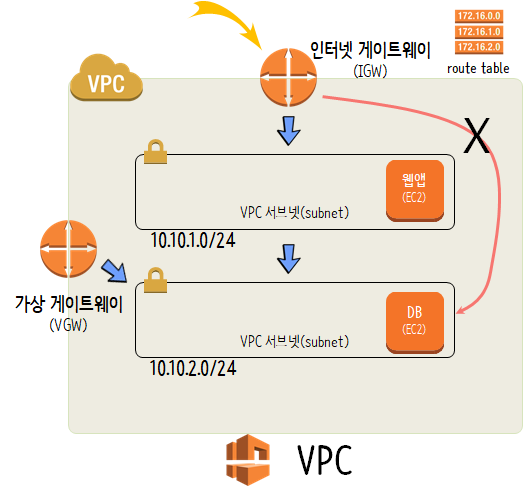
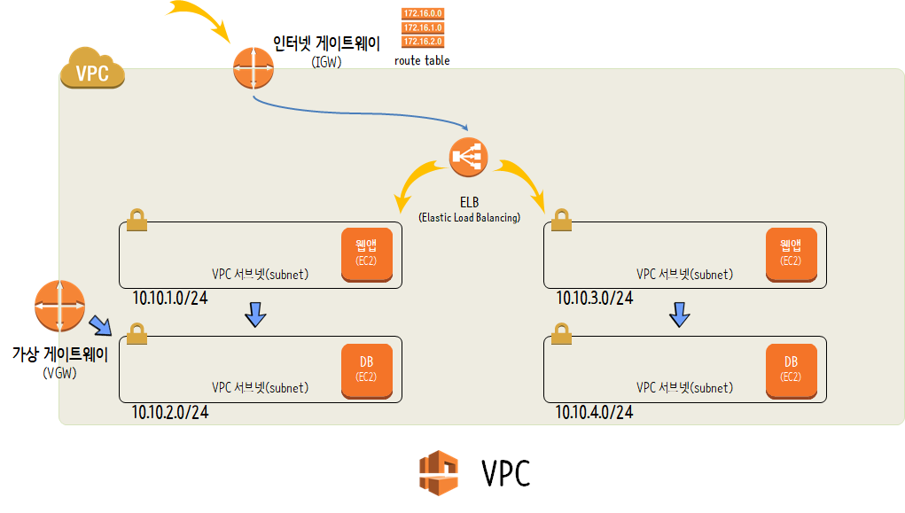
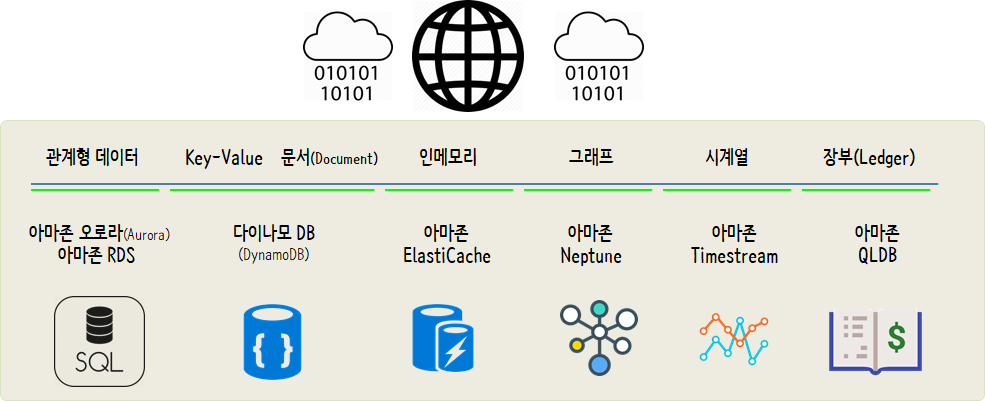

```{r setup, include=FALSE}
knitr::opts_chunk$set(echo = TRUE, message=FALSE, warning=FALSE,
                      comment="", digits = 3, tidy = FALSE, prompt = FALSE, fig.align = 'center')

```


# 데이터 과학을 위한 인프라 [^aws-coursera] {#model-infra}


[^aws-coursera]: [Amazon Web Services (2018), "AWS Fundamentals - Going Cloud-Native"](https://www.coursera.org/learn/aws-fundamentals-going-cloud-native/home/welcome)

클라우드 컴퓨팅을 활용할 경우 장점 6개를 다음과 같이 많이 꼽고 있다.

1. 변동비에 대한 자본비용 효율적 관리
1. 대규모 규모의 경제(economies of scale) 달성에 대한 혜택
1. 컴퓨팅 자원 및 투자에 대해 추측해서 미리 정할 필요없음
1. 속도와 민첩성 향상
1. 데이터 센터를 운영하는데 따른 비용 지출을 줄임
1. 단 몇분만에 세계시장으로 진출


AWS 지역 (region) 선택 시 다음 사항을 고려해야 한다.
AWS 전산센터는 전세계에 널리 광범위하게 걸쳐 제공되고 있다.
전세계 어디서나 AWS 전산센터 서비스를 이용할 수 있는데 다음 사항을 고려하여 
최적 AWS 지역 전산센터를 선택한다.

1. 지연속도(latency)
1. 비용
1. 법률 준수(compliance)
1. 서비스: 최신 AWS 기능이 순차적으로 지역별로 순차적으로 제공되기 때문

AWS 지역(region)은 Availability zone의 집합이다.
Avaiablity zone에는 물리적 IDC(전산센터)가 두개 이상 존재할 수 있는데 동일한 역할을 사용자 입자에서 봤을 때 제공한다. 이유는 물리적 IDC(전산센터) 한곳이 자연재해로 인해서 엉망이 되더라도 다른 물리적 IDC에서 기능을 발휘할 수 있도록 하여 사용자 입장에서는 동일한 서비스를 제공할 수 있게 되기 때문이다.
현재(2018-12) 시점에서 18개 Region, 55개 Availability Zone으로 AWS 클라우드가 구성되어 있다.


# AWS Compute 서비스 {#aws-compute}

- [Amazon Elastic Compute Cloud (EC2)](https://aws.amazon.com/ec2/)
    - [EC2 인스턴스 유형](https://aws.amazon.com/ec2/instance-types/)
    - [Amazon Lightsail](https://aws.amazon.com/lightsail/): [유튜브: AWS re:Invent 2017: Building production apps easily with Amazon Lightsail](https://www.youtube.com/watch?v=29_LqYnomdg)
- AWS 람다(Lambda): [AWS Lambda](https://aws.amazon.com/lambda)
- AWS 컨테이너(Container) 서비스
    - [Amazon Elastic Container Service (Amazon ECS)](https://aws.amazon.com/ecs/)
    - [Amazon Elastic Container Service for Kubernetes (Amazon EKS)](https://aws.amazon.com/eks/)
    - [AWS Fargate](https://aws.amazon.com/fargate/)

# VPC {#aws-vpc}


[Amazon Virtual Private Cloud(VPC)](https://aws.amazon.com/vpc)를 사용하면 AWS 클라우드에서 논리적으로 격리된 공간을 제공하게 되어 안전하게 AWS 자원을 넣어 관리할 수 있도록 하는 역할을 수행한다. VPC가 완전히 격리되면 아무짝에도 사용할 수 없기 때문에 인터넷 게이트웨이(Internet Gateway, IGT)를 통해서 내부 AWS 자원에 접근할 수 있도록 한다.

## VPC 아키텍처 - 웹앱과 데이터베이스 분리 {#aws-vpc-app-db}

VPC 내부에 VPC 서브넷(subnet)을 구성하여 또 다시 보안을 강화할 수 있다. 
즉, 앱과 DB를 분리하는 경우 보안을 더욱 강화할 수 있는데 앱 EC2를 `10.10.1.0/24` 서브넷에 위치시키고, DB EC2는 `10.10.2.0/24` 서브넷에 위치시켜 데이터베이스 보안을 더욱 강화할 수 있다. 이와 같은 아키텍처를 구성할 경우 인터넷 게이트웨이를 통해서 직접 데이터베이스로 접근하는 것을 막을 수 있어 보안이 한층 강화된다.



## VPC 아키텍처 - 데이터베이스 접근 분리 {#aws-vpc-app-db-access}

VGW(Virtual Private Gateway)를 별도로 만들어 데이터베이스에 접근하는데, 이런 경우  불편하게 인터넷 게이트웨이(IGW) &rarr; 웹앱 VPC 서브넷을 경유하지 않아도 된다. 이런 경우 유지보수(maintability) 품질속성을 향상시킬 수 있다. 




## VPC 아키텍처 - 장애 대응 {#aws-vpc-app-availability}

상기 아키넥처를 갖게 되면 웹앱이나 데이터베이스에 장애가 발생할 경우 전체 서비스가 불가능하게 된다. 이에 능동적으로 대응하기 위해서 VPC 내부에 다른 리전(region) 가용영역(availability zone)에 서브넷을 구성하여 한쪽 리전에서 장애나 천재지변이 나더라도 정상적으로 서비스를 제공할 수 있도록 한다. 

이를 위해서 ELB(Elastic Load Balancing)을 VPC내부에 둘 경우 가용영역 리전 한 곳에서 문제가 생기더라도 다른 가용영역 리전에서 트래픽을 받으면 고객입장에서는 정상적으로 서비스가 제공되는 것으로 넘길 수 있다.



## VPC 아키텍처 - 확장성 {#aws-vpc-app-scalability}

VPC 아키텍처 내부에 자동 확장기능(auto scaling)을 넣어 트랙픽 증가에 유연하게 대응하는 아키텍처를 반영하는 것도 시스템의 안정성을 높이는 측면에서 도움이 된다.

# 저장공간(Storage) {#aws-storage}

일반적인 웹페이지를 상정하면 크게 3가지 요소로 구분된다. 이미지와 같은 객체 데이터를 저장해야되고, 고객정보와 같이 관계형 데이터베이스를 통해 저장되는 블록데이터와 웹페이지 자체 HTML로 구분된다.   
특히, 데이터를 저장할 때 크게 두가지 방식으로 나뉜다. 하나는 객체 저장소(Object Storage), 다른 하나는 블록 저장소(Block Storage)다. 객체는 이미지 일부가 바뀌더라도 전체를 다 바꿔야 하기 때문에 S3와 같은 객체 저장소가 유리하고, 고객정보와 같이 일부가 바뀌는 경우 일부만 바꿀 필요가 있는 경우 관계형 데이터베이스 같은 블록저장소를 사용하는 것이 일반적이다.


- [Amazon Simple Storage Service (Amazon S3)](https://aws.amazon.com/s3)
- [Amazon Elastic Block Store (Amazon EBS)](https://aws.amazon.com/ebs): Amazon EC2 인스턴스에 사용할 영구 블록 스토리지 볼륨을 제공
- [Amazon Elastic File System (Amazon EFS)](https://aws.amazon.com/ko/efs/):  간단하고 확장 가능하며 탄력적인 파일 스토리지로 사용이 간편하며, 파일 시스템을 쉽고 빠르게 생성 및 구성할 수 있는 간단한 인터페이스를 제공.


<style>
div.blue { background-color:#e6f0ff; border-radius: 5px; padding: 10px;}
</style>
<div class = "blue">

**데이터베이스와 저장소(storage) 차이점**


A **database** is generally used for storing related, structured data, with well defined data formats, in an efficient manner for insert, update and/or retrieval (depending on application).

On the other hand, a **file system** is a more unstructured data store for storing arbitrary, probably unrelated data. The file system is more general, and databases are built on top of the general data storage services provided by file systems.
출처: quora.com
</div>

# 데이터베이스 {#aws-database}

전통적으로 데이터는 데이터베이스에 넣어 관리하는 것을 원칙으로 삼았지만, 
다양한 형태의 데이터형태의 등장과 더불어 AWS에서도 이에 대응되는 다양한 데이터베이스 서비스를 제공하고 있다.
RDBMS, NOSQL, Graph 데이터베이스를 넘어 시계열(Timestream), QLDB가 그것이다. 




 
