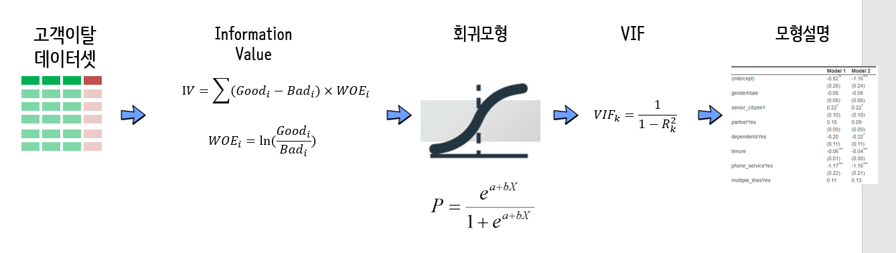

```{r setup, include=FALSE}
knitr::opts_chunk$set(echo = TRUE, message=FALSE, warning=FALSE,
                      comment="", digits = 3, tidy = FALSE, prompt = FALSE, fig.align = 'center')
```


# 고객이탈과 HR 이탈 {#hr-overview}

고객이탈은 영어로 “Customer Churn” 혹은 “Customer Attrition”이라고 하는데 통상적으로 고객이 더이상 서비스 이용이나 제품구매를 멈출 때 발생된다. 거의 모든 사업영역에서 고객이탈이 문제가 되지만, 특히 문제가 되는 분야가 통신(텔코, Tele-communication)산업으로 KT, SKT, U+ 등 통신3사가 거의 과점을 하고 있는 산업분야로 이해하면 된다.

과거 고객이탈에 대한 부분만 관심을 가졌다는 현재는 인적자원(Human Resource) 임직원 이탈이 부각되고 있다.


- [Turnover costs way more than you think](https://www.huffingtonpost.com/julie-kantor/high-turnover-costs-way-more-than-you-think_b_9197238.html)
    1. The Cost of Training and On-Boarding
    1. Interview Expenses
    1. Advertising Costs
    1. Lowered Engagement
    1. Productivity of New Hires
    1. Impact on Morale & The Gossip Machine
    1. Less Effective Service
- [Employee turnover is the highest its been in 10 years. Here's What To Do About It.](https://www.forbes.com/sites/jeffboss/2018/02/26/employee-turnover-is-the-highest-its-been-in-10-years-heres-what-to-do-about-it/)

인적자원 이탈을 두가지 형태로 나타난다.

- 자발적인 이직: 임직원이 사직하고 조직을 떠나는 경우.
    - 명목적인 이유 
      - 더 나은 기회를 찾아 이직
      - 건강상의 이유
      - 업무전환배치와 근무지 변경
      - 교육
      - 개인적 사유 外
    - 숨겨진 이유
      - 상급자와 관계
      - 급여인상율
      - 초과근무
      - 업무상 출장 거리
      - 직무 만족도
      - 정년보장
- 비자발적인 이직: 조직이 임직원을 사직하게 되는 경우.

데이터가 다양해졌고 많이 축적되었기 때문에 과거에 비해 인적자원 및 고객이탈 대한 원인파악 및 대책 수립이 가능하게 되었다.

## 데이터셋 {#hr-dataset}

- 고객 이탈(Telco Customer Churn - Focused customer retention programs): <https://www.kaggle.com/blastchar/telco-customer-churn/home>
- 임직원 이탈(Employee Attrition - Can you forecast employee attrition?): <https://www.kaggle.com/HRAnalyticRepository/employee-attrition-data/home>

임직원 이탈에 대한 내용보다 고객이탈에 대한 내용을 중심을 설명가능한 예측모형을 만들어 나갑니다.

## 작업흐름도 {#hr-dataset-workflow}

원데이터에 대한 정제작업이 마무리되면 Information Value를 통해 변수 선택과 변수내 수준도 적절한 형태로 조정한 후에 로지스틱 선형회귀모형에 적합시킨다. 이 과정에서 VIF를 통해 중복되는 변수도 걸러내고 최종 모형을 만들어 성능평가를 한후에 모형에 대한 이해와 커뮤니케이션을 위한 정리작업을 수행한다.




# 고객이탈 데이터 정제 {#hr-dataset-clean}

`.csv` 데이터를 `read_csv()`를 통해 불러와서 변수명과 변수 자료형을 향수 분석에 맞게 조정한다.

```{r dataset}
library(tidyverse)
library(readxl)
library(janitor)
library(skimr)

churn_dat <- read_csv("data/WA_Fn-UseC_-Telco-Customer-Churn.csv")

churn_df <- churn_dat %>% 
  clean_names()

churn_list <- skim_to_list(churn_df)

churn_df <- churn_df %>% 
  mutate(churn = factor(churn, levels = c("No", "Yes"))) %>% 
  mutate_at(vars(churn_list$character$variable), as.factor) %>% 
  mutate(senior_citizen = factor(senior_citizen)) %>% 
  select(-customer_id) %>% 
  mutate(multiple_lines    = ifelse(str_detect(multiple_lines, "No"), "No", "Yes"),
         internet_service  = ifelse(str_detect(internet_service, "No"), "No", "Yes"),
         online_security   = ifelse(str_detect(online_security, "No"), "No", "Yes"),
         online_backup     = ifelse(str_detect(online_backup, "No"), "No", "Yes"),
         device_protection = ifelse(str_detect(device_protection, "No"), "No", "Yes"),
         tech_support      = ifelse(str_detect(tech_support, "No"), "No", "Yes"),
         streaming_tv      = ifelse(str_detect(streaming_tv, "No"), "No", "Yes"),
         streaming_movies  = ifelse(str_detect(streaming_movies, "No"), "No", "Yes")) 
  
```

## 고객 이탈 통계 {#hr-dataset-turnover-statistics}

먼저 고객 이탈에 대한 통계를 산출한다. 이를 위해서 문자형을 정수형으로 변환하고 이탈은 `1` 잔존을 `0`으로 인코딩한 후에 `mean()` 함수로 평균을 낸다.

```{r iv-dataset-turnover-statistics}
churn_df %>% 
  summarise(churn_rate = mean(as.integer(churn)-1))
```

## 고객이탈 시각화 - 연속형 {#hr-dataset-turnover-viz}

`skimr` 팩키지 `skim_to_list()` 함수를 사용해서 변수 자료형을 문자형, 정수형, 숫자형, 부울형 등올 나눈후에 숫자형만 추출하여 이를 이탈목적변수(`churn`)와 교차하여 시각화한다.


```{r turnover-viz-eda-continuous}
library(ggridges)
library(cowplot)
## 2.1. 정적 시각화 -----
y_p <- churn_df %>%
    ggplot(aes(x = churn, fill = churn)) +
    geom_bar(alpha = 0.8) +
    scale_fill_manual(values = c("gray", "red")) +
    guides(fill = FALSE)

x_cont_p <- churn_df %>%
    select(churn, tenure, churn_list$numeric$variable) %>% 
    gather(variable, value, -churn) %>%
    mutate(value = as.integer(value)) %>% 
    ggplot(aes(x = value, y = churn, fill = churn)) +
    facet_wrap( ~ variable, scale = "free", ncol = 2) +
    scale_fill_manual(values = c("gray", "red")) +
    geom_density_ridges(alpha = 0.8) +
    guides(fill = FALSE, color = FALSE)

plot_grid(y_p, x_cont_p, rel_widths = c(1,3))
```

## 고객이탈 시각화 - 범주형 {#hr-dataset-turnover-viz-categorical}

동일하게 `skimr` 팩키지 `skim_to_list()` 함수를 사용해서 변수 자료형을 문자형, 정수형, 숫자형, 부울형 등올 나눈후에 문자형을 요인(factor)형 변환한 후에 이를 이탈목적변수(`churn`)와 교차하여 시각화한다.


```{r turnover-viz-eda-categorical, fig.width=10}
x_cat_p <- churn_df %>%
    select_if(is.factor) %>% 
    gather(variable, value, -churn) %>% 
    group_by(churn) %>% 
    count(variable, value) %>% 
    ungroup() %>% 
    ggplot(data = ., aes(x=value, y=n, fill=churn)) + 
      geom_col(position="dodge", width=0.7) +
      facet_wrap(~variable, scale = "free", ncol = 4) +
      scale_fill_manual(values = c("gray", "red")) +
      guides(fill = FALSE, color = FALSE)

plot_grid(y_p, x_cat_p, rel_widths = c(1,3))
```


# IV (information value) {#hr-dataset-iv}

`Information` 팩키지 `create_infotables()` 함수를 통해 IV를 쉽게 계산할 수 있다.
고객이탈에 영향을 많이 주는 변수를 예측변수를 사전에 선정하는데 참조한다.

|  Information value 	|  예측력(Predictive power)  |
|---------------------|----------------------------|
|        IV  <  0.15	|         Poor               | 
| 0.15 < IV < 0.4	    |        Moderate            |
|        IV > 0.4	    |         Strong             |


```{r iv-dataset}
library(Information) # install.packages("Information")

churn_iv_df <- churn_df %>% 
  mutate(churn = as.integer(churn) -1 )

churn_iv <- create_infotables(data=churn_iv_df, y="churn", bins=10, parallel=TRUE)

churn_iv$Summary %>% 
  mutate(Variable = fct_reorder(Variable, IV)) %>% 
  ggplot(aes(x=Variable, y=IV)) +
    geom_col() +
    coord_flip()

churn_iv$Summary %>% 
  top_n(6, wt=IV)

```


# 예측모형 생성 [^churn-model-parsnip] {#hr-dataset-turnover-predictive-model}

[^churn-model-parsnip]: [Matt Dancho (2020-12-15), "Logistic Regression in R | R-Tip 015", Business Science](https://www.youtube.com/watch?v=Qi-sVE0SWFc)

과거 `caret` 팩키지를 활용하여 훈련데이터와 검증데이터로 분리했다면, 
이번에는 `tidymodels`를 구성하는 `parsnip` 팩키지를 활용하여 로지스틱 회귀모형을 구현한다.

## 훈련/시험 데이터 생성 {#hr-dataset-feature-split}

먼저, 훈련/시험 데이터로 나눠 훈련데이터를 대상으로 고객이탈 예측모형을 개발한다.
`initial_split()` 함수로 전체 데이터를 7:3으로 훈련/시험 데이터로 분리할 수 있다.

```{r hr-dataset-train-test-split}
library(tidymodels)

churn_tbl <- churn_df %>% 
  mutate_if(is.character, as.factor) %>% 
  drop_na()

set.seed(777)

splits <- initial_split(churn_tbl, prop = 0.7, strata = churn)

splits
```

## 피처 공학 {#hr-dataset-predictive-model-fe}

피처 공학을 통해 먼저 범주형 데이터는 `step_other()` 함수로 One-hot 인코딩하고,
숫자형 변수는 정규화시킨다.

```{r hr-dataset-fe}
recipe_spec <- recipe(churn ~ ., data = training(splits)) %>% 
  step_other(all_nominal(), -all_outcomes()) %>% 
  step_normalize(all_numeric())

# recipe_spec %>% prep() %>% juice()
```


## 예측모형 생성 {#hr-dataset-predictive-model}

과적합을 방지하기 위해서 `car` 팩키지 `vif()` 함수를 사용해서 VIF가 **5** 이상되는 변수를 제거하여 강건한 예측모형을 생성했다.

|     VIF           |        Interpretation         |
|-------------------|-------------------------------|
| 1 < VIF           |       상관관계 없음           |
| 1 < VIF < 5       |     다소 상관관계 존재함      |
|     VIF > 5       |   심하게 상관관계 존재함      |

VIF가 5보다 큰 경우 해당 변수를 제거하고 회귀모형을 구축하고 더이상 VIF가 5보다 큰게 없는 경우까지 반복하는 과정을 거쳤다.

하지만, `tidymodels`로 바뀌게 되면 Feature Engineering은 `recipes`, 다양한 모형은 `parsnip`을 사용해서 정의하고 이를 `workflows`로 연결시키면 코드도 깔끔하고 나중에 유연하게 고성능 예측모형을 개발할 수 있게 된다.

```{r hr-dataset-variable-selection-vif}

model_spec <- logistic_reg( mode = "classification") %>%
    set_engine("glm")

wkfl_fit <- workflows::workflow() %>% 
  add_recipe(recipe_spec) %>% 
  add_model(model_spec) %>% 
  fit(training(splits))

wkfl_fit
```

## 예측모형 성능 {#hr-dataset-predictive-model-performance}

VIF를 통해 다공선성을 방지한 강건한 예측모형을 생성했는데 이에 대한 성능평가를 예측모형 구축에 사용되지 않은 `test_df` 데이터를 바탕으로 `caret` 팩키지 `confusionMatrix()` 함수로 평가했다.

`workflow` 객체를 `predict()` 함수에 넣어 시험데이터를 대상으로 고객이탈 여부와 확률을 산출하여 이를 데이터프레임으로 저장시킨다.

```{r hr-dataset-predictive-model-performance}
prediction_class_test <- predict(wkfl_fit, new_data = testing(splits), type = "class")

prediction_prob_test  <- predict(wkfl_fit, new_data = testing(splits), type = "prob")

results_tbl <- bind_cols(
    prediction_class_test,
    prediction_prob_test,
    testing(splits)
)
```

고객이탈 분류기 성능을 `roc_auc()` 함수로 추정할 수 있고, `autoplot()` 함수로 시각적으로 확이도 가능하다.

```{r hr-dataset-predictive-model-viz}
results_tbl %>%
    roc_auc(churn, .pred_Yes )

results_tbl %>%
    roc_curve(churn, .pred_Yes ) %>%
    autoplot(
        options = list(
            smooth = TRUE
        )
    ) +
    labs(title = "Area Under the Curve (AUC): 0.836")
```

# 예측모형 설명 {#hr-dataset-predictive-explain}

## 중요 변수 {#hr-dataset-predictive-explain-vip}

`workflow` 객체로부터 `parsnip` 객체를 뽑아내서 이를 `vip()` 함수에 넣어준다.
이를 통해, 중요변수로 `tenure`, `monthly_charges`를 확인할 수 있다.

```{r hr-dataset-predictive-explain}
library(vip)

# 중요변수 시각화
wkfl_fit$fit$fit %>%
    vip(
        num_features = 20,
        geom         = "point",
        aesthetics   = list(
            size     = 4,
            color    = "#18bc9c"
        )
    ) +
    theme_minimal(base_size = 18) +
    labs(title = "로지스틱 회귀모형 - 변수 중요도",
         y="중요도")
```

## 고객 이탈 설명 {#hr-dataset-predictive-explain-vip-boxplot}

중요변수로 `tenure`, `monthly_charges`를 고객이탈야부를 교차시켜 시각화한다.
월별 통신료가 높은 고객의 이탈율이 상대적으로 초기에 높은 것이 확인된다.

```{r hr-dataset-predictive-explain-box}
churn_tbl %>%
    ggplot(aes(tenure, monthly_charges, color = churn)) +
    geom_smooth(method = "loess") +
    geom_jitter(alpha = 0.25) +
    theme_minimal(base_size = 18) +
    scale_color_viridis_d(end = 0.4) +
    labs(title = "월별 통신료가 높은 고객의 이탈율이 높음",
         x     = "가입기간",
         y     = "월별 통신료",
         color = "이탈여부") +
    theme(legend.position = "top")
```


# 예측모형 활용 {#hr-dataset-predictive-model-application}

예측모형 성능을 확인한 후에 가장 이탈 위험이 많은 고객 상위 10을 뽑아 이를 다음 후속작업에 활용한다.
`tidypredict` 팩키지 `tidypredict_to_column()` 함수를 사용하면 깔끔하게 이탈확률이 높은 고객을 추려내는데 도움이 되는데,
따로 팩키지를 사용하지 말고 앞서 제작한 `results_tbl` 데이터프레임에 모든 정보가 담겨있어 이를 활용하여 이탈위험이 높은 고객 10명을 추려낸다.

```{r hr-dataset-predictive-model-predict-performance}
results_tbl %>%  
  select(-.pred_No) %>% 
  top_n(10, wt=.pred_Yes) %>% 
  DT::datatable() %>% 
    DT::formatPercentage(".pred_Yes", digits=1)
```


# 예측모형 커뮤니케이션  {#hr-dataset-predictive-model-communication}

`texreg` 팩키지 혹은 `stargazer` 팩키지를 통해 예측모형에 대한 사항을 정리하여 커뮤니케이션하기 용이하다.
마찬가지로 `workflow` 객체에서 `parsnip` 객체를 추출한다.

```{r hr-dataset-model-communication-html, results="asis"}
library(texreg)

# screenreg(list(churn_glm, best_glm), custom.note = "")
# htmlreg(list(churn_glm, best_glm), custom.note = "")

htmlreg(wkfl_fit$fit$fit, custom.note = "")
```


