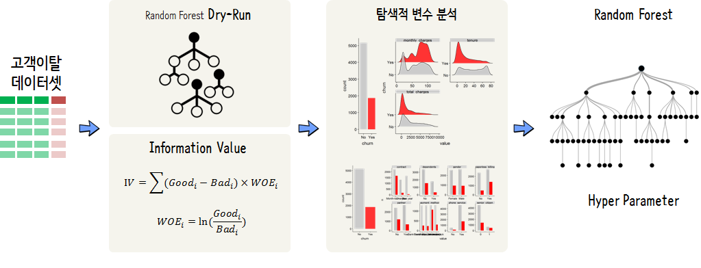

```{r setup, include=FALSE}
knitr::opts_chunk$set(echo = TRUE, message=FALSE, warning=FALSE,
                      comment="", digits = 3, tidy = FALSE, prompt = FALSE, fig.align = 'center')

```


# `random forest` 작업흐름도 {#hr-dataset-workflow}

`random forest` 방법론은 변수 선택, 변수 내 구분점, 결측값 처리 등을 자동으로 해주는 덕분에 앞부분에 변수(Feature)에 대한 별도 작업이 필요 없을 수도 있다. 하지만, 예측력이 뛰어나며 유지보수, 모형설명 측면 등을 고려했을 때 사전에 `Dry-Run`혹은 IV 방법론을 동원하여 예측모형 데이터 전처리 작업을 수행하는 것이 나름 의미가 있다.




# 고객이탈 데이터 정제 {#hr-dataset-clean}

`.csv` 데이터를 `read_csv()`를 통해 불러와서 변수명과 변수 자료형을 향수 분석에 맞게 조정한다.
앞서 로지스틱 회귀모형을 적합시키면서 데이터에 대한 전처리 작업은 마무리 되었기 때문에 바로 다음 단계로 넘어간다.

```{r dataset-rf}
library(tidyverse)
library(readxl)
library(janitor)
library(skimr)

churn_dat <- read_csv("data/WA_Fn-UseC_-Telco-Customer-Churn.csv")

churn_df <- churn_dat %>% 
  clean_names()

churn_list <- skim_to_list(churn_df)

churn_df <- churn_df %>% 
  mutate(churn = factor(churn, levels = c("No", "Yes"))) %>% 
  mutate(senior_citizen = factor(senior_citizen)) %>% 
  mutate(multiple_lines    = ifelse(str_detect(multiple_lines, "No"), "No", "Yes"),
         internet_service  = ifelse(str_detect(internet_service, "No"), "No", "Yes"),
         online_security   = ifelse(str_detect(online_security, "No"), "No", "Yes"),
         online_backup     = ifelse(str_detect(online_backup, "No"), "No", "Yes"),
         device_protection = ifelse(str_detect(device_protection, "No"), "No", "Yes"),
         tech_support      = ifelse(str_detect(tech_support, "No"), "No", "Yes"),
         streaming_tv      = ifelse(str_detect(streaming_tv, "No"), "No", "Yes"),
         streaming_movies  = ifelse(str_detect(streaming_movies, "No"), "No", "Yes"))  %>% 
  mutate_at(vars(churn_list$character$variable), as.factor) %>% 
  select(-customer_id) %>% 
  filter(complete.cases(.))
  
```


# 예측모형 생성 - `Dry-Run` {#rf-hr-dataset-turnover-predictive-model}

## 사전 설정 {#rf-hr-dataset-feature-split}

일반화 선형모형이 갖는 장점중의 하나는 상대적으로 컴퓨팅 파워를 적게 필요로 한다는 점이다. 하지만, 이런 장점이 예측모형의 성능을 상대적으로 저하되는 원인이 되기도 한다. Random Forest 및 관련된 다양한 최신 예측 알고리즘은 예측성능은 뛰어나지만 이에 못지 않게 모형개발자가 해야 될 일은 컴퓨터가 대신하기 때문에 이에 대한 설정을 다음과 같이 한다.

1. `caret` 팩키지를 활용하여 훈련데이터와 검증데이터로 분리한다.
    - Out-of-sample 모형 성능평가
1. 훈련데이터를 모형데이터와 검증데이터로 분리한다.
    - In-sample 모형 과적합 방지
1. 병렬컴퓨팅(멀티코어)
    - 부츠트랩 표본을 바탕으로 병렬처리를 통해 Random Forest 학습시간 단축

```{r rf-hr-dataset-train-test-split}
library(caret)
library(randomForest)

## 1. 훈련/시험 데이터 생성
index_train <- createDataPartition(churn_df$churn, p = 0.1, list = FALSE)

train_df <- churn_df[index_train, ]
test_df  <- churn_df[-index_train, ]

## 2. 모형검증 데이터셋 생성

cv_folds <- createMultiFolds(train_df$churn, k = 3, times = 3)

cv_ctrl <- trainControl(method = "repeatedcv", number = 3,
                         repeats = 3, index = cv_folds,
                         summaryFunction = twoClassSummary,
                         verbose=TRUE,
                         classProbs=TRUE,
                         allowParallel = TRUE,
                         search = "random")

hp_grid <- expand.grid(mtry  = c(2,5,7),    
                       ntree = c(100, 500))


## 3. 병렬 컴퓨팅 환경설정 ------
library(doSNOW)
# 실행시간
start.time <- Sys.time()

cl <- makeCluster(4, type = "SOCK")
registerDoSNOW(cl)
```

## 예측모형 생성/학습 {#rf-hr-dataset-predictive-model}

본격적인 학습을 시작한다.

```{r rf-hr-dataset-variable-selection-vif}
churn_rf  <- train(churn ~ ., data = train_df, 
                   method = "rf",
                   trControl = cv_ctrl, 
                   tuneLength = 15,
                   # tuneGrid = hp_grid,
                   metric = "Spec",
                   importance = TRUE)

stopCluster(cl)
 
total.time <- Sys.time() - start.time
total.time
```

## 예측모형 중요정보 {#hr-dataset-predictive-model-performance}

`tuneLength=15`를 통해 초모수(hyper parameter)에 대한 무작위 검색(random search)를 수행해서 `mtry` 값이 2라는 것을 찾아낸다. 그리고 중요 변수 10를 추려낸다.

```{r hr-dataset-predictive-model-performance}
library(ggRandomForests)
library(pdp)

churn_vip <- varImp(churn_rf)

# 전체 변수 중 50%만 사용하기로 함.  
important_variable <- churn_vip$importance %>% rownames_to_column("variable") %>% 
  top_n(10, wt=Yes) %>% 
  pull(variable)

which_two_pcnt <- tolerance(churn_rf$results, metric = "ROC", 
                         tol = 2, maximize = TRUE)  

churn_rf$results[which_two_pcnt,]
```

# 예측모형 생성 및 설명 [^rf-explain] [^rf-vip] {#rf-hr-dataset-turnover-predictive-model-explain}

[^rf-explain]: [Vishal Sharma(June 9, 2017), "Quick Introduction to Partial Dependence Plots"](http://rpubs.com/vishal1310/QuickIntroductiontoPartialDependencePlots)

[^rf-vip]: [vip: Variable Importance Plots](https://koalaverse.github.io/vip/index.html)

## 변수중요도 {#rf-hr-dataset-turnover-predictive-model-explain-vi}

`xgboost`, `ranger`, `rpart`... 모두 변수 중요도를 나타내는 함수를 갖고 있지만, 데이터도 다르고 함수명도 다르다. [`vip`](https://github.com/koalaverse/vip/) 팩키지는 이런 면에서 변수중요도를 기반 의사결정 나무모형과 독립적으로 변수중요도만 추출해 준다는 점에서 의미가 있다.


```{r rf-hr-dataset-variable-prediction-vi}
library(randomForest)
library(pdp)
library(vip)

# churn_vi <- vi(churn_rf$finalModel, method="ice")

vip(churn_rf$finalModel, num_features=10L, width = 0.5, fill = "green3", color="green1")
```


# 목표 응답변수 연관 {#hr-dataset-predictive-model-explain-dependency}


```{r rf-hr-ggrandomforests-explain-dependency, eval=FALSE}
library(gridExtra)

features <- churn_rf$finalModel$importance %>% as.data.frame() %>%
  rownames_to_column(var="variable") %>% top_n(10, wt=No) %>% 
  arrange(desc(No)) %>% 
  pull(variable)

pdps <- lapply(features, FUN = function(feature) {
  pd <- partial(churn_rf$finalModel, pred.var = feature, train = test_df)
    autoplot(pd) + 
    theme_light()
})

partial(churn_rf$finalModel, pred.var = monthly_charges, train = train_df)

grid.arrange(grobs = pdps, ncol = 5)
```

