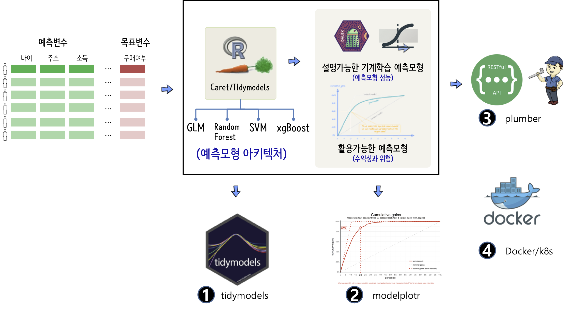

```{r setup, include=FALSE}
knitr::opts_chunk$set(echo = TRUE, message=FALSE, warning=FALSE,
                      comment="", digits = 3, tidy = FALSE, prompt = FALSE, fig.align = 'center')

```


# 콘텐츠 개발 배경 [^cloudera-lime] {#cloudera-contents}

Software Carpentry Instructor로 "Cloudera Conference 2018 - Seoul: 기계의 역습 - 설명가능한 기계학습"으로 발표를 하게 되면서 작성된 교육 콘텐츠

<iframe width="400" height="250" src="https://www.youtube.com/embed/K_TGdklC504" frameborder="0" allow="accelerometer; autoplay; encrypted-media; gyroscope; picture-in-picture" allowfullscreen></iframe>

[^cloudera-lime]: [Cloudera Conference 2018 - Seoul: 기계의 역습 - 설명가능한 기계학습](https://www.clouderasessionsseoul.com/agenda.php)

# 기본 예측모형 확장 {#cloudera-predictive-model-extension}

클라우데라 2018년 발표한 설명가능한 기계학습 모형에 몇가지 기능을 더 추가하여 확장한다.

- [`tidymodels`](https://github.com/tidymodels)
- [`modelplotr`](https://modelplot.github.io/)
- [`plumber`](https://www.rplumber.io/)
- [도커와 쿠버네티스](https://subicura.com/2019/05/19/kubernetes-basic-1.html) 


{#id .class width="100%"}

