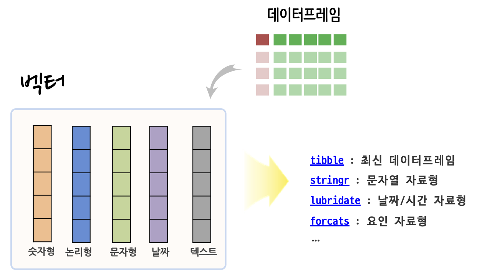

```{r setup, include=FALSE}
knitr::opts_chunk$set(echo = TRUE, message=FALSE, warning=FALSE,
                      comment="", digits = 3, tidy = FALSE, prompt = FALSE, fig.align = 'center')

```


# 데이터 정제 {-#data-cleaning-type}

데이터 정제(data cleaning) 과정은 원데이터를 모형개발과 시각화를 위해 적절하게 처리하는 것으로 볼 수 있다. 이를 위해서 자료구조를 맞추는 것, 중복이 없도록 하는 것, 결측값을 해결하는 것 등 다양한 사항이 포함된다.

# 자료형 [^data-type-in-r] {#data-type}

[^data-type-in-r]: [데이터 과학 - 측도와 R 자료구조](https://statkclee.github.io/data-science/ds-data-structure.html)

[외부에서 다양한 데이터](https://statkclee.github.io/ingest-data/)를 R로 가져오게 되면 통상 데이터프레임에 담기게 되고 이를 각 자료형에 맞도록 자료형을 맞추는 작업이 가장 먼저 수행되는 데이터 정제 작업 중 하나다.



예제로 [제19대 대통령 선거 득표결과](http://info.nec.go.kr/)를 담고 있는 엑셀파일을 다운로드받아 이를 정제한다. 먼저 시도명과 나머지 데이터를 보게 되면 모두 문자열로 되어 있는 것을 확인할 수 있다.

```{r data-type-example}
library(tidyverse)
library(readxl)

dirty_dat <- read_excel("data/president.xlsx", sheet = "Sheet1", skip=4)

dirty_df <- dirty_dat %>% 
  select(1:8) %>% 
  set_names(c("시도명", "선거인수", "투표수", "문재인", "홍준표", "안철수", "유승민", "심상정")) %>% 
  slice(2:n())

dirty_df %>% 
  DT::datatable()
```

이를 시도명은 총 17개가 있어 범주를 한정하고 이를 요인형(factor) 자료형으로 맞춰야 하고, 선거인수, 투표수 등은 정수형 혹은 숫자형으로 변환을 시켜둬야 의미가 있는 데이터로 탈바꿈된다.

```{r data-type-example-clean}
( dirty_df <- dirty_df %>% 
  mutate(시도명 = factor(시도명)) %>% 
  mutate(선거인수 = parse_number(선거인수),
         투표수 = str_remove_all(투표수, ",") %>% as.integer) )
```

앞선 방식은 데이터에 대해 친숙하고, 다년간 경험이 쌓은 경우 적절한데, 사실 이전에 `is.*()` 함수를 사용해서 자료형을 확인하는 것도 가능하다. 2016년 작성된 `assertive` 팩키지는 이를 확장하여 다양한 경우에 직관적인 구문을 제공하여 생산성을 높였다.
자료형을 변환시킬 경우 `as.*()` 방식으로 기존 자료형을 적절한 자료형으로 변환시킬 수 있다.

<div class = "row">
  <div class = "col-md-6">
**`is.*()` 판별식**

- `is.logical()`
- `is.factor()`
- `is.numeric()`
- `is.character()`
- `is.Date()`
- `is.data.frame()`
- `is.list()`

  </div>
  <div class = "col-md-6">
**`assertive` 팩키지 판별식**

- `assert_is_logical()`
- `assert_is_factor()`
- `assert_is_numeric()`
- `assert_is_character()`
- `assert_is_date()`
- `assert_is_data.frame()`
- `assert_is_list()`

  </div>

  <div class = "col-md-6">
**자료형 변환**

- `as.logical()`
- `as.factor()`
- `as.numeric()`
- `as.character()`
- `as.date()`
- `as.data.frame()`
- `as.list()`

  </div>  
</div>

# 범위값 확인 {#data-cleaning-range-constraint}

