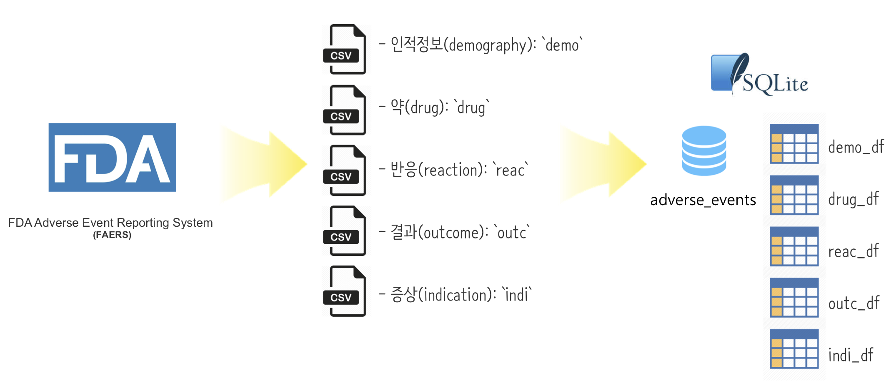

 

```{r, include=FALSE}
source("tools/chunk-options.R")

knitr::opts_chunk$set(echo = TRUE, message=FALSE, warning=FALSE,
                      comment="", digits = 3, tidy = FALSE, prompt = TRUE, fig.align = 'center')

library(tidyverse)
```




# 약물 부작용 데이터 [^database-with-r] {#dataset}

[^database-with-r]: [Fisseha Berhane ( June 27, 2018), 'Working with databases in R', Data Science +](https://datascienceplus.com/working-with-databases-in-r/)

약을 복용했을 때, 이상증상이 발생되면 미국 식약처, FDA에서 운영중인 
미국 FDA 부작용 사례 보고 시스템(FDA Adverse Event Reporting System)에 관련 내용을 등록시킬 수 있다. 약과 관련된 부작용에 대한 사례를 등록할 때 인적정보(demography), 약(drug), 반응(reaction)과 결과(outcome), 증상(indication)에 대한 정보를 제출하게 되어있다.

- 인적정보(demography): `demo`
- 약(drug): `drug`
- 반응(reaction): `reac`
- 결과(outcome): `outc`
- 증상(indication): `indi`

2018년부터 분기별로 2019년 현재시점까지 가능한 `.csv.zip` 데이터를 `download.file()` 함수로 다운로드 받아 `unzip()` 함수로 압축을 풀어 `.csv` 파일로 저장시킨다.

```{r dataset-datascience, eval=FALSE}
library(tidyverse)
library(lubridate)
library(download)

year_start <- 2018
year_last <- year(Sys.time())
for (i in year_start:year_last){
  for (m in 1:4){
    url1 <- paste0("http://www.nber.org/fda/faers/",i,"/demo",i,"q",m,".csv.zip")
        download.file(url1, dest=paste0("data/", "demo", i, "q", m, ".csv.zip")) # Demography
        unzip(paste0("data/demo", i, "q", m, ".csv.zip"), exdir="data/")
    url2<-paste0("http://www.nber.org/fda/faers/",i,"/drug",i,"q",m,".csv.zip")
        download.file(url2, dest=paste0("data/", "drug", i, "q", m, ".csv.zip")) # Drug
        unzip(paste0("data/drug", i, "q", m, ".csv.zip"), exdir="data/")
    url3<-paste0("http://www.nber.org/fda/faers/",i,"/reac",i,"q",m,".csv.zip")
        download.file(url3, dest=paste0("data/", "reac", i, "q", m, ".csv.zip")) # Reaction
        unzip(paste0("data/reac", i, "q", m, ".csv.zip"), exdir="data/")
    url4<-paste0("http://www.nber.org/fda/faers/",i,"/outc",i,"q",m,".csv.zip")
        download.file(url4, dest=paste0("data/", "outc", i, "q", m, ".csv.zip")) # Outcome
        unzip(paste0("data/outc", i, "q", m, ".csv.zip"), exdir="data/")
    url5<-paste0("http://www.nber.org/fda/faers/",i,"/indi",i,"q",m,".csv.zip")
        download.file(url5, dest=paste0("data/", "indi", i, "q", m, ".csv.zip")) # Indication for use
        unzip(paste0("data/indi", i, "q", m, ".csv.zip"), exdir="data/")
  }
}

```

## 인적사항(demography) {#fda-demography}

```{r demography-data}
demo_filenames <- list.files(path="data", pattern="^demo.*.csv", full.names=TRUE)

demo_df <- map_df(demo_filenames, read_csv) %>% 
  select(primaryid, caseid, age, age_cod, event_dt,
         sex, wt, wt_cod, occr_country)

glimpse(demo_df)
```

## 약(drug) {#fda-drug}

```{r drug-data}
drug_filenames <- list.files(path="data", pattern="^drug.*.csv", full.names=TRUE)

drug_df <- map_df(drug_filenames, read_csv) %>% 
  select(primaryid, drug_seq, drugname, route)

glimpse(drug_df)
```

## 반응(reaction) - 이상증상(Adverse Effect) {#fda-reaction}

```{r reaction-data}
reaction_filenames <- list.files(path="data", pattern="^reac.*.csv", full.names=TRUE)

reac_df <- map_df(reaction_filenames, read_csv) %>% 
  select(primaryid, pt)

glimpse(reac_df)
```

## 결과(outcome) {#fda-outcome}

```{r outcome-data}
outcome_filenames <- list.files(path="data", pattern="^outc.*.csv", full.names=TRUE)

outc_df <- map_df(outcome_filenames, read_csv) %>% 
  select(primaryid, outc_cod)

glimpse(outc_df)
```

##  진단/증상(indication) {#fda-indication}

```{r indication-data}
indi_filenames <- list.files(path="data", pattern="^indi.*.csv", full.names=TRUE)

indi_df <- map_df(indi_filenames, read_csv) %>% 
  select(primaryid , indi_drug_seq, indi_pt)

glimpse(indi_df)
```


# 데이터베이스 생성 {#create-database}

`fda_database` 데이터베이스를 생성시키고 `copy_to` 명령어로 데이터베이스에 테이블을 추가시킨다.

```{r create-database}
## 데이터 베이스 생성
fda_database<- src_sqlite("adverse_events", create = TRUE)
## 테이블 추가
copy_to(fda_database, demo_df, temporary = FALSE, overwrite = TRUE) 
copy_to(fda_database, drug_df, temporary = FALSE, overwrite = TRUE) 
copy_to(fda_database, indi_df, temporary = FALSE, overwrite = TRUE) 
copy_to(fda_database, reac_df, temporary = FALSE, overwrite = TRUE) 
copy_to(fda_database, outc_df, temporary = FALSE, overwrite = TRUE) 
```

## 데이터베이스 연결 {#connect-database}

`create = FALSE` 인자를 넣어 "adverse_events" 데이터베이스에 연결하고 조회할 수 있는 테이블을 `src_tbls()` 함수로 확인한다.

```{r connect-database}
fda_db <- src_sqlite("adverse_events", create = FALSE)
src_tbls(fda_db)
```

# 데이터베이스 쿼리 {#query-database}

인터넷에서 데이터를 다운로드 받아 데이터베이스에 저장시킨 후에 SQL문을 작성해서 데이터 분석 작업을 수행해도 좋지만, R `dplyr` 문법을 사용해서 데이터 분석 작업을 수행하는 것도 가능하다.

## 헬로월드 {#query-database-helloworld}

`fda_df` 데이터베이스에서 `demo_df` 테이블을 추출하여 R **데이터프레임**으로 메모리에 `demography_df` 라는 객체를 만든다. 

```{r query-database-helloworld}
demography_df <-  tbl(fda_db, "demo_df" )

class(demography_df)

head(demography_df, 3)
```

## 작동원리 {#query-database-mechansm}

`dplyr` 문법에 맞춰 정형데이터 데이터프레임에 대한 쿼리를 작성하게 되면 `dplyr`에서 데이터베이스에 맞게 SQL 문을 자동으로 작성해서 데이터베이스에서 쿼리 결과를 가져오게 된다.

```{r query-database-mechanism}
KR <- demography_df %>% 
  filter(occr_country == "KR")

KR

show_query(KR)

explain(KR)
```

하지만, `tail()`은 동작하지 않는데 이유는 명확하다. 이를 원하면 전체 테이블을 `collect()` 명령으로 가져와서 R 데이터프레임으로 변환시킨 후에 `tail()` 명령어를 던지면 된다.

```{r query-database-mechanism-query, error=TRUE}
tail(demography_df)
```

```{r query-database-mechanism-query-tail, error=TRUE}
demography_df %>% 
  collect() %>% 
  tail
```

# 사례 {#fda-case-study}

국가별 약물 사건사고 건수에 대해 사우이 10개 국가를 뽑아내는 통계를 `demography_df` 데이터베이스 테이블 객체에 대해 `dplyr` 동사로 진행을 한 후에 `collect()` 명령어로 R 메모리에 데이터프레임 객체로 변환시킨 후에 `ggplot` 막대그래프로 시각화한다.

```{r fda-query-case}
country_df <- demography_df %>% 
  group_by(Country = occr_country) %>% 
  summarize(Total=n()) %>%      
  arrange(desc(Total)) %>%       
  filter(Country != '')

country_df %>% 
  collect() %>% 
  top_n(10, wt =  Total) %>% 
  ggplot(aes(x=fct_reorder(Country,Total), y=Total))  +
    geom_bar(stat='identity', color='skyblue', fill='#b35900') +
    labs(title = 'Top ten countries with highest number of adverse event reports', 
         x = "",
         y = 'Total number of reports') +
    coord_flip()
```

# 테이블 결합 {#fda-case-study-table}

관계형 데이터베이스의 장점은 복잡한 데이터 관계를 `primaryid`같은 키를 활용하여 테이블을 구조화하여 관리용이성을 증가시키고 효율성을 키울수 있다는 점이다. 반대로 데이터를 분석할 경우 관계형 데이터베이스 테이블을 결합(join)하여 추가 분석 작업을 용이하게 한다. 

```{r fda-table-join}
outcome_df  <- tbl(fda_db, "outc_df" )
reaction_df <- tbl(fda_db, "reac_df" )

demography_df %>% 
  inner_join(outcome_df, by='primaryid', copy = TRUE) %>%
  inner_join(reaction_df, by='primaryid', copy = TRUE) %>% 
  count(outc_cod, pt)
```


# 데이터베이스 마무리 {#fda-case-study-close}

`rm()`, `gc()`를 하게 되면 깔끔하게 `sqlite` 데이터베이스 연결을 마무리고 정리한다.

```{r sqlite-remove}
rm(); gc()
```


