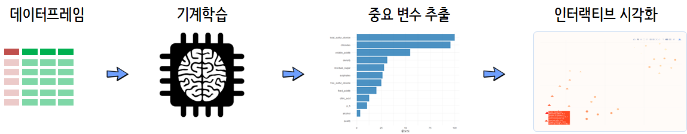

 
``` {r, include=FALSE}
source("tools/chunk-options.R")

knitr::opts_chunk$set(echo = TRUE, message=FALSE, warning=FALSE,
                      comment="", digits = 3, tidy = FALSE, prompt = TRUE, fig.align = 'center')


```

# 지도학습 모형과 EDA [^viz-model-shirin] {#model-supervised-viz}

[^viz-model-shirin]: [Shirin playgRound (July 20, 2018), "Explaining Black-Box Machine Learning Models - Code Part 1: tabular data + caret + iml"](https://shirinsplayground.netlify.com/2018/07/explaining_ml_models_code_caret_iml/)

데이터 시각화하는 과정은 엄청 노동집약적인 과정이다. 혹자는 고용창출시스템이라고도 하지만,
다른 한편으로는 데이터 분석을 시각화를 통해 구현하는 입장에서는 저녁이 없는 삶이기도 하다.
"저녁이 있는 삶"을 위해서 기계학습을 도입하여 데이터에서 유의미한 정보를 추출하는 기계적인 과정을 기계에 맡기고 추출된 주요 변수를 바탕으로 시각화 후속작업을 수행하게 되는 것을 추진해보자.



# 적포도주, 백포도주 분류 기계학습 {#model-eda-wine}

## 포도주(wine) 데이터 [^wine-data] {#model-eda-wine-data}

[^wine-data]: [Wine Quality: Modeling wine preferences by data mining from physicochemical properties.](https://www.kaggle.com/danielpanizzo/wine-quality)

[Wine Quality](https://www.kaggle.com/danielpanizzo/wine-quality) 데이터를 다운로드 받아,
적포도주, 백포도주 변수에 수준(level)을 정의해서 하나의 데이터프레임으로 생성시킨다.

1. fixed acidity: most acids involved with wine or fixed or nonvolatile (do not evaporate readily)
1. volatile acidity: the amount of acetic acid in wine, which at too high of levels can lead to an unpleasant, vinegar taste
1. citric acid: found in small quantities, citric acid can add ‘freshness’ and flavor to wines
1. residual sugar: the amount of sugar remaining after fermentation stops, it’s rare to find wines with less than 1 gram/liter and wines with greater than 45 grams/liter are considered sweet
1. chlorides: the amount of salt in the wine
1. free sulfur dioxide: the free form of SO2 exists in equilibrium between molecular SO2 (as a dissolved gas) and bisulfite ion; it prevents microbial growth and the oxidation of wine
1. total sulfur dioxide: amount of free and bound forms of S02; in low concentrations, SO2 is mostly undetectable in wine, but at free SO2 concentrations over 50 ppm, SO2 becomes evident in the nose and taste of wine
1. density: the density of water is close to that of water depending on the percent alcohol and sugar content
1. pH: describes how acidic or basic a wine is on a scale from 0 (very acidic) to 14 (very basic); most wines are between 3-4 on the pH scale
1. sulphates: a wine additive which can contribute to sulfur dioxide gas (S02) levels, wich acts as an antimicrobial and antioxidant
1. alcohol: the percent alcohol content of the wine
1. wine: red or wine, 두 데이터프레임을 결합하여 변수로 추가함.

``` {r model-eda-wine-data}
# 0. 환경설정 ------
library(tidyverse)
library(caret)
library(janitor)
library(ggridges)
library(ggthemes)
library(cowplot)
library(corrplot)
library(corrr)
library(plotly)
library(crosstalk)

# 1. 데이터 ------
red_dat <- read_csv("data/wineQualityReds.csv") %>% 
    mutate(wine="red")

white_dat <- read_csv("data/wineQualityWhites.csv") %>% 
    mutate(wine="white")

wine_df <- bind_rows(red_dat, white_dat) %>% 
    clean_names() %>% 
    select(-x1) %>% 
    mutate(wine=factor(wine, levels = c("red", "white"))) %>% 
    filter(complete.cases(.))
```


## 기계학습 모형 {#model-eda-wine-data-caret}

`caret` 팩키지로 백포도주와 적포도주 판별에 주요한 요인을 미치는 변수를 `random forest`를 
사용해서 뽑아본다. 이를 위해서 훈련, 시험데이터로 나누고 변수에 대한 전처리 작업을 수행하고 
교차 타당도(`repeatedcv`)를 5개로 나눠 3회 실시할 때 `random forest`를 모형 기본 아키텍처로 설정한다.

전반적인 모형 성능을 `wine_test` 표본으로 성능을 평가한다.

``` {r model-eda-wine-data-caret}
# 2. 기계학습 ------
## 2.1. 훈련/시험 데이터 분할 ------
idx <- createDataPartition(wine_df$wine, 
                           p = 0.7, 
                           list = FALSE, 
                           times = 1)

wine_train <- wine_df[ idx,]
wine_test  <- wine_df[-idx,]

## 2.2. 모형적합 ------
fit_ctrl <- trainControl(method = "repeatedcv", number = 5, repeats = 3)

wine_rf <- train(wine ~ ., 
                  data = wine_train, 
                  method = "rf", 
                  preProcess = c("scale", "center"),
                  trControl = fit_ctrl,
                  verbose = FALSE)

## 2.3. 모형성능평가 ------
test_predict <- predict(wine_rf, wine_test)
confusionMatrix(test_predict, wine_test$wine)
```

## 중요 변수 추출 {#model-eda-wine-data-caret-importance}

`varImp()` 함수로 `random forest` 모형에 백포도주와 적포도주를 분류하는데 중요한 역할을 수행한 변수를 추출하여 
시각화한다. 변수가 많고 관측점이 많은 경우 시각화에 시간이 많이 걸리고 속도가 늦은 단점이 많아 상위 중요 변수 몇개만 추출한다.

``` {r model-eda-wine-data-caret-importance}
# 3. 모형 설명 -----
## 3.1. 중요변수 추출 -----
wine_rf_imp <- varImp(wine_rf, scale = TRUE)

(top_three_variable_v <- wine_rf_imp$importance %>%
    as.data.frame() %>%
    rownames_to_column(var="variable") %>% 
    top_n(3, Overall) %>% 
    pull(variable))

## 3.2. 중요변수 시각화 -----
wine_rf_imp$importance %>%
    as.data.frame() %>%
    rownames_to_column(var="variable") %>%
    ggplot(aes(x = reorder(variable, Overall), y = Overall)) +
    geom_bar(stat = "identity", fill = "#1F77B4", alpha = 0.8) +
    coord_flip() +
    labs(y="중요도", x="") +
    theme_minimal(base_family="NanumGothic")
```


# 지도학습 모형 시각화 {#model-eda-wine-viz}

기계학습을 통해서 `r paste0(top_three_variable_v, collapse=", ")` 변수가 
다른 변수에 비해서 포도주 분류에 중요한 역할을 수행하는 것을 확인했다. 이를 염두에 두고 시각화를 진행해 보자.

## 정적 시각화 {#model-eda-wine-data-viz}

포도주 분류가 목적이기 때문에 예측변수와 예측에 동원되는 설명변수를 시각화한다.

``` {r model-eda-wine-data-viz}
# 2. 탐색적 데이터 분석 ------
## 2.1. 정적 시각화 -----
y_p <- wine_df %>%
    ggplot(aes(x = wine, fill = wine)) +
    geom_bar(alpha = 0.8) +
    scale_fill_manual(values = c("red", "gray")) +
    guides(fill = FALSE)

x_p <- wine_df %>%
    gather(variable, value, fixed_acidity:quality) %>%
    ggplot(aes(x = value, y = wine, color = wine, fill = wine)) +
    facet_wrap( ~ variable, scale = "free", ncol = 3) +
    scale_color_manual(values = c("red", "gray")) +
    scale_fill_manual(values = c("red", "gray")) +
    geom_density_ridges(alpha = 0.8) +
    guides(fill = FALSE, color = FALSE)

plot_grid(y_p, x_p, rel_widths = c(1,3))
```

## 인터랙티브 시각화 {#model-eda-wine-data-viz-interactive}

`crosstalk`를 통해 예측변수와 설명변수를 연결하고 이를 `plotly` 팩키지로 인터랙티브 시각화한다.

``` {r model-eda-wine-data-viz-interactive, fig.width=10}
## 2.2. 인터랙티브 시각화 -----
# https://github.com/clauswilke/ggridges/issues/12

wine_lng_df <- wine_df %>%
    gather(variable, value, fixed_acidity:quality)

wine_lng_sd <- SharedData$new(wine_lng_df)

wine_y_g <- wine_lng_sd %>%
    ggplot(aes(x = wine, fill = wine)) +
    geom_bar(alpha = 0.8) +
    scale_fill_manual(values = c("red", "gray")) +
    guides(fill = FALSE)

wine_x_g <- wine_lng_df %>% 
    ggplot(aes(x = value, group=wine, color = wine, fill = wine)) +
    geom_density(alpha = 0.8) +
    facet_wrap(~variable, scales="free") +
    scale_color_manual(values = c("red", "gray")) +
    scale_fill_manual(values = c("red", "gray")) +
    guides(fill = FALSE, color = FALSE)

subplot(wine_y_g, wine_x_g, nrows=1, widths=c(0.2, 0.4)) %>% highlight("plotly_click") %>% hide_legend()
```

## 교차분석 {#model-eda-wine-data-viz-interactive-cross}

기계학습 모형으로 추출한 변수를 대상으로 교차분석을 수행한다. 앞선 교차분석이 예측변수에 초점을 두었다면,
여기서는 설명변수가 사이의 교차분석에 관심을 둔다.

``` {r model-eda-wine-data-viz-interactive-cross}
## 2.3. 교차분석 -----
### 중요변수만 추출한 데이터프레임 
# top_three_variable_v <- c("volatile_acidity", "chlorides", "total_sulfur_dioxide")

wine_key_df <- wine_df %>% 
    select(top_three_variable_v, wine)

### 정적 교차그래프
GGally::ggpairs(wine_key_df, aes(color=wine, alpha=0.7))
    
### 인터랙티브 교차그래프
wine_sd <- wine_key_df %>% sample_frac(0.1) %>% SharedData$new(.)
wine_xy_g <- GGally::ggpairs(wine_sd, aes(color=wine, alpha=0.7))
highlight(ggplotly(wine_xy_g), on = "plotly_selected")
```

## 상관분석 [^moon-corrplot] {#model-eda-wine-data-viz-interactive-cor}

[^moon-corrplot]: [corrplot 패키지 소개](https://rpubs.com/cardiomoon/27080)

### 정적 상관표 {#model-eda-wine-data-viz-interactive-corrplot}


범주형 예측변수(포도주)를 제외한 나머지 설명변수 전체를 대상으로 피어슨 상관분석을 수행하고,
`corrplot` 팩키지를 통해서 시각화한다. 문건웅님이 작성한 `cor_mtest()` 함수를 활용하여 유의성도 검정도 수행한다.

``` {r model-eda-wine-data-viz-interactive-corrplot}
## 2.4. 상관분석 -----

### 2.4.1. 상관계수 시각화
wine_cor <- wine_df %>% 
    select(-wine) %>% 
    cor(method="pearson")

cor_mtest <- function(mat, conf.level = 0.95) {
    mat <- as.matrix(mat)
    n <- ncol(mat)
    p.mat <- lowCI.mat <- uppCI.mat <- matrix(NA, n, n)
    diag(p.mat) <- 0
    diag(lowCI.mat) <- diag(uppCI.mat) <- 1
    for (i in 1:(n - 1)) {
        for (j in (i + 1):n) {
            tmp <- cor.test(mat[, i], mat[, j], conf.level = conf.level)
            p.mat[i, j] <- p.mat[j, i] <- tmp$p.value
            lowCI.mat[i, j] <- lowCI.mat[j, i] <- tmp$conf.int[1]
            uppCI.mat[i, j] <- uppCI.mat[j, i] <- tmp$conf.int[2]
        }
    }
    return(list(p.mat, lowCI.mat, uppCI.mat))
}

wine_cor_test <- cor_mtest(wine_cor)

corrplot.mixed(wine_cor, lower="color", upper="number", p.mat=wine_cor_test[[1]], sig.level=0.05,
               order = "hclust", addrect = 2)
```

### 인터랙티브 상관계수 {#model-eda-wine-data-viz-interactive-corrplot-plotly}

`corrr` 팩키지를 사용해서 행렬 상관계수 자료형을 데이터프레임으로 변환시켜 이를 `ggplot()`에 넣어 
각 변수간 상관계수를 시각화하고, 이를 `ggplotly()` 함수에 넣어 인터랙티브하게 시각화시킨다.

``` {r model-eda-wine-data-viz-interactive-corrplot-plotly}
### 2.4.2. 상관계수 분포

wine_cor_df <- wine_df %>% 
    select(-wine) %>% 
    correlate() %>%
    shave(upper = TRUE) %>% # (3)
    stretch(na.rm = TRUE)

wine_cor_g <- wine_cor_df %>% 
    ggplot(aes(x=x, y=y, size=abs(r), color=r, text=paste0("x: ", x,"\n",
                                                           "y: ", y, "\n", 
                                                           "상관계수:", round(r, 2)))) +
      geom_point() +
      scale_colour_gradient2(low = "blue", mid = "white", high = "red") +
      labs(x="", y="", color="상관계수") +
      theme(axis.text.x = element_text(angle = 40, hjust = 1))

ggplotly(wine_cor_g, tooltip="text")
```

### 변수 군집분석 [^variable-clustering] {#model-eda-wine-data-viz-interactive-corrplot-cluster}

[^variable-clustering]: [Cluster Analysis in R, Last update: 11 May, 2018](http://girke.bioinformatics.ucr.edu/GEN242/pages/mydoc/Rclustering.html#42_distance_matrices)

상관분석을 통해 유사성이 높은 변수를 시각적으로 확인을 한 후에 군집분석 알고리즘 동원해서 시각화하자.

``` {r model-eda-wine-data-viz-interactive-corrplot-cluster}
### 2.4.3. 상관계수 군집분석
par(mfrow=c(2,2))
corrplot(wine_cor, order = "hclust", addrect = 3)

### 정적 그래프

wine_dist <- as.dist(1-wine_cor)
wine_hr <- hclust(wine_dist, method = "complete", members=NULL)
wine_cluster  <- cutree(wine_hr, 3)

wine_var_color <- RColorBrewer::brewer.pal(3, "Set1")

plot(ape::as.phylo(wine_hr),  edge.col=4, edge.width=2, show.node.label=TRUE, no.margin=TRUE)
plot(ape::as.phylo(wine_hr), type = "unrooted", cex = 0.9, no.margin = TRUE)
plot(ape::as.phylo(wine_hr), type = "fan", cex = 1.5, tip.color = wine_var_color[wine_cluster],  label.offset = 0.1)
```

### 인터랙티브 변수 군집분석 [^variable-clustering-interactive] {#model-eda-wine-data-viz-interactive-corrplot-cluster-interactive}

[^variable-clustering-interactive]: [STHDA, Beautiful dendrogram visualizations in R: 5+ must known methods - Unsupervised Machine Learning](http://www.sthda.com/english/wiki/beautiful-dendrogram-visualizations-in-r-5-must-known-methods-unsupervised-machine-learning#ggdendro-package-ggplot2-and-dendrogram)

군집분석 결과물을 수목도(dendrogram)로 구현하는 것도 가능하다.
군집분석 객체를 `as.dendrogram()` 함수로 수목도 객체로 변환시키고 나서 `dendro_data()`함수로 데이터프레임으로 변환이 가능하다.
이를 `segment()`함수로 `ggplot()`에 넣게 되면 정적 그래프로 시각화가 가능하고 그 다음은 동일하다. 

``` {r model-eda-wine-data-viz-interactive-corrplot-cluster-interactive}
### 인터랙티브 그래프
library(ggdendro)

ggdendrogram(wine_hr, rotate = TRUE, theme_dendro = TRUE)

wine_dend <- as.dendrogram(wine_hr)

wine_hr_data <- dendro_data(wine_hr, type="rectangle")

wine_dend_g <- ggplot() + 
    geom_segment(data=segment(wine_hr_data), aes(x=x, y=y, xend=xend, yend=yend)) +
    geom_text(data=label(wine_hr_data), aes(x=x, y=y, label=label, hjust=0), size=3) +
    coord_flip() + 
    scale_y_reverse(expand=c(0.2, 0))

ggplotly(wine_dend_g)
```