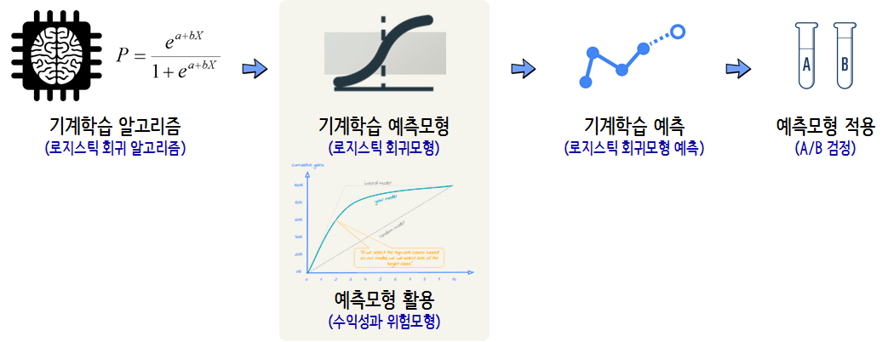
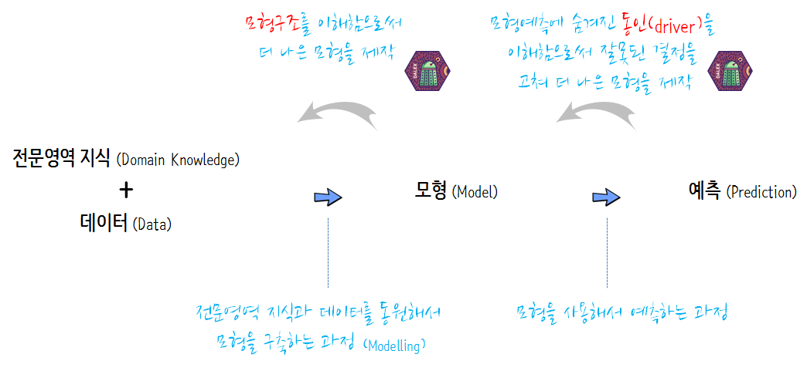
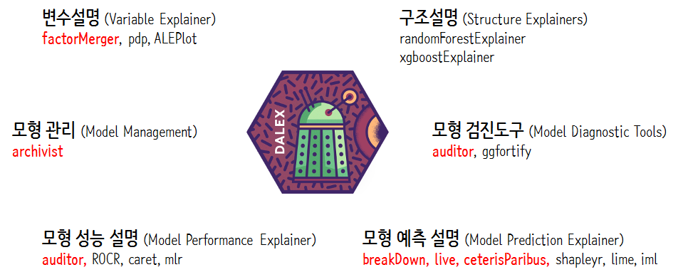
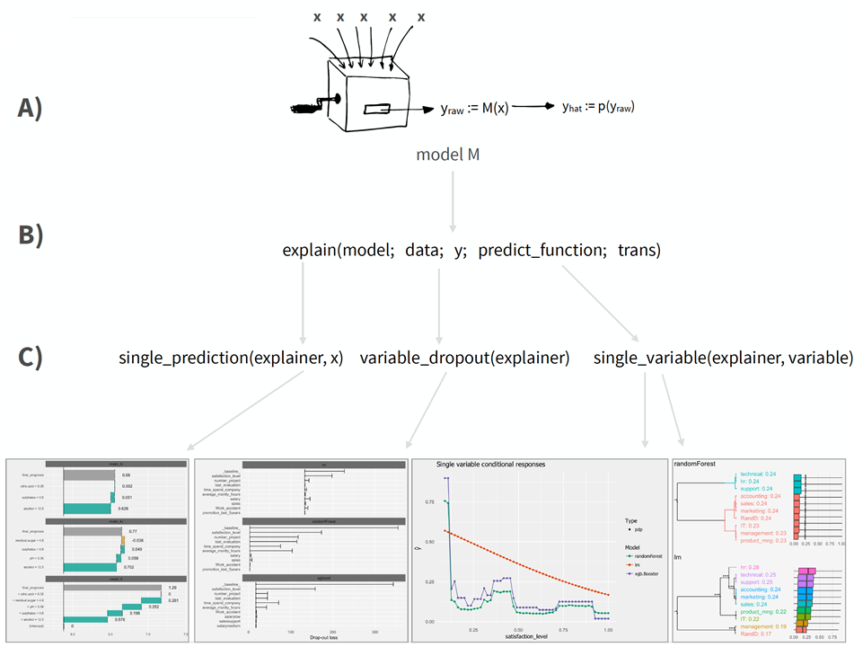

 
``` {r, include=FALSE}
source("tools/chunk-options.R")

knitr::opts_chunk$set(echo = TRUE, message=FALSE, warning=FALSE,
                      comment="", digits = 3, tidy = FALSE, prompt = TRUE, fig.align = 'center')

library(knitr)
library(kableExtra)

```

# GDPR [^gdpr-gov] [^gdpr-paper] {#gdpr-algorithm}

[^gdpr-gov]: [개인정보보호 종합포털(GDPR): https://www.privacy.go.kr/](https://www.privacy.go.kr/gdpr)
[^gdpr-paper]: [Bryce Goodman, Seth Flaxman (2016), "European Union regulations on algorithmic decision-making and a right to explanation"](https://arxiv.org/abs/1606.08813)

**GDPR(General Data Protection Regulation)**은 2018년 5월 25일부터 시행되는 EU(유럽연합)의 개인정보보호 법령이며, 
동 법령 위반시 과징금 등 행정처분이 부과될 수 있어 EU와 거래하는 우리나라 기업도 동법에 영향을 받는다.
법을 위반할 경우 해당 기업은 세계 연매출의 4% 또는 2,000만 유로 중 높은 쪽의 과징금을 부과받게 된다.

GDPR은 종래의 Directive가 아니라 Regulation이라는 법 형식으로 규율되어 법적 구속력(binding)을 가지며 모든 EU 회원국들에게 직접적으로 적용(directly applicable)된다.
GDPR은 2016년 5월 제정되었고, 2018년 5월 25일부터 시행되고 있다.

특히, 기계학습/인공지능 알고리즘과 관련된 규정은 다음과 같고 '설명을 요구할 권리'를 통해 정보주체가 알고리즘이 내리는 
자동화된 의사결정에 대해 설명을 요구할 수 있는 근거가 된다.

- 제13조/제14조: 정보를 제공받을 권리(Right to be informed)
- 제22조: 자동화된 결정 및 프로파일링 관련 권리 (Right to related to automated decision making and profiling)


<style>
div.blue { background-color:#e6f0ff; border-radius: 5px; padding: 10px;}
</style>
<div class = "blue">

- 용어정리 
    - **개인정보 (Personal data)** (제1항)
        - ‘개인정보’란 식별되었거나 또는 식별가능한 자연인(정보주체)과 관련된 모든 정보 의미
        - ‘식별가능한 자연인’은 직접적 또는 간접적으로 식별될 수 있는 사람을 의미하며, 특히 이름, 식별번호, 위치정보, 온라인 식별자(online identifier) 등의 식별자를 참조하거나, 하나 또는 그 이상의 신체적․생리적․유전적․정신적․경제적․문화적 또는 사회적 정체성에 대한 사항들을 참조하여 식별할 수 있는 사람을 뜻함
    - **컨트롤러 (Controller)** (제7항)
        - 컨트롤러란 개인정보의 처리 목적 및 수단을 단독 또는 제3자와 공동으로 결정하는 자연인, 법인, 공공 기관(public authority), 에이전시(agency), 기타 단체(other body) 를 의미
        - 이러한 처리의 목적 및 수단이 EU 또는 회원국 법률에 의해 결정되는 경우, 컨트롤러의 지명 또는 지명을 위한 특정 기준(specific criteria)은 EU 또는 회원국 법률에서 규정될 수 있음  
    - **프로세서 (Processor)** (제8항)
        - 프로세서란 컨트롤러를 대신하여 개인정보를 처리하는 자연인, 법인, 공공 기관(public authority), 에이전시(agency), 기타 단체(other body)를 의미
        - **Processing** is “any operation or set of operations which is performed on personal data or on sets of personal data, whether or not by automated means”
    - **수령인 (Recipient)과 제3자 (Third party)** (제9항, 제10항)
        - 수령인(recipient)은 제3자(third party)인지 여부와 관계없이, 개인정보를 공개․제공받는 (disclosed) 자연인, 법인, 공공 기관(public authority), 에이전시(agency), 기타 단체(other body)를 의미
        - 제3자(third party)는 정보주체, 컨트롤러, 컨트롤러 또는 프로세서의 직접적인 권한에 따라 개인정보를 처리할 수 있는 자를 제외한 모든 자연인, 법인, 공공 기관(public authority), 에이전시(agency), 기타 단체(other body)를 의미
    - **프로파일링 (Profiling)** (제4항)
        - 프로파일링은 자연인의 특정한 개인적 측면(certain personal aspects)을 평가하기 위해, 특히 개인의 업무 수행(performance at work), 경제적 상황(economic situation), 건강(health), 개인 선호(personal preferences), 관심사(interests), 신뢰도(reliability), 행동(behaviour), 위치(location), 이동(movement)에 관한 측면을 분석(analyse) 또는 예측(predict)하기 위해 개인정보를 사용하는 모든 형태의 자동화된 개인정보(any form of automated processing of personal data) 처리를 의미
        - 프로파일링은 프로세싱이 자동화 되어야 하고, 프로세싱이 평가를 목적으로 해야 한다.

</div>

## 예측 알고리즘 [^mckinsey-report] {#gdpr-algorithm-in-practice}

[^mckinsey-report]: [Ian MacKenzie, Chris Meyer, and Steve Noble(2013), "How retailers can keep up with consumers", McKnsey&Company](https://www.mckinsey.com/industries/retail/our-insights/how-retailers-can-keep-up-with-consumers)

2013년 매킨지 보고서에 따르면 아마존에서 고객이 구매하는 것의 35%, 넷플리스에서 구독자가 구매하는 것의 75%가 예측 알고리즘에서 나온다고 적시하고 있다.


# GDPR 예측모형{#gdpr-predictive-model}

GDPR 대응 예측모형은 투명성과 신뢰성을 달성해야 되는데, 우선 기계학습 알고리즘이 검증되어야 하고 이를 바탕으로 기계학습 예측모형을 개발하고 이를 활용하기 위해서 수익성과 위험에 대한 평가도 동시에 이뤄저야 하고 이렇게 도출된 기계학습 예측에 대한 검토도 확인된 후에 예측모형을 실제 적용하여 효과 여부가 판정된다. 




# 예측모형 [^iml-christophM] [^dalex-github] {#model-explain-predictive-model}

[^iml-christophM]: [Christoph Molnar (2018-08-14), "Interpretable Machine Learning A Guide for Making Black Box Models Explainable."](https://christophm.github.io/interpretable-ml-book/)

[^dalex-github]: [DALEX: Descriptive mAchine Learning EXplanations](https://pbiecek.github.io/DALEX/)

통계모형과 비교하여 예측모형(predictive model)은 예측 성능에 무게중심을 두고 있다. 
과거 예측만 맞으면 된다고 생각을 하고 있었으나, 최근에는 예측모형을 좀더 다양한 곳에 많이 사용하고자
예측모형에 대한 이해와 설명에 관심이 모아지고 있다.
해당 분야는 최근들어 급격히 발전에 발전을 거듭하고 있고 현재 시점 공개된 예측모형 이해와 해석에 대한 사항을 살펴보자.

[DALEX](https://pbiecek.github.io/DALEX/), [LIME](https://github.com/thomasp85/lime), 
[iml](https://christophm.github.io/interpretable-ml-book/) 등 기계학습 예측모형을 이해하고 설명하기 위한 다양한 접근방법이 제시되고 있다.

<iframe width="300" height="180" src="https://www.youtube.com/embed/7miIGBG7JKY" frameborder="0" allow="autoplay; encrypted-media" allowfullscreen></iframe>


# 예측모형 이해와 설명 {#model-explain-predictive-model-explain}

예측모형 이해와 설명을 위해서 먼저 전문영역 지식(Domain Knowledge)와 데이터를 가지고 모형을 구축하는 과정, 구축된 
최적의 예측모형을 활용하여 예측(Prediction)을 만들어 내는 과정이 그동안 많이 연구되고 실무에 적용되었던 사실이다.

데이터에서 모형을 만들고 이를 예측하는 과정을 반대로 돌려서 모형예측에 숨겨진 동인(driver)을 
이해함으로써 잘못된 결정을 고쳐 더 나은 모형을 제작하는 과정과 모형구조를 이해함으로써 
더 나은 모형을 제작하는 과정이 이제는 명시적으로 관심을 갖고 살펴보게 되게 된 것이다.



예측모형의 구조를 이해하는 것과 예측값에 대한 이해를 하는 것은 서로 밀접히 연관되어 있지만, 나누어서 살펴보는 것이 도움이 된다.
이를 위해서 예측모형 이해와 해석에서 `caret`같은 위상을 점하고자 부단히 노력하고 있는 폴란드 교수님이 주도되어 시작하는 `DALEX`를 살펴보자.

모형성능 설명, 변수설명, 모형예측 설명이 주된 기능이고 이를 위해서 DALEX 팩키지는 `auditor`, `breakDown`, `factorMerger`, `ceterisParibus` 등 
관련 팩키지의 도움을 받아 나름 **DALEX 생태계**를 구성하고 있다.




## DALEX 아키텍처 {#model-dalex-architecture}

DALEX 아키텍처는 3단 구성을 갖는다. 

- 예측모형이 준비된 단계
- 준비된 예측모형을 `explain()` 함수에서 넣어 예측모형 설명 및 이해 객체(explainer) 준비단계
- `print()`, `plot()` 제네릭으로 설명자(explainer)를 사용하는 단계

`single_variable()` 함수로 연속형 범주형 변수가 예측변수에 갖는 효과를 살펴보는 기능과 
`variable_dropout()` 함수로 변수 중요도를 이해하고 설명하는 기능, 마지막으로 `single_prediction()` 함수로 
해당 관측점에 대한 변수기여도를 살펴보는 기능이 담겨있다.



