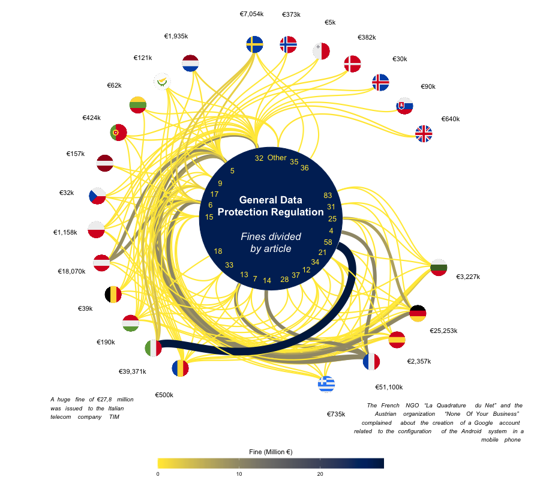

 

``` {r, include=FALSE}
knitr::opts_chunk$set(echo = TRUE, message=FALSE, warning=FALSE,
                      comment="", digits = 3, tidy = FALSE, prompt = FALSE, fig.align = 'center')

```

# GDPR 원문 [^warming-up] {.tabset #gdpr-original}

[^warming-up]: [GitHub Gist: @ofchurches,  ofchurches/gist:da902a393ce8e529b33ca0a137cd5ff3](https://gist.github.com/ofchurches/da902a393ce8e529b33ca0a137cd5ff3)

Tidy Tuesday 웹사이트에서 상기 GDPR 원문을 데이터프레임으로 가져오고 GDPR 원문에 담긴 감정을 분석해보자.

```{r gdpr-text}
library(tidyverse)
library(tidytext)

gdpr_text <- readr::read_tsv('https://raw.githubusercontent.com/rfordatascience/tidytuesday/master/data/2020/2020-04-21/gdpr_text.tsv')

gdpr_text %>% 
  DT::datatable()
```

감정분석을 위해서 `wordcloud` 팩키지 `comparison.cloud()`를 사용해서 긍적어와 부정어를 시각화해본다.

```{r gdpr-text-viz}
gdpr_text %>%
  unnest_tokens(word, gdpr_text) %>%
  inner_join(get_sentiments("bing")) %>%
  count(word, sentiment, sort = TRUE) %>%
  reshape2::acast(word ~ sentiment, value.var = "n", fill = 0) %>%
  wordcloud::comparison.cloud(colors = c("#F8766D", "#7CAE00"),
                   max.words = 100, match.colors = TRUE)
```


KISA GDPR 대응지원 센터 웹사이트에 가면 [자료실: GDPR 조문](https://gdpr.kisa.or.kr/gdpr/static/gdprProvision.do)을 국문과 영문으로 번역한 PDF 파일이 존재한다. 또한, [General Data Protection Regulation (GDPR)](https://gdpr-info.eu/) 웹사이트에서 조문(Article)별로 검색이 편리하게 정리되어 있다.

## 영문 {#gdpr-nglish}

{width=800px height=600px}

## 국문

{width=800px height=600px}

## 국영문 비교

{width=800px height=600px}


# 데이터셋 [^gdpr-dataset] {#get-gdpr-dataset}

[^gdpr-dataset]: [Roel's R-tefacts (April 8, 2020), "Scraping Gdpr Fines - Into the DOM with a flavour of regex"](https://blog.rmhogervorst.nl/blog/2020/04/08/scraping-gdpr-fines/)

GDPR 벌금 데이터셋은 [TidyTuesday, "rfordatascience/tidytuesday"](https://github.com/rfordatascience/tidytuesday/blob/master/data/2020/2020-04-21/readme.md) GitHub 저장소에 2020-04-21 기준 저장되어 있다. 추가로 최신 데이터가 필요한 경우 [Roel's R-tefacts (April 8, 2020), "Scraping Gdpr Fines - Into the DOM with a flavour of regex"](https://blog.rmhogervorst.nl/blog/2020/04/08/scraping-gdpr-fines/) 블로그를 참조하여 데이터를 크롤링한다.

[GDPR Enforcement Tracker](https://www.enforcementtracker.com/) 웹사이트에도 GDPR 위반 관련 데이터가 잘 정리되어 있다.

```{r crawl-data}
library(rvest)

link<- "https://www.privacyaffairs.com/gdpr-fines/"
page <- read_html(link)

temp <- page %>% html_nodes("script") %>% .[9] %>% 
  rvest::html_text() 

ends <- str_locate_all(temp, "\\]")
starts <- str_locate_all(temp, "\\[")

table1 <- temp %>% stringi::stri_sub(from = starts[[1]][1,2], to = ends[[1]][1,1]) %>% 
  str_remove_all("\n") %>% 
  str_remove_all("\r") %>%
  jsonlite::fromJSON()

gdpr_dat <- temp %>% stringi::stri_sub(from = starts[[1]][2,2], to = ends[[1]][2,1]) %>% 
  str_remove_all("\n") %>% 
  str_remove_all("\r") %>%  
  jsonlite::fromJSON() %>% 
  as_tibble() %>% 
  janitor::clean_names()

gdpr_dat %>% 
  write_csv("data/gdpr_fines.csv")

gdpr_dat %>% 
  arrange(desc(price)) %>% 
  select(-id, -picture, -summary) %>% 
  mutate(source =  paste0("<a href='", source, "'>", source, "</a>")) %>% 
  DT::datatable(escape = FALSE)
```

# 데이터 정제 [^gdpr-data-cleaning] {#data-cleaning}

[^gdpr-data-cleaning]: [Philgee (Apr-30-2020), "Lets tidy the tuesday: A look at the GDPR-Violations"](https://medium.com/@philipp.giese/lets-tidy-the-tuesday-a-look-at-the-gdpr-violations-a9c2f328b10d)

크롤링된 데이터에 일부 문제가 있어 이를 바로잡는다.

## 날짜 결측값 {#data-cleaning-missing}

날짜가 1970-01-01 등으로 결측값이 있거나 Article 관련해서 체계적으로 데이터가 정비되어 있지 않아 이를 바로 후속 분석이 가능한 형태로 가공한다.

```{r data-cleaning}
library(lubridate)

gdpr_df <- gdpr_dat %>%
  mutate(date = as_date(date, format = "%m/%d/%Y", tz = "UTC")) %>%
  mutate(wrong_date = date == as_date("1970-01-01")) %>%
  mutate(date = if_else(
    grepl("25.maj_2018", source) &
      wrong_date,
    as_date("2018-05-25"),
    date
  )) %>%
  mutate(date = if_else(
    grepl("2019/03/29", source) &
      wrong_date,
    as_date("2019-03-29"),
    date
  )) %>%
  mutate(date = if_else(
    grepl(
      "https://theword.iuslaboris.com/hrlaw/insights/spain-video-surveillance-and-data-protection-in-the-workplace",
      source
    ) & wrong_date,
    as_date("2019-09-20"),
    date
  )) %>%
  mutate(date = if_else(
    grepl(
      "https://www.etrend.sk/ekonomika/gdpr-zacina-hryzt-telekomunikacny-operator-dostal-pokutu-40-tisic-eur.html",
      source
    ) & wrong_date,
    as_date("2019-09-27"),
    date
  )) %>%
  filter(date > as_date("1970-01-01"))
```

## Article 변형 {#data-cleaning-articles}

`Article` 관련 사항을 체계적으로 정비한다. `articles` 칼럼을 추출하여 이를 정규표현식으로 정제한다.

```{r data-cleaning-articles}
gdpr_tbl <- gdpr_df %>% 
  transmute(id, country = name, price, authority, date, controller, type,
            articles = str_extract_all(article_violated, "Art. ?[:digit:]+")) %>% 
  mutate(ttl_articles = map_int(articles, length)) %>% 
  unnest(articles) %>% 
  mutate(articles = str_trim(articles) %>% str_remove(., " ") %>%  str_extract(., "Art\\. ?[:digit:]+")) %>% 
  nest(articles = c(articles))

gdpr_tbl
```


# 탐색적 데이터 분석  {#gdpr-EDA}

GDPR로 인해 부과된 벌금에 대한 사항이 중요 정보별로 준비되어 있어 관심 사항별로 살펴보자.

## 국가별 벌금 {#gdpr-country}

국가별로 벌금부과 건수와 총금액을 합산하여 표를 만들어 살펴본다.

```{r gdpr-EDA-country}
gdpr_tbl %>% 
  group_by(country) %>% 
  summarise(건수 = n(),
            금액 = sum(price)) %>% 
  arrange(-금액) %>% 
  DT::datatable() %>% 
    DT::formatRound(c("건수", "금액"), digits=0)
```

국가별로 벌금부과 건수와 총금액을 합산된 정보를 이용하여 두 변수간의 관계를 산점도를 그려 시각화한다.
[`ggimg`](https://github.com/statsmaths/ggimg) 팩키지에 `svg` 지원이 없다보니 이를 우회하는 방법으로 `.svg` 파일을 다운로드 받아 `.png` 파일로 모두 변환시키고 나서 이를 가져와서 작업한다.

```{r gdpr-EDA-country-viz}
library(ggimg)

flag_df <- gdpr_dat %>%
  select(id, picture) %>%
  mutate(flag = str_extract(picture, "[\\w,\\s-]+\\.svg$") %>%
           paste0("data/", .))

## 웹국기를 로컬 컴퓨터로 다운로드
# map2(flag_df$picture, flag_df$flag, download.file)

## .svg 파일을 .png로 변환
# svg_files <- list.files(path="data", pattern = "svg")
# 
# svg_path_files <- paste0("data/", svg_files)
# png_path_files <- str_replace(svg_path_files, "svg", "png")
# 
# for(i in seq_along(svg_path_files)) {
#   tmp <- rsvg::rsvg(svg_path_files[i])
#   png::writePNG(tmp, png_path_files[i])
# }

## 국기 시각화
library(ggrepel)

flag_df %>% 
  mutate(flag = str_replace(flag, "svg", "png")) %>%   
  inner_join(gdpr_tbl) %>% 
  group_by(picture, flag, country) %>% 
  summarise(건수 = n(),
            금액 = sum(price)) %>% 
  ggplot(aes(x=건수, y=금액, label = country)) +
    geom_point() +
    theme_minimal() +
    scale_y_log10(labels = scales::dollar_format(prefix ="€")) +
    geom_point_img(aes(
      x = 건수,
      y = 금액,
      img = flag), size = 0.5) +
   geom_text_repel()
```

## 조항(Article)별  {#gdpr-articles}

국가별로 벌금부과 건수와 총금액을 합산된 정보를 이용했다면 이번에는 조항별로 살펴보자.

```{r gdpr-EDA-articles}
gdpr_tbl %>% 
  unnest(articles) %>% 
  group_by(articles) %>% 
  summarise(건수 = n(),
            금액 = sum(price)) %>% 
  arrange(-금액) %>% 
  DT::datatable() %>% 
  DT::formatRound(c("건수", "금액"), digits=0)
```

마찬가지 방식으로 벌금부과 건수와 총금액을 산점도를 그려 관계를 살펴보자.

```{r gdpr-EDA-articles-viz}
gdpr_tbl %>% 
  unnest(articles) %>% 
  group_by(articles) %>% 
  summarise(건수 = n(),
            금액 = sum(price)) %>% 
  ggplot(aes(x=건수, y=금액, label = articles)) +
    geom_point() +
    theme_minimal() +
    scale_y_log10(labels = scales::dollar_format(prefix ="€")) +
   geom_text_repel()
```


## GDPR 요약  {#gdpr-summary}

GDPR 위반시 가장 많이 언급된 단어 빈도수 분석은 다음과 같다. GDPR 위반시 부과된 벌금과 함께 `summary` 필드에 관련 내용이 간략히 요약되어 있다.

```{r gdpr-EDA-summary}
library(tidytext)
library(extrafont)
loadfonts()

gdpr_df %>% 
 select(authority, summary) %>% 
 unnest_tokens(word, summary) %>% 
 anti_join(stop_words) %>% 
 count(word, sort = TRUE) %>% 
 head(30) %>% 
 mutate(word = fct_reorder(word,n)) %>% 
 ggplot() + 
   geom_col(aes(x = n, y = word), fill = "red")  +
   gghighlight::gghighlight(word == 'consent') +
   labs(title = "GDPR 위반시 자주 언급된 단어",
        caption = "데이터 출처: Privacy Affairs",
        x="단어 출현빈도수",
        y="") +
   theme_minimal(base_family = "NanumGothic")
```


## GDPR 조항 연관빈도  {#gdpr-upsetr}

GDPR 위반 관련하여 서로 많이 연관된 조항을 파악하는 것도 필요하다.  [UpSetR](https://cran.rstudio.com/web/packages/UpSetR/)을 활용하여 파악하는 것이 가능해졌다. 사용법은 각 사례별로 해당되는 조항(article)은 1, 그렇지 않는 조항은 0으로 표식하는 것이고 이를 `upset()` 함수에 넣어주면 된다.

```{r gdpr-EDA-upsetr}
library(UpSetR)

cooccurrence_df <- gdpr_tbl %>%
  select(id, articles) %>% 
  unnest(articles) %>%
  mutate(value = 1) %>%
  distinct() %>%
  pivot_wider(names_from = articles, 
              values_from = value, 
              values_fill = list(value = 0)) %>%
  as.data.frame()

upset(cooccurrence_df, order.by = c( "freq"))
```

## 동시 언급 조항 네트워크  [^generate-edgelist] [^network-analysis] {#tidytuesday-articles-network}

[^generate-edgelist]: [stackoverflow, "
Generating an edge list from ID and grouping vectors
"](https://stackoverflow.com/questions/34670145/generating-an-edge-list-from-id-and-grouping-vectors)

[^network-analysis]: [Jesse Sadler(October 25, 2017), "Introduction to Network Analysis with R: Creating static and interactive network graphs"](https://www.jessesadler.com/post/network-analysis-with-r/)

GDPR 위반시 언급되는 위반 조항(article)에 대해서 네트워크 분석을 진행하여 조항간 관계를 파악할 수 있다.

```{r gdpr-edgelist}
library(tidygraph)
library(ggraph)

# Edgelist 생성
gdpr_edge_list <- gdpr_tbl %>%
  unnest(articles) %>%
  group_by(id) %>%
  filter(n() >= 2) %>%
  do(data.frame(t(combn(.$articles, 2)), stringsAsFactors = FALSE)) %>%
  ungroup() %>%
  select(- id) %>%
  rename(from = X1, to = X2) %>%
  group_by(from, to) %>%
  summarise(weight = n()) %>% 
  ungroup()

# tidygraph 그래프객체 생성
gdpr_graph <- as_tbl_graph(gdpr_edge_list) %>%
  to_undirected() %>%
  activate(nodes) %>%
  mutate(centrality = centrality_authority()) %>%
  mutate(group = as.factor(group_edge_betweenness())) %>%
  group_by(.add = group) %>%
  mutate(name_first = last(name, order_by = centrality)) %>%
  ungroup()

# 그래프 시각화
gdpr_graph %>%
  ggraph(layout = 'linear', circular = TRUE) + 
  geom_edge_arc(aes(alpha = weight, width = weight), show.legend = FALSE) + 
  geom_node_label(aes(label = name, 
                      colour = group)) +
  theme_graph(base_family = "NanumGothic") + 
  guides(colour = FALSE, size = FALSE) + 
  labs(title = str_wrap("GDPR 위반시 함께 언급되는 조항 관계도", 
                        width = 40))
```

## 국가별 적용조항 벌금  [^country-article-fine] {#tidytuesday-articles-network}

[^country-article-fine]: [`2020_04_21_GDPR_Fines.R`](https://github.com/teunbrand/tidytuesdayscripts/blob/master/scripts/2020_04_21_GDPR_Fines.R)

국가별 적용된 조항(article)에 따라 GDPR 위반 벌금을 한장의 그래프로 표현한다.

```{r generate-country-article}
# source("code/teunbrand-gdpr.R")
```



## 인포그래픽 {#gdpr-infographic}

<https://github.com/ysamano/TidyTuesday/blob/master/2020/week_17/week_17_gdpr_violations.R>

## 공간정보 시각화 {#gdpr-geospatial}

<https://github.com/symplyelah/Tidytuesday/blob/master/2020/GDPR_Violations/GDPR%20Violations.Rmd>

## Sankey 그래프 {#gdpr-sankey}

<https://github.com/njsilbiger/TidyTuesday_CSUN/blob/master/GDPR_042120/GDPRscript.R>