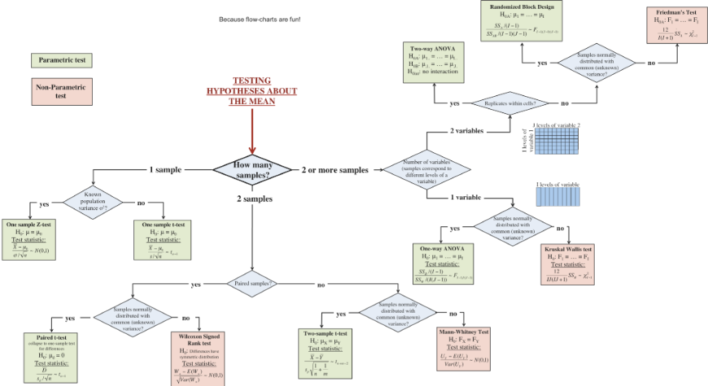

 

``` {r, include=FALSE}
knitr::opts_chunk$set(echo = TRUE, message=FALSE, warning=FALSE,
                      comment="", digits = 3, tidy = FALSE, prompt = FALSE, fig.align = 'center')
library(tidyverse)
library(extrafont)
loadfonts()
library(showtext)
par(family = "NanumGothic")
library(patchwork)
library(broom)

# Reproducible "random" results
set.seed(40)

# Generate normal data with known parameters
rnorm_fixed = function(N, mu = 0, sd = 1)
  scale(rnorm(N)) * sd + mu

# Plot style.
theme_axis = function(P,
                      jitter = FALSE,
                      xlim = c(-0.5, 2),
                      ylim = c(-0.5, 2),
                      legend.position = NULL) {
  P = P + theme_bw(15) +
    geom_segment(
      x = -1000, xend = 1000,
      y = 0, yend = 0,
      lty = 2, color = 'dark gray', lwd = 0.5
    ) +
    geom_segment(
      x = 0, xend = 0,
      y = -1000, yend = 1000,
      lty = 2, color = 'dark gray', lwd = 0.5
    ) +
    coord_cartesian(xlim = xlim, ylim = ylim) +
    theme(
      axis.title = element_blank(),
      axis.text = element_blank(),
      axis.ticks = element_blank(),
      panel.border = element_blank(),
      panel.grid = element_blank(),
      legend.position = legend.position
    )
  
  # Return jittered or non-jittered plot?
  if (jitter) {
    P + geom_jitter(width = 0.1, size = 2)
  }
  else {
    P + geom_point(size = 2)
  }
}
```

# 모형과 가설검정 [^hypothesis-testing] [^rebecca-testing] {.tabset #statistical-testing}

[^hypothesis-testing]: [Kevin Hannay (Jan 13 2020), "Everything is a Regression:In search of unifying paradigms in statistics"](https://towardsdatascience.com/everything-is-just-a-regression-5a3bf22c459c)

[^rebecca-testing]: [Rebecca Barter (December 4, 2018), "Which hypothesis test should I use? A flowchart: A flowchart to decide what hypothesis test to use."](http://www.rebeccabarter.com/blog/2018-12-04_hypothesis_testing/)

모형으로 다양한 통계검정을 이해하게 되면 비모수 통계검정을 비롯하여 표본집단에 대한 구분부터 각각을 개별적으로 이해하고 암기할 필요가 없으며 단 하나의 수식 $y = \beta_0 + \beta_1 \times x$ 이라는 단순한 공식으로 상당수 통계검정을 처리할 수 있다.
예를 들어 상관분석, 일원 분산분석, t-검정, $\chi^2$-검정 등이 여기에 포함된다.

평균에 대한 가설검정은 다음 작업흐름도에 따라 어떻게 보면 기계적인 과정을 거쳐 판정에 이를 수 있다.
특히, [Common statistical tests are linear models (or: how to teach stats)](https://lindeloev.github.io/tests-as-linear/) 블로그에 관련 내용이 잘 정리되어 있다.

## 검정 작업흐름도 {#testing-flowchart}

```{r statistical-testing, eval = FALSE}
webshot2::webshot("http://www.rebeccabarter.com/blog/2018-12-04_hypothesis_testing/", 
                  selector = "#content > p:nth-child(3) > img", 
                  "fig/hypothesis-testing.png")
```



## 선형모형과 통계검정 {#testing-pdf}

{width=800px height=600px}


# NBA 선수선발 데이터 {#statistical-testing-model-data}

실제 NBA 선수선발 데이터를 가지고 앞서 언급한 사례를 살펴보자. [NBA 선수선발 데이터](http://khannay.com/data/NBA_Draft_Data.csv)는 LeBron James 부터 선수선발 순위를 포함한 선수 역량과 관련된 정보가 정리되어 있다.

```{r rmarkdown-model-data}
library(tidyverse)

download.file(url="http://khannay.com/data/NBA_Draft_Data.csv", destfile = "data/NBA_Draft_Data.csv")

nba_df <- read_csv("data/NBA_Draft_Data.csv") %>% 
  janitor::clean_names()

nba_df %>% 
  arrange(-pts) %>% 
  select(tm, player, pts, pick_number, everything()) %>% 
  # sample_n(100) %>% 
  DT::datatable()

```

## 평균득점과 지명순서 {#nba-data-viz}

```{r nba-data-viz}
nba_df %>% 
  ggplot(aes(x=pick_number, y=pts)) +
    geom_point() +
    geom_smooth(method="lm") +
    theme_bw() +
    labs(x="지명순서", y="평균득점")
```

# 피어슨 상관관계 [^chi-test-rpubs] {#statistical-testing-correlation}

[^chi-test-rpubs]: [Phillip M. Alday (May 2018), "Explicit GLM(M) Equivalents for Standard Tests", RPubs](https://rpubs.com/palday/glm-test)

피어슨 상관관계를 모형으로 표현하면 다음과 같다.

$y = \beta_0 + \beta_1 \times x$ 선형모형에서 $\beta_1 = 0$ 인지 검정하는 것과 유사하다.

```{r pearson-correlation}
# Fixed correlation
D_correlation <- data.frame(MASS::mvrnorm(30, mu = c(0.9, 0.9), 
                            Sigma = matrix(c(1, 0.8, 1, 0.8), ncol = 2), 
                            empirical = TRUE)) %>% 
  as_tibble() # Correlated data

# Add labels (for next plot)
D_correlation <- D_correlation %>% 
  mutate(label_num = sprintf('(%.1f,%.1f)', X1, X2),
         label_rank = sprintf('(%i,%i)', rank(X1), rank(X2)))

# Plot it
fit <- lm(I(X2 * 0.5 + 0.4) ~ I(X1 * 0.5 + 0.2), D_correlation)
intercept_pearson <- coefficients(fit)[1]

P_pearson <- ggplot(D_correlation, aes(x=X1*0.5+0.2, y=X2*0.5+0.4)) +
  geom_point() +
  geom_smooth(method=lm, se=FALSE, lwd=2, aes(colour='beta_1')) + 
  geom_segment(x=-100, xend=100, 
               y=intercept_pearson, yend=intercept_pearson, 
               lwd=2, aes(color="beta_0")) + 
  scale_color_manual(name=NULL, values=c("blue", "red"), labels=c(bquote(beta[0]*" (intercept)"), bquote(beta[1]*" (slope)")))
  
theme_axis(P_pearson, legend.position = c(0.4, 0.9))
```

앞선 이론적인 배경을 바탕으로 `MP:  Minutes Played`와 `PTS: Points`를 산점도로 파악하고 이에 대한 상관관계를 통계검정과 선형모형으로 비교해보자. 즉, 인과관계는 모르겠지만 `MP`와 `PTS`간의 상관관계는 존재하는 파악하고자 한다.


```{r compare-correlation}
nba_df %>% 
  ggplot(aes(x=mp, y=pts)) +
    geom_point()
```

$$ \hat {\beta} = {\rm cor}(Y_i, X_i) \cdot \frac{ {\rm SD}(Y_i) }{ {\rm SD}(X_i) } $$ 

${\rm SD}(Y_i) = {\rm SD}(X_i)$ 동일한 경우에만 $\hat{\beta}$이 상관계수와 동일한 관계를 갖는 점을 명심하면 `cor.test()` 내장함수로 구현된 상관계수 통계검정과 `glm()` 선형모형을 비교해보면 약간의 차이는 있지만 `t` 통계량은 물론 `p-`값도 유사함을 발견할 수 있다.

<div class = "row">
  
  <div class = "col-md-4">
  
```{r nba-correlation}
cor.test(nba_df$mp, nba_df$pts, method = "pearson")
```
  

  </div>
  
  <div class = "col-md-4">

```{r nba-correlation-glm}
pts_cor_lm <- glm(pts ~ 1 + mp, data = nba_df)
broom::tidy(pts_cor_lm)
```

  </div>
  
  <div class = "col-md-4">
  
```{r nba-correlation-glm-scaled}
pts_cor_lm <- glm(scale(pts) ~ 1 + scale(mp), data = nba_df)
broom::tidy(pts_cor_lm)
```

  </div>
</div>


# `t`-검정 {#statistical-testing-model-ttest}

`GLM` 모형과 `t-`검정을 비교해보자. 

```{r nba-data-viz-ttest}
nba_df <- nba_df %>% 
  mutate(pick_binary = if_else(pick_number > 15, "하위", "상위")) %>% 
  mutate(pick_binary = factor(pick_binary, levels = c("하위", "상위")))

pick_pts <- nba_df %>% 
  select(pts, pick_binary)

pick_lm <- glm(pts ~ pick_binary, data=pick_pts)

broom::tidy(pick_lm)
```


```{r nba-data-viz-ttest-glm}
t.test(pts ~ pick_binary, data = pick_pts, var.equal = TRUE)
summary(pick_lm)
```


