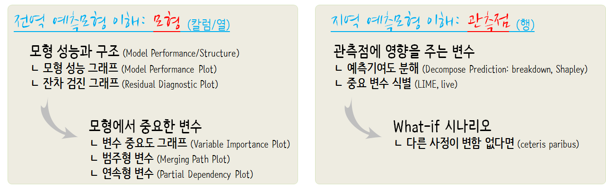

 
``` {r, include=FALSE}
source("tools/chunk-options.R")

knitr::opts_chunk$set(echo = TRUE, message=FALSE, warning=FALSE,
                      comment="", digits = 3, tidy = FALSE, prompt = TRUE, fig.align = 'center')

library(knitr)
library(kableExtra)

```

# $H_2O$와 DALEX {#h2o-dalex}

기계학습 $H_2O$ 모형을 크게 회귀모형과 분류모형으로 나누어서 회귀모형은 `mpg` 연비데이터,
분류모형은 `attrition` 데이터로 기계학습 예측모형을 개발한다. 
그리고 나서 `DALEX`를 주된 모형 이해와 해석을 위한 엔진으로 사용해서 살펴본다.




# `mpg` 연비예측 회귀분석 [^dalex-h2o-example] {#h2o-dalex-regression}

[^dalex-h2o-example]: [Alicja Gosiewska(2018-06-16), "How to use DALEX with H2O"](https://rawgit.com/pbiecek/DALEX_docs/master/vignettes/DALEX_h2o.html)

`ggplot2`에 포함된 `mpg` 데이터를 사용해서 $H_2O$ 기계학습 예측모형을 개발한다.

## `mpg` 연비 데이터 {#h2o-dalex-regression-data}

`mpg` 연비 데이터, 즉 데이터프레임을 훈련과 시험데이터로 구분하여 $H_2O$ 기계학습 모형에 준비한다.

``` {r h2o-dalex-regression-data}
# 0. 환경설정 -----
library(tidyverse)
library(h2o)
library(recipes)
library(skimr)
library(caret)
library(DALEX)
library(cowplot)

##  H2O 초기화 ----
h2o.no_progress()
h2o.init()

# 1. 연비 데이터 -----
## 1.1. 데이터 가져오기 -----
mpg_dat <- ggplot2::mpg

## 1.2. 데이터 정제 -----
mpg_df <- mpg_dat %>% 
    mutate_if(is.character, as.factor) %>% 
    mutate(manufacturer = fct_lump(manufacturer, 9),
           fl = fct_lump(fl, 2),
           class = fct_lump(class, 5),
           trans = ifelse(str_detect(trans, "auto"), "auto", "manual") %>% as.factor,
           year = as.factor(year)) %>% 
    select(cty, manufacturer, displ, year, cyl, trans, drv, fl, class)

## 1.3. 훈련/시험 데이터 분할 -----
mpg_idx <- createDataPartition(mpg_df$cty, times = 1, p=0.7, list=FALSE)

mpg_train <- mpg_df[mpg_idx, ]
mpg_test  <- mpg_df[-mpg_idx, ]
```

## $H_2O$ 예측모형과 `explainer` 객체 {#h2o-dalex-regression-fit}

$H_2O$ 기계학습 모형을 개발한다. `h2o.glm`, `h2o.gbm`, `h2o.automl`로 예측모형 객체를 생성시킨다.
그리고 나서 `mpg_predict()` 함수를 지정하고 이를 통해 `explainer` 객체를 생성시킨다. 

``` {r h2o-dalex-regression-fit}
# 2. 예측모형 개발 -----
## 2.1. 데이터프레임 --> H2O 데이터프레임
mpg_train_h2o <- as.h2o(mpg_train)
mpg_test_h2o <- as.h2o(mpg_test)

## 2.2. 예측모형 적합
model_h2o_glm    <- h2o.glm(y = "cty", training_frame = mpg_train_h2o)
model_h2o_gbm    <- h2o.gbm(y = "cty", training_frame = mpg_train_h2o)
model_h2o_automl <- h2o.automl(y = "cty", training_frame = mpg_train_h2o, max_models = 10)

# 3. 모형 이해와 설명 -----
## 3.1. explainer 객체 생성
mpg_predict <- function(model, newdata)  {
    newdata_h2o <- as.h2o(newdata)
    res <- as.data.frame(h2o.predict(model, newdata_h2o))
    return(as.numeric(res$predict))
}

explainer_h2o_glm <- explain(model = model_h2o_glm, 
                             data = mpg_test[,-1],  
                             y = mpg_test$cty,
                             predict_function = mpg_predict,
                             label = "h2o GLM")

explainer_h2o_gbm <- explain(model = model_h2o_gbm, 
                             data = mpg_test[,-1],  
                             y = mpg_test$cty,
                             predict_function = mpg_predict,
                             label = "h2o GBM")

explainer_h2o_automl <- explain(model = model_h2o_automl, 
                                data = mpg_test[,-1],  
                                y = mpg_test$cty,
                                predict_function = mpg_predict,
                                label = "h2o AutoML")
```


## $H_2O$ 예측모형 설명과 이해 {#h2o-dalex-regression-explain}

$H_2O$ 예측모형에 대한 이해와 설명을 위해서 모형성능, 변수중요도, 예측모형 변수 반응(연속형, 범주형)과 예측에 대해서 순차적으로 확인한다.

``` {r h2o-dalex-regression-explain}
## 3.2. 모형성능 -----

mp_h2o_glm <- model_performance(explainer_h2o_glm)
mp_h2o_gbm <- model_performance(explainer_h2o_gbm)
mp_h2o_automl <- model_performance(explainer_h2o_automl)

plot(mp_h2o_glm, mp_h2o_gbm, mp_h2o_automl)

plot(mp_h2o_glm, mp_h2o_gbm, mp_h2o_automl, geom = "boxplot")

## 3.3. 변수 중요도 -----

vi_h2o_glm <- variable_importance(explainer_h2o_glm, type="difference")
vi_h2o_gbm <- variable_importance(explainer_h2o_gbm, type="difference")
vi_h2o_automl <- variable_importance(explainer_h2o_automl, type="difference")

plot(vi_h2o_glm, vi_h2o_gbm, vi_h2o_automl)

## 3.4. 예측모형 변수 반응(연속형)  -----

pdp_h2o_glm    <- variable_response(explainer_h2o_glm, variable = "displ")
pdp_h2o_gbm    <- variable_response(explainer_h2o_gbm, variable = "displ")
pdp_h2o_automl <- variable_response(explainer_h2o_automl, variable = "displ")

plot(pdp_h2o_glm, pdp_h2o_gbm, pdp_h2o_automl)

## 3.4. 예측모형 변수 반응(범주형)  -----

# mpp_h2o_glm    <- variable_response(explainer_h2o_glm,    variable = "class", type = "factor")
mpp_h2o_gbm    <- variable_response(explainer_h2o_gbm,    variable = "class", type = "factor")
mpp_h2o_automl <- variable_response(explainer_h2o_automl, variable = "class", type = "factor")

plot(mpp_h2o_gbm, mpp_h2o_automl)

## 3.5. 예측 이해 -----

new_car <- mpg_test[1,]
pb_h2o_glm    <- prediction_breakdown(explainer_h2o_glm, observation = new_car)
pb_h2o_gbm    <- prediction_breakdown(explainer_h2o_gbm, observation = new_car)
pb_h2o_automl <- prediction_breakdown(explainer_h2o_automl, observation = new_car)

plot(pb_h2o_glm, pb_h2o_gbm, pb_h2o_automl)
```


# 직원이탈 분류모형 [^bs-h2o-attrition] {#h2o-dalex-classification}

[^bs-h2o-attrition]: [Boehmke (July 23, 2018), "DALEX AND H2O: MACHINE LEARNING MODEL INTERPRETABILITY AND FEATURE EXPLANATION"](http://www.business-science.io/business/2018/07/23/dalex-feature-interpretation.html)

## `attrition` 데이터 {#h2o-dalex-classification-data}

`rsample` 팩키지에 포함된 `attrition` 데이터셋을 가져온다.
이번에는 데이터를 전부 $H_2O$ 데이터프레임으로 변환시켜 예측모형 구축작업을 수행한다.

``` {r h2o-dalex-attrition-dataset}
# 1. 인력 이탈(Job Attrition) 데이터 -----
## 1.1. 데이터 가져오기 -----
attr_df <- rsample::attrition %>% 
    mutate_if(is.ordered, factor, ordered = FALSE) %>%
    mutate(Attrition = recode(Attrition, "Yes" = "1", "No" = "0") %>% factor(levels = c("1", "0")))

## 1.2. 데이터프레임 --> H2O 데이터프레임 -----
attr_h2o <- as.h2o(attr_df)

## 1.3. 데이터 분할 -----
splits <- h2o.splitFrame(attr_h2o, ratios = c(.7, .15), destination_frames = c("train","valid","test"))
names(splits) <- c("train","valid","test")

# 1.4. 모형 변수명 설정
y <- "Attrition"
x <- setdiff(names(attr_df), y) 
```


## $H_2O$ 예측모형 {#h2o-dalex-classification-fit}

GLM, Random Forest, GBM, AutoML 예측모형을 생성하고 각 모형의 성능을 AUC 기준으로 살펴본다.

``` {r h2o-dalex-attrition-fit}
# 2. 예측모형 구축 -----

## 2.1. GLM, RF, GBM, autoML -----
attr_glm <- h2o.glm(x = x, y = y, 
    training_frame = splits$train,
    validation_frame = splits$valid,
    family = "binomial")

attr_rf <- h2o.randomForest(x = x, y = y,
    training_frame = splits$train,
    validation_frame = splits$valid,
    ntrees = 1000,
    stopping_metric = "AUC",    
    stopping_rounds = 10,         
    stopping_tolerance = 0.005)

attr_gbm <-  h2o.gbm(x = x, y = y,
    training_frame = splits$train,
    validation_frame = splits$valid,
    ntrees = 1000,
    stopping_metric = "AUC",    
    stopping_rounds = 10,         
    stopping_tolerance = 0.005)

attr_automl <- h2o.automl(x = x, y = y,
                     training_frame = splits$train,
                     validation_frame = splits$valid,
                     max_models = 10)

## 2.2. 모형성능 
data.frame("GLM" = h2o.auc(attr_glm, valid = TRUE),
           "RF" = h2o.auc(attr_rf, valid = TRUE),
           "GBM" = h2o.auc(attr_gbm, valid = TRUE),
           "AutoML" = h2o.auc(attr_automl@leader, valid = TRUE)) %>% 
    gather(모형, AUC값) %>% 
    arrange(desc(AUC값))
```

## 예측모형 설명자 {#h2o-dalex-classification-explainer}

예측모형 설명자를 생성한다. `explain()` 함수에 예측함수(`attr_pred`), 검증/시험 데이터, 검증/시험 예측결과가 필요하다.
각 형태에 맞춰 데이터를 준비하고 이를 `explain()` 함수에 넣어준다.

``` {r h2o-dalex-attrition-explainer}
# 3. 예측모형 이해와 설명 -----
## 3.1. explainer 객체 생성 -----
### 교차검증 데이터프레임 생성 
x_valid <- as.data.frame(splits$valid)[, x]

### 예측변수 숫자형 벡터로 변환
y_valid <- as.vector(as.numeric(as.character(splits$valid$Attrition)))

### 직원이탈 예측함수
attr_pred <- function(model, newdata)  {
    results <- as.data.frame(h2o.predict(model, as.h2o(newdata)))
    return(results[[3L]])
}

# attr_pred(attr_rf, x_valid) %>% head()

### GLM 설명자
explainer_glm <- explain(
    model = attr_glm,
    data = x_valid,
    y = y_valid,
    predict_function = attr_pred,
    label = "h2o GLM"
)

### RF 설명자
explainer_rf <- explain(
    model = attr_rf,
    data = x_valid,
    y = y_valid,
    predict_function = attr_pred,
    label = "h2o RF"
)

### GBM 설명자
explainer_gbm <- explain(
    model = attr_gbm,
    data = x_valid,
    y = y_valid,
    predict_function = attr_pred,
    label = "h2o GBM"
)

### AutoML 설명자
explainer_automl <- explain(
    model = attr_automl,
    data = x_valid,
    y = y_valid,
    predict_function = attr_pred,
    label = "h2o AutoML"
)
```

## 예측모형 이해와 설명 {#h2o-dalex-classification-explainer-global}

예측모형 이해와 설명에서 먼저 예측모형 자체에 대한 이해와 설명이 필요하다.
이를 위해서 모형성능, 중요변수, 중요 변수별 예측변수 연관 설명을 순차적으로 진행한다.

``` {r h2o-dalex-attrition-explainer-global}
## 3.2. 예측모형 성능 -----

resids_glm <- model_performance(explainer_glm)
resids_rf  <- model_performance(explainer_rf)
resids_gbm <- model_performance(explainer_gbm)
resids_automl <- model_performance(explainer_automl)

p1 <- plot(resids_glm, resids_rf, resids_gbm, resids_automl) +
    theme(legend.position = "top")
p2 <- plot(resids_glm, resids_rf, resids_gbm, resids_automl, geom = "boxplot") +
    theme(legend.position = "top")

plot_grid(p1, p2, nrow = 1)

## 3.3. 변수중요도 -----
vip_glm    <- variable_importance(explainer_glm, n_sample = -1, loss_function = loss_root_mean_square) 
vip_rf     <- variable_importance(explainer_rf,  n_sample = -1, loss_function = loss_root_mean_square)
vip_gbm    <- variable_importance(explainer_gbm, n_sample = -1, loss_function = loss_root_mean_square)
vip_automl <- variable_importance(explainer_automl, n_sample = -1, loss_function = loss_root_mean_square)

plot(vip_glm, vip_rf, vip_gbm, vip_automl, max_vars = 10)

## 3.4. 중요 변수별 예측변수 연관 설명 -----
### 연속형 변수
pdp_glm     <- variable_response(explainer_glm,    variable =  "Age", type = "pdp")
pdp_rf      <- variable_response(explainer_rf,     variable =  "Age", type = "pdp")
pdp_gbm     <- variable_response(explainer_gbm,    variable =  "Age", type = "pdp")
pdp_automl  <- variable_response(explainer_automl, variable =  "Age", type = "pdp")

plot(pdp_glm, pdp_rf, pdp_gbm, pdp_automl)

### 범주형 변수
cat_glm  <- variable_response(explainer_glm, variable = "EnvironmentSatisfaction", type = "factor")
cat_rf   <- variable_response(explainer_rf,  variable = "EnvironmentSatisfaction", type = "factor")
cat_gbm  <- variable_response(explainer_gbm, variable = "EnvironmentSatisfaction", type = "factor")
cat_automl  <- variable_response(explainer_automl, variable = "EnvironmentSatisfaction", type = "factor")

plot(cat_glm, cat_rf, cat_gbm, cat_automl)
```

## 예측 이해와 설명 {#h2o-dalex-classification-explainer-local}

예측 모형 자체에 대한 이해와 설명이 된 후에 이를 통해 나온 예측값에 대한 이해와 설명이 필요하다.
이를 위해서 `breakDown` 팩키지 `prediction_breakdown()` 함수에 예측값을 넣어 어떤 변수가 예측에 영향을 주었는지 
확인한다.

``` {r h2o-dalex-attrition-explainer-local}
## 3.5. 예측결과 이해(local interpretation) -----
new_employee <- splits$valid[1, ] %>% as.data.frame()

### Breakdown 계산 
new_employee_glm    <- prediction_breakdown(explainer_glm, observation = new_employee)
new_employee_rf     <- prediction_breakdown(explainer_rf,  observation = new_employee)
new_employee_gbm    <- prediction_breakdown(explainer_gbm, observation = new_employee)
new_employee_automl <- prediction_breakdown(explainer_automl, observation = new_employee)

new_employee_rf %>% DT::datatable()
plot(new_employee_rf)
```

각 예측모형을 상대적으로 비교한다.

``` {r h2o-dalex-attrition-explainer-local-comparison}
list(new_employee_glm,   
     new_employee_rf,    
     new_employee_gbm,   
     new_employee_automl) %>% 
    purrr::map(~ top_n(., 11, wt = abs(contribution))) %>%
    do.call(rbind, .) %>%
    mutate(variable = paste0(variable, " (", label, ")")) %>%
      ggplot(aes(contribution, reorder(variable, contribution))) +
      geom_point() +
      geom_vline(xintercept = 0, size = 1, color = "darkgray") +
      facet_wrap(~ label, scales = "free_y", ncol = 1) +
      ylab(NULL)
```
