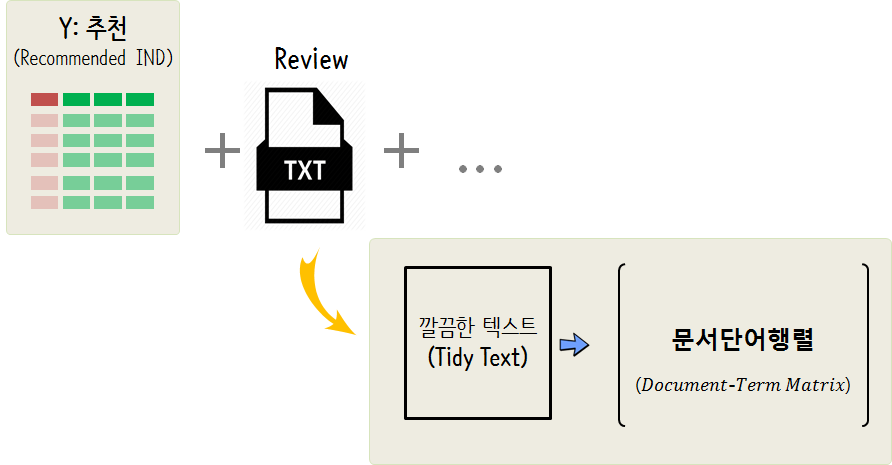

# 캐글 데이터셋 {#kaggle-datasets}

[Women's e-commerce cloting reviews](https://www.kaggle.com/nicapotato/womens-ecommerce-clothing-reviews) 데이터를 바탕으로 텍스트 데이터를 예측모형에 Feature로 넣어 예측력을 향상시키는 방안을 살펴보자.

## 데이터 사전 {#data-dictionary}

캐글 [Women's e-commerce cloting reviews](https://www.kaggle.com/nicapotato/womens-ecommerce-clothing-reviews) 데이터는 총 11개 변수로 구성되어 있고 관측점이 23,486개로 구성되어 있다.
**Recommended IND**를 라벨 목표변수로 두고 예측모형을 구축해보자.

- Clothing ID: Integer Categorical variable that refers to the specific piece being reviewed.
- Age: Positive Integer variable of the reviewers age.
- Title: String variable for the title of the review.
- Review Text: String variable for the review body.
- Rating: Positive Ordinal Integer variable for the product score granted by the customer from 1 Worst, to 5 Best.
- Recommended IND: Binary variable stating where the customer recommends the product where 1 is recommended, 0 is not - recommended.
- Positive Feedback Count: Positive Integer documenting the number of other customers who found this review positive.
- Division Name: Categorical name of the product high level division.
- Department Name: Categorical name of the product department name.
- Class Name: Categorical name of the product class name.


```r
library(tidyverse)
library(janitor)

cloth_dat <- read_csv("data/Womens Clothing E-Commerce Reviews.csv")

cloth_dat %>% 
  clean_names() %>% 
  sample_n(100) %>% 
  DT::datatable()
```

preservee5051b3ed6d3fb44


## 데이터 전처리 {#data-dictionary-preprocessing}

캐글 옷 리뷰 데이터에서 텍스트 관련 변수(`Title`, `Review`)를 빼고 전통적인 사각형 데이터프레임을 생성한다.
텍스트는 별도로 빼서 **DTM**을 만들어 결합시킨다. 텍스트 Feature를 모형설계행렬로 반영한 후 예측모형 알고리즘을 돌려 예측모형 정확도를 향상시킨다.



### 텍스트 빼고 전처리 {#data-dictionary-preprocessing-no-text}


```r
cloth_dat <- cloth_dat %>% 
  clean_names() %>% 
  filter(complete.cases(.)) %>% 
  rename(y = recommended_ind)

cloth_df <- cloth_dat %>% 
  mutate(y = factor(y, levels=c(1,0), labels=c("yes", "no"))) %>% 
  mutate_if(is.character, as.factor) %>% 
  select(y, age, title, review_text, division_name, department_name, class_name) %>% 
  mutate(class = fct_lump(class_name, 9)) %>% 
  select(y, age, division = division_name, department = department_name, class)
```

### 텍스트 전처리 {#data-dictionary-preprocessing-with-text}

캐글 옷 리뷰 데이터에서 텍스트 관련 변수(`Title`, `Review`)를 별도 구성하여 텍스트를 DTM으로 변환시킨 후에 예측모형 구축헤 활용한다.


```r
library(tm)
library(text2vec)
library(SnowballC)
library(tidytext)

cloth_dat %>% 
  # unnest_tokens(output=word, input = title) %>% 
  # anti_join(get_stopwords()) %>% 
  cast_dtm(review_text, term, count)
```


# 예측모형 {#data-predictive-model}


## 텍스트 제외 예측모형 {#data-predictive-model}


```r
# 2. 예측모형 -----
## 2.1. 훈련/시험 데이터 분할 ------
library(caret)

xy_index <- createDataPartition(cloth_df$y, times =1, p=0.5, list=FALSE)

train_df <- cloth_df[xy_index, ]
test_df  <- cloth_df[-xy_index, ]

## 2.2. 모형 개발/검증 데이터셋 준비 ------
cv_folds <- createMultiFolds(train_df$y, k = 5, times = 1)

cv_cntrl <- trainControl(method = "repeatedcv", number = 5,
                         sampling = "down",
                         summaryFunction = twoClassSummary,
                         classProbs = TRUE,
                         repeats = 1, index = cv_folds)


## 2.2. 모형 개발/검증 데이터셋 준비 ------
library(doSNOW)
# 실행시간
start.time <- Sys.time()

cl <- makeCluster(4, type = "SOCK")
registerDoSNOW(cl)

cloth_glm   <- train(y ~ ., data = train_df, 
                    method = "glm",
                    family = "binomial",
                    metric='Sens',
                    trControl = cv_cntrl, 
                    tuneLength = 7)

cloth_rf   <- train(y ~ ., data = train_df, 
                    method = "ranger",
                    metric='Sens',
                    num.tree = 100,
                    importance = "permutation",
                    trControl = cv_cntrl, 
                    tuneLength = 7)


stopCluster(cl)

total.time <- Sys.time() - start.time
total.time
```

```
Time difference of 24.993 secs
```

```r
# 3. 예측모형 성능 -----
## GLM
glm_pred_df <- predict(cloth_glm, newdata=test_df, type="prob") %>%
  tbl_df %>% 
  mutate(class = factor(ifelse(yes > no, "yes", "no"), levels = c("yes", "no")),
         prob  = yes)

confusionMatrix(glm_pred_df$class, test_df$y)
```

```
Confusion Matrix and Statistics

          Reference
Prediction  yes   no
       yes 3262  609
       no  4781 1178
                                          
               Accuracy : 0.4517          
                 95% CI : (0.4418, 0.4616)
    No Information Rate : 0.8182          
    P-Value [Acc > NIR] : 1               
                                          
                  Kappa : 0.034           
 Mcnemar's Test P-Value : <2e-16          
                                          
            Sensitivity : 0.4056          
            Specificity : 0.6592          
         Pos Pred Value : 0.8427          
         Neg Pred Value : 0.1977          
             Prevalence : 0.8182          
         Detection Rate : 0.3318          
   Detection Prevalence : 0.3938          
      Balanced Accuracy : 0.5324          
                                          
       'Positive' Class : yes             
                                          
```

```r
## randomForest
rf_pred_df <- predict(cloth_rf, newdata=test_df) %>% 
  tbl_df %>% 
  rename(class = value)

confusionMatrix(rf_pred_df$class, test_df$y)
```

```
Confusion Matrix and Statistics

          Reference
Prediction  yes   no
       yes 3757  768
       no  4286 1019
                                          
               Accuracy : 0.4859          
                 95% CI : (0.4759, 0.4958)
    No Information Rate : 0.8182          
    P-Value [Acc > NIR] : 1               
                                          
                  Kappa : 0.0212          
 Mcnemar's Test P-Value : <2e-16          
                                          
            Sensitivity : 0.4671          
            Specificity : 0.5702          
         Pos Pred Value : 0.8303          
         Neg Pred Value : 0.1921          
             Prevalence : 0.8182          
         Detection Rate : 0.3822          
   Detection Prevalence : 0.4603          
      Balanced Accuracy : 0.5187          
                                          
       'Positive' Class : yes             
                                          
```


