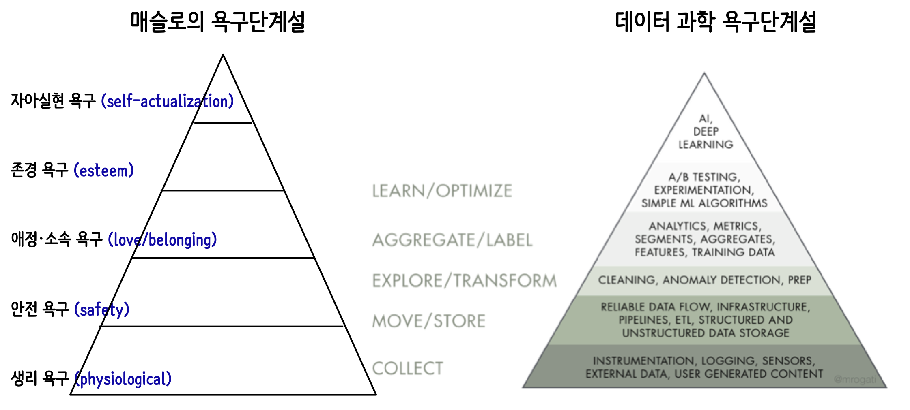
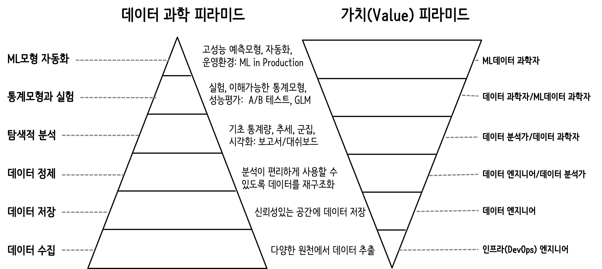

```{r setup, include=FALSE}
knitr::opts_chunk$set(echo = TRUE, message=FALSE, warning=FALSE,
                      comment="", digits = 3, tidy = FALSE, prompt = FALSE, fig.align = 'center')

```


# 데이터 과학 욕구단계설 [^ai-for-needs] [^data-science-pyramid] {#data-for-needs}

[^ai-for-needs]: [Monica Rogati (June 12th 2017), "The AI Hierarchy of Needs", Hackernoon](https://hackernoon.com/the-ai-hierarchy-of-needs-18f111fcc007)

[^data-science-pyramid]: [Hugh Williams (Jan 24, 2018), "The Pyramid of Data Needs (and why it matters for your career)"](https://medium.com/@hugh_data_science/the-pyramid-of-data-needs-and-why-it-matters-for-your-career-b0f695c13f11)

[매슬로의 욕구단계설](https://ko.wikipedia.org/wiki/%EB%A7%A4%EC%8A%AC%EB%A1%9C%EC%9D%98_%EC%9A%95%EA%B5%AC%EB%8B%A8%EA%B3%84%EC%84%A4)은 인간의 욕구가 그 중요도별로 하나의 욕구가 충족되면 위계상 다음 단계에 있는 욕구가 나타나서 그 충족을 요구하는 식으로 체계를 이룬다는 것이 핵심으로 이 이론을 AI/ML, 데이터 과학에 적용시켜도 크게 무리가 없다.
즉, 데이터를 수집하게 되면 이를 체계적으로 구조화하는 과정을 거치고 싶어지고, 체계적으로 잘 정리되면 이를 통해 데이터에 담긴 가치를 탐색과 이해의 과정이 뒤따르고, 그 다음은 이를 모형화 및 실험을 하고 마지막으로 이를 자동화하여 데이터에 담긴 가치를 최대한 활용하고자 한다.



# 데이터 과학 가치 창출 {#data-for-needs-value}

데이터 과학을 통해 가치를 창출하기 위해서는 앞선 데이터 과학 욕구단계설을 찬찬히 밟아가야 하며 이 과정 중 하나라도 생략하거나 담당 엔지니어가 없게 되면 초기 투자에서 계획된 효과를 얻을 수 없게 된다.


