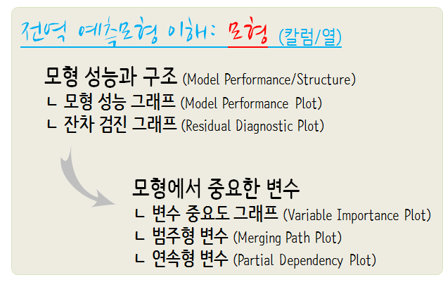

 
``` {r, include=FALSE}
source("tools/chunk-options.R")

knitr::opts_chunk$set(echo = TRUE, message=FALSE, warning=FALSE,
                      comment="", digits = 3, tidy = FALSE, prompt = TRUE, fig.align = 'center')

library(knitr)
library(kableExtra)

```

# 전역 예측모형 이해 [^dalex-model-explanation] {#ggplot-mpg-dataset-dalex}

[^dalex-model-explanation]: [Przemysław Biecek (2018-08-11), "DALEX: Descriptive mAchine Learning EXplanations"](https://pbiecek.github.io/DALEX_docs/)

`ggplot2` 팩키지에 연비 데이터(`mpg`)가 포함되어 있다. 이를 바탕으로 연비를 예측하는 데이터 모형을 개발해보자.
예측모형을 개발하고 나서 블랙박스인 예측모형에 대한 이해를 `DALEX` 팩키지를 바탕으로 수행해보자.

예측모형 아키텍처 선정이 중요한데 가장 많이 회자되는 GLM, Random Forest, SVM을 대상으로 연비예측모형을 생성한다.
그리고 나서 전역 예측모형 이해를 위해서 관심이 많은 다음 세가지 사항에 대해서 코딩한다.

- 모형 성능 비교: 어떤 모형 아키텍처가 가장 좋은 성능을 나타내는가?
- 모형 성능 중요 변수: 각 예측모형에 가장 큰 영향을 주는 변수는 어떤 것이 있는가?
- 변수별 예측변수 영향도: 변수별 예측변수 영향 측정



## `mpg` 연비데이터 {#ggplot-mpg-dataset}

`ggplot2`에 포함된 `mpg` 데이터셋은 기존 `mtcars` 데이터보다 관측점도 많은 반면,
전처리가 필요하다.이를 위해서 필요한 데이터 전처리 작업을 수행하고 나서 훈련 데이터와 시험데이터로 나눈다.

``` {r dalex-mpg-dataset}
# 0. 환경설정 -----
library(tidyverse)
library(DALEX)
library(randomForest)
library(caret)
library(e1071)

# 1. 연비 데이터 -----
## 1.1. 데이터 가져오기 -----
mpg_dat <- ggplot2::mpg

## 1.2. 데이터 정제 -----
mpg_df <- mpg_dat %>% 
    mutate_if(is.character, as.factor) %>% 
    mutate(manufacturer = fct_lump(manufacturer, 9),
           fl = fct_lump(fl, 2),
           class = fct_lump(class, 5),
           trans = ifelse(str_detect(trans, "auto"), "auto", "manual") %>% as.factor,
           year = as.factor(year)) %>% 
    select(cty, manufacturer, displ, year, cyl, trans, drv, fl, class)

## 1.3. 훈련/시험 데이터 분할 -----
mpg_idx <- createDataPartition(mpg_df$cty, times = 1, p=0.7, list=FALSE)

mpg_train <- mpg_df[mpg_idx, ]
mpg_test  <- mpg_df[-mpg_idx, ]
```

## 예측모형 아키텍처 {#dalex-model-architecture}

GLM, Random Forest, SVM을 예측모형 아키텍처로 선정하여 모형을 구축한다.

``` {r dalex-model-architecture}
# 2. 모형 -----
## 2.1. 선형모형 -----
mpg_lm <- lm(cty ~ ., data = mpg_train)

## 2.2. Random Forest -----
mpg_rf <- randomForest(cty ~ ., data = mpg_train)

## 2.3. SVM -----
mpg_svm <- svm(cty ~ ., data = mpg_train)
```

## 예측모형 이해와 설명 {#dalex-model-architecture-explain}

예측모형 이해와 설명을 위해서 DALEX(Descriptive mAchine Learning EXplanations) 팩키지 `explain()` 함수로 객체를 생성한다.

### 예측모형 성능 {#dalex-model-architecture-explain-performance}

앞선 세가지 모형 아키텍처에 대한 모형성능을 이해하기 위해서 `model_performance()` 함수를 사용한다.
잔차분포를 통해 Random Forest 모형이 가장 좋은 성능을 보여주고 있고, 상자그림(boxplot)을 통해서도 동일한 결과를 평균적으로 보여주고 있다.

``` {r dalex-model-architecture-explain}
# 3. 모형이해와 설명 -----
## 3.1. 모형이해와 설명 준비 -----
explainer_lm <- explain(mpg_lm, 
                        data = mpg_test[,-1], y = mpg_test$cty)

explainer_rf <- explain(mpg_rf, 
                        data = mpg_test[,-1], y = mpg_test$cty)

explainer_svm <- explain(mpg_svm, 
                        data = mpg_test[,-1], y = mpg_test$cty)


## 3.2. 모형 성능 -----

mp_lm  <- model_performance(explainer_lm)
mp_rf  <- model_performance(explainer_rf)
mp_svm <- model_performance(explainer_svm)

plot(mp_lm, mp_rf, mp_svm)
plot(mp_lm, mp_rf, mp_svm, geom = "boxplot")
```

### 예측모형 변수 중요도 {#dalex-model-architecture-explain-variable}

세가지 모형에 특정 변수를 빼고 예측모형을 돌렸을 때 가장 중요한 기여를 하는 변수를 `variable_importance()` 함수로 추정한다.

``` {r dalex-model-architecture-variable}
## 3.3. 변수 중요도 -----

vi_lm  <- variable_importance(explainer_lm, loss_function = loss_root_mean_square, type = "difference")
vi_rf  <- variable_importance(explainer_rf, loss_function = loss_root_mean_square, type = "difference")
vi_svm <- variable_importance(explainer_svm, loss_function = loss_root_mean_square, type = "difference")
plot(vi_lm, vi_rf, vi_svm)
```

### 예측모형 변수 반응(연속형) {#dalex-model-architecture-explain-variable-response}

PDP(Partial Dependence Plot)을 통해서 예측변수인 종속변수 연비(`mpg`)에 특정 변수를 `single_variable()`에 넣어 
투여된 변수 변화에 따른 연비변화를 확인할 수 있다.

``` {r dalex-model-architecture-variable-response}
## 3.4. 변수 반응도 -----
### PDP
sv_rf   <- single_variable(explainer_rf,  variable =  "displ", type = "pdp")
sv_lm   <- single_variable(explainer_lm,  variable =  "displ", type = "pdp")
sv_svm  <- single_variable(explainer_svm, variable =  "displ", type = "pdp")
plot(sv_rf, sv_lm, sv_svm)
```

### 예측모형 변수 반응(범주형) {#dalex-model-architecture-explain-variable-response-cat}

종속변수 연비(`mpg`)에 특정 변수가 연속형 뿐만 아니라 범주형도 존재한다. 제조사(`manufacturer`)와 차급(`class`)에 따라 
자동차 연비 변화를 묶어서 확인하는 것이 가능하다.

``` {r dalex-model-architecture-variable-response-cat, fig.height=8, eval=FALSE}
### 범주형 변수(Mering Path Plot)
#### 제조사
svd_rf  <- single_variable(explainer_rf,  variable = "manufacturer", type = "factor")
svd_lm  <- single_variable(explainer_lm,  variable = "manufacturer", type = "factor")
svd_svm  <- single_variable(explainer_lm, variable = "manufacturer", type = "factor")
plot(svd_rf, svd_lm, svd_svm)

#### 차급
svd_class_rf  <- single_variable(explainer_rf,  variable = "class", type = "factor")
svd_class_lm  <- single_variable(explainer_lm,  variable = "class", type = "factor")
svd_class_svm  <- single_variable(explainer_lm, variable = "class", type = "factor")
plot(svd_class_rf, svd_class_lm, svd_class_svm)
```

