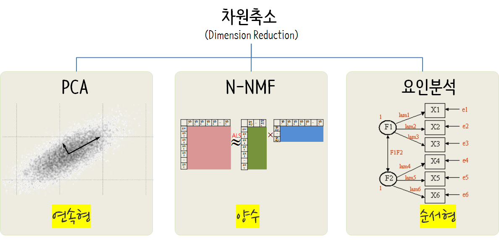
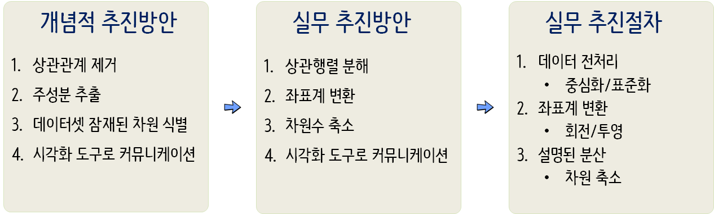

 

``` {r, include=FALSE}
knitr::opts_chunk$set(echo = TRUE, message=FALSE, warning=FALSE,
                      comment="", digits = 3, tidy = FALSE, prompt = FALSE, fig.align = 'center')
library(tidyverse)
library(extrafont)
loadfonts()
library(showtext)
par(family = "NanumGothic")
```

# 포켓몬 데이터 [^prcatical-guide-to-cluster-analaysis-in-r] {#pokemon-data-unsupervised}

[^prcatical-guide-to-cluster-analaysis-in-r]: [Mr Alboukadel Kassambara (2017), Practical Guide to Cluster Analysis in R: Unsupervised Machine Learning, Amazon Digital Services LLC](https://www.amazon.com/Practical-Guide-Cluster-Analysis-Unsupervised-ebook/dp/B077KQBXTN/ref=la_B076JDHZC8_1_1?s=books&ie=UTF8&qid=1511857119&sr=1-1)

초딩에게 인기가 많은 포켓몬 캐릭터를 군집으로 묶어낸다. 
주성분 분석을 통해 전처리하고 나서 계층적 군집화 및 k-평균 군집화 통계분석을 수행하고,
계층적 군집화와 평균 군집화 결과를 비교해보자.

[캐글 포켓몬](https://www.kaggle.com/abcsds/pokemon) 데이터가 공개되어 721종류 포켓몬에 대한 데이터와 포켓몬 유형에 대한 정보가 담겨있다.

각 포켓몬에 대한 데이터 원본은 [http://pokemondb.net/pokedex](http://pokemondb.net/pokedex)에서 확인한다.

## 포켓몬 데이터 불러오기 {#import-pokemon-data}

포켓몬 데이터를 캐글에서 다운로드 받아 불러온다. 
"Shuckle" 포켓몬은 이상점에 해당되니 대상에서 제거하고, 주성분분석과 군집분석을 위해 필요한 칼럼만 뽑아낸다.

``` {r pokemon-import}
# 0. 환경설정 --------------------------------------------
library(tidyverse)
library(janitor)

# 1. 포켓몬 데이터 ---------------------------------------
pkmon_dat <- read_csv("data/Pokemon.csv") 

pkmon_df <- pkmon_dat %>%  
  clean_names() %>% 
  dplyr::filter(name != "Shuckle") %>% 
  select(-number, -type_2) %>% 
  mutate_if(is.character, as.factor) %>% 
  mutate(generation = factor(generation)) %>% 
  as.data.frame() %>% 
  column_to_rownames(var="name")

# pkmon_legend <- ifelse(pkmon_dat$Legendary =="True", TRUE, FALSE)

pkmon_df %>% 
  sample_n(100) %>% 
  DT::datatable()
```

# 데이터 전처리 {#preprocess-pokemon-data}

## 전통적인 방식 {#preprocess-pokemon-data-old-school}

군집분석 및 주성분분석을 위해 가장 먼저 척도조정이 필수적이다.
척도조정이 이루어지지 않는 경우 특정변수에 왜곡이 발생할 우려가 있다.

이런 왜곡을 잡아내는데 `scale` 함수를 활용한다. `colMeans`, `apply` 함수에 `sd` 값을 통해 
척도조정이 잘 이루어졌는지 확인한다.

``` {r pokemon-preporcessing}
# 2. 데이터 전처리 ---------------------------------------
## 2.1. 척도 조정 ----------------------------------------
# 척도조정되지 않은 원본
pkmon_df %>% 
  select(total:speed) %>% 
  gather(variable, value) %>% 
  group_by(variable) %>% 
  summarise_all(funs(mean, sd))

# colMeans(pkmon_df)
# apply(pkmon_df, 2, sd)

# 척도조정
pkmon_scaled_df <- pkmon_df %>% 
  mutate_if(is.integer, scale)

rownames(pkmon_scaled_df) <- rownames(pkmon_df)

# 척도조정한 원본
# colMeans(pkmon_scaled_df)
# apply(pkmon_scaled_df, 2, sd)

pkmon_scaled_df %>% 
  select(total:speed) %>% 
  gather(variable, value) %>% 
  group_by(variable) %>% 
  summarise_all(funs(mean, sd))
```

## `tidymodels` 방식 [^tidymodels-pca] {#preprocess-pokemon-data-tidymodels}

[^tidymodels-pca]: [Julia Silge (2020. 4. 15.), "Principal component analysis for hip hop songs with tidymodels"](https://www.youtube.com/watch?v=OvgzIx5mDNM)

`tidyverse`를 구성하는 주요 팩키지 중 하나인 [`tidymodels`](https://github.com/tidymodels)를 기본 도구로 활용해서 포켓몬 데이터에 대한 주성분 분석을 위한 데이터 전처리 작업을 수행해본다. 

```{r tidymodels-pca}
library(tidyverse)
library(tidymodels)

pkmon_tbl <- pkmon_dat %>%  
  clean_names() %>% 
  dplyr::filter(name != "Shuckle") %>% 
  select(-number, -type_2) %>% 
  mutate(generation = factor(generation)) %>% 
  mutate_if(is.character, factor)

pkmon_rec <- recipe(legendary ~ ., data = pkmon_tbl) %>%
  update_role(name, new_role = "id") %>%
  step_corr(all_numeric()) %>% 
  step_normalize(all_numeric()) %>%
  step_pca(all_numeric(), num_comp = 3)


pkmon_pca_estimates <- prep(pkmon_rec)
pkmon_pca_estimates

pkmon_pca_data <- bake(pkmon_pca_estimates, pkmon_tbl)
pkmon_pca_data
```


# 차원축소 {#pokemon-pca-dimension-reduction}

**차원(dimension)**은 데이터셋의 단순히 칼럼(변수)라고 볼 수 있고, **차원수(Dimensionality)**는 데이터셋을 규정하는 차원의 수라고 정의하자. 데이터셋을 규정하는 잠재된 내재 차원은 측정된 칼럼 혹은 변수를 통해 데이터로 발현된 것으로 가정한다.
따라서, 데이터셋에 잠재된 차원을 찾아내는 방법이 필요하고 이에 더하여 **차원의 저주(Curse of dimensionality)**로 인하여 차원이 증가할수록 필요로하는 관측점의 수가 기하급수적으로 증가하게 되어 차원을 축약하는 것이 반듯이 필요하다. 그리고 자료형에 따라 다양한 차원축소방법이 개발되어 활용되고 있다.

- 주성분분석(Principal Component Analysis)
- N-NMF(Non-Negative Matrix Factorization)
- 요인분석(Factor Analysis)



## 탐색적 데이터 분석 {#pokemon-pca-eda}

차원축소기법은 변수간의 상관관계를 바탕으로 이를 축약해 나가는 것이 기본이라 상관관계를 통해 사전적으로 파악하는 것이 필요하다. 

### 상관계수 [^ggcorrplot] {#pokemon-pca-eda-correlation}

[^ggcorrplot]: [STHDA, "ggcorrplot: Visualization of a correlation matrix using ggplot2"](http://www.sthda.com/english/wiki/ggcorrplot-visualization-of-a-correlation-matrix-using-ggplot2)

`corrr` 팩키지를 통해서 상관계수를 데이터프레임으로 변환시켜 후속/연결 작업을 수월히 수행할 수 있다.

```{r pokemon-pca-correlation}
library(corrr)

pkmon_scaled_df %>% 
  select_if(is.numeric) %>% 
  correlate() %>% # (2)
  shave(upper = TRUE) %>% # (3)
  stretch(na.rm = TRUE) %>% 
  arrange(-r) %>% 
  DT::datatable() %>% 
    DT::formatRound("r", digits = 2)
```

### 상관계수 시각화 {#pokemon-pca-eda-correlation-viz}

[`ggcorrplot`](https://github.com/kassambara/ggcorrplot)은 ggplot2 기반이라 [`corrplot`](https://cran.r-project.org/web/packages/corrplot/index.html)이 갖는 기능을 그대로 옮겨왔다. 

```{r pokemon-pca-correlation-viz}
library(ggcorrplot)

pkmon_df %>% 
  select_if(is.numeric) %>% 
  cor() %>% 
  ggcorrplot(hc.order = TRUE, type = "lower",
             outline.col = "white",
             lab = TRUE)

```

## 차원축소 주성분 분석 {#pokemon-pca}

차원축소를 개념적으로 추진하는 파이프라인은 상관관계를 제거하고, 주성분을 신규 차원으로 추출해서 
데이터셋의 잠재된 차원 식별하여 시각화 도구로 커뮤니케이션하는 것으로 정의되지만,
실무적으로는 상관계수 행렬을 분해하여 좌표계를 바꾸고 차원수를 줄여 시각화 도구로 커뮤니케이션하게 되는 절차를 거치게 됩니다.
이제 데이터단으로 내려오게 되면, 중심화/표준화를 통해 데이터 전처리 작업을 수행하고 회전과 투영으로 좌표계를 변환하고 설명되는 분산을 최대화되는 차원을 선택하여 차원 축소작업을 마무리한다.




군집분석 등 후속분석을 위해 활용될 수 있는 변수가 많은 경우 차원을 축소할 필요가 있다.
이런 목적으로 Base R `prcomp()` 함수를 사용해서 주성분 분석을 수행했다. 물론 `scale=TRUE`, `center=TRUE` 인자를 넣어 척도를 조정한다.

주성분을 몇개까지 선택할 것인지에 대해서 설명되는 분산량을 누적한 누적 설명되는 분산량을 기준으로 80%, 90% 등 선정을 한다.

## 차원축소 주성분 분석 통계량 {#pokemon-pca-statistics}

`FactoMineR` 팩키지 `PCA()` 함수를 사용해서 차원을 축소하려는 변수를 넣고, 부가변수도 지정한다. `summary()` 함수를 통해서 주성분분석 주요내용을 확인할 수 있다.
특히, `PCA()`함수에 범주형 변수는 `quali.sup`, 연속형 변수는 `quanti.sup`으로 지정한다. 

``` {r pokemon-pca-new-statistics}
## 2.2. PCA 주성분분석 ----------------------------------------
library(FactoMineR)
library(factoextra)

pkmon_pca <- PCA(pkmon_scaled_df, quali.sup = c(1, 9:10), quanti.sup= 2, graph = FALSE)

summary(pkmon_pca)
```

`pkmon_pca$eig`을 통해서 고유값을 추출하고, `dimdesc()` 함수를 통해서 주성분에 대한 각 변수 기여도를 살펴볼 수 있고, `pkmon_pca$var$contrib`을 통해 각 변수별로 주성분에 대한 관련성도 파악이 가능하다.

``` {r pokemon-pca-new-additional}
pkmon_pca$eig

dimdesc(pkmon_pca, axes = 1:2)

pkmon_pca$var$contrib
```

## 차원축소 주성분 분석 시각화 {#pokemon-pca-viz}

`biplot`을 통해 주성분분석 결과를 통해 변수들간에 연관성이 큰 변수를 이해하고 관측점들 관계도 동시에 시각화한다.

### 변수 및 관측점 대한 PCA 시각화 {#pokemon-pca-viz-var}

주성분과 변수에 대한 관련성, 주성분과 관측점에 대한 관련성을 시각화한다.

``` {r pokemon-pca-biplot-var, fig.width=10}
pca_var_g <- fviz_pca_var(pkmon_pca, select.var = list(cos2 = 0.5), repel = TRUE)
pca_ind_g <- fviz_pca_ind(pkmon_pca, select.ind = list(cos2 = 0.7), repel = TRUE)

cowplot::plot_grid(pca_var_g, pca_ind_g, ncol=2)
```


### 주성분에 대한 변수 기여도 시각화 {#pokemon-pca-viz-var-contribution}

주성분에 대한 변수 기여도 시각화한다.

``` {r pokemon-pca-biplot-var-contribution}
pca_1_g <- fviz_cos2(pkmon_pca, choice = "var", axes = 1, top = 5)
pca_2_g <- fviz_cos2(pkmon_pca, choice = "var", axes = 2, top = 5)

cowplot::plot_grid(pca_1_g, pca_2_g, ncol=2)

```

### `biplot` 시각화 {#pokemon-pca-viz-var-contribution-biplot}

주성분 평면에 변수와 관측점을 함께 시각화하고, 보조변수(`pkmon_df$legendary`)를 바탕으로 이를 시각화한다. 

``` {r pokemon-pca-biplot, fig.width=10, fig.height=8}
# fviz_pca_biplot(pkmon_pca)

fviz_pca_ind(pkmon_pca, habillage = pkmon_df$legendary, addEllipses = TRUE)
```

