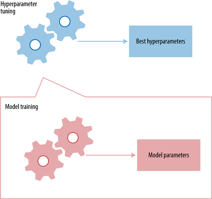

```{r setup, include=FALSE}
knitr::opts_chunk$set(echo = TRUE, message=FALSE, warning=FALSE,
                      comment="", digits = 3, tidy = FALSE, prompt = FALSE, fig.align = 'center')

library(reticulate)
use_condaenv("anaconda3")
# reticulate::repl_python()
```


# 데이터와 모형정의 {#ansur-dataset-model}

## 데이터셋 - ANSUR II {#ansur-dataset}

[미군 신체측정 데이터셋(Anthropometric Survey of US Army Personnel, ANSUR 2)](http://www.openlab.psu.edu/ansur2/)은 2012년 내부에 공개되었고 2017년에 대중에 공개되었다. 
총 6,000명 군인(남자 4,082, 여자 1,986)에 대한 측정정보를 담고 있다. 실제 데이터를 받아보면 6,068명 행으로 되어있고, 108 칼럼으로 구성되어 있다. R에서 불필요하다고 판단되는 변수를 일부 제고하고 남은 99개 변수를 대상으로 예측모형 구축작업을 수행해 나간다.

`pd.read_csv()` 함수로 데이터프레임으로 불러온 후에 `.shape`, `.dtypes`, `.head` 를 사용해서 데이터프레임과 친숙해진다.

```{python ansur-python}
import pandas as pd

ansur_pd = pd.read_csv("data/soldier_df.csv")

ansur_pd.shape

ansur_pd.dtypes

ansur_pd.head(3)
```

## 모형정의 {#ansur-pm}

데이터에 대한 확인이 되었으면 다음으로 모형을 정의한다. 즉, 남성과 여성이 Label 이 되고, 남성과 여성을 신체특성 변수 feature로 예측하는 모형이다.

$$\text{남자 혹은 여자} = f(x_1 , x_2 , \cdots, x_n) + \epsilon$$

# 예측모형 시운전(Dry-Run) {#ansur-pm-dry-run}

## Feature 공학 {#ansur-feature}

데이터프레임에서 범주형 변수로 정의한 칼럼명을 리스트로 정의한 후에 `LabelEncoder`를 사용해서 예측모형에서 사용할 수 있는 형태로 변환시킨다.

```{python ansur-feature}
from sklearn.preprocessing import LabelEncoder

category_columns = ["Gender", "Component", "Branch", "DODRace", "WritingPreference"]

for column in category_columns:
    le = LabelEncoder()
    ansur_pd[column] = le.fit_transform(ansur_pd[column])

print(ansur_pd.dtypes)
```

## 시운전 예측모형 {#ansur-feature-skeleton}

`BernoulliNB` 나이브 베이즈모형을 신체측정 feature를 바탕으로 시운전 개념으로 적합시켜본다.

```{python ansur-feature-pm-skeleton}
from sklearn.naive_bayes import BernoulliNB

features, labels = ansur_pd.drop('Gender', 1), ansur_pd['Gender']
dry_run_nb = BernoulliNB() 
dry_run_nb.fit(features, labels) 
dry_run_nb.predict(features.head(5))
```

## 시운전 예측모형 평가 {#ansur-feature-skeleton-dryrun}

`train_test_split`으로 훈련/시험 데이터로 쪼개고 `RandomForestClassifier`를 추가해서 두가지 예측모형의 성능을 비교할 수 있는 `accuracy_score` 함수로 측정한다.

```{python ansur-feature-pm-skeleton-dryrun}
from sklearn.model_selection import train_test_split
from sklearn.ensemble import RandomForestClassifier
from sklearn.metrics import accuracy_score

# 성능비교를 위한 딕셔너리
accuracies = {}

X_train, X_test, y_train, y_test = train_test_split(
  features, labels, test_size = 0.3, random_state=7)

# Random Forest ------------------------------
rf_model = RandomForestClassifier(random_state = 77).fit(
  X_train, y_train)

rf_predictions = rf_model.predict(X_test)
accuracies['rf'] = accuracy_score(y_test, rf_predictions)

# 나이브베이즈 ------------------------------
nb_model = BernoulliNB().fit(
  X_train, y_train)

nb_predictions = nb_model.predict(X_test)
accuracies['Naive Bayes'] = accuracy_score(y_test, nb_predictions)

accuracies
```


# 예측모형 후처리 [^hyper-paramter] {#ansur-pm-tuning}

[^hyper-paramter]: [Will Koehrsen(Jan 10, 2018), "Hyperparameter Tuning the Random Forest in Python"](https://towardsdatascience.com/hyperparameter-tuning-the-random-forest-in-python-using-scikit-learn-28d2aa77dd74)

## 초모수 튜닝 {#ansur-pm-tuning-hyper-parameter}

Random Forest 예측모형은 초모수(hyper parameter)를 탐색하여 예측모형의 성능을 추가로 더 끌어올릴 수 있다. 이를 위해서 랜덤탐색(random search)도 있고, 격자탐색(grid search)도 더불어 많이 사용된다.   



`RandomForestClassifier`, Random Forest 모형의 경우 다음 초모수가 성능에 영향을 미치는 것으로 연구결과가 공개되어 있다.

- n_estimators = 의사결정나무 갯수
- max_features = 노드를 쪼갤 때 고려되는 최대 feature 갯수
- max_depth = 각 의사결정나무 최대 깊이

```{python ansur-hyper-paramter}
from pprint import pprint

print('기본설정 디폴트 모형에 사용된 모수 목록:\n')
pprint(rf_model.get_params())
```

Random Forest 예측모형에 가장 영향을 많이 미치는 초모수 3개에 대해서 아래와 같이 값을 부여하고, `param_grid`를 통해 격자탐색을 작업을 수행하여 최적모수를 찾아낸다.

```{python ansur-hyper-paramter-fit}
from sklearn.model_selection import GridSearchCV

param_grid = {'n_estimators' : list(range(10, 50, 10)),
              'max_features' : ['auto', 'sqrt'],
              'max_depth'    : list(range(2, 10, 2))}

grid = GridSearchCV(RandomForestClassifier(), param_grid, cv=3)
grid.fit(X_train, y_train)
grid.best_params_
```

`grid.best_params_` 딕셔너리에는 최적화된 초모수가 포함되어 있다. 해당 값들을 꺼내 초모수에 넣어 Random Forest 모형에 넣어 다시 훈련데이터에 적합시키게 되면 예측모형의 성능이 소폭 향상된 것을 확인할 수 있다.

```{python ansur-hyper-paramter-fit-refit}
rf_hyper_model = RandomForestClassifier(n_estimators = grid.best_params_['n_estimators'],
                                        max_features = grid.best_params_['max_features'],
                                        max_depth    = grid.best_params_['max_depth']).fit(X_train, y_train)

rf_hyper_predictions = rf_hyper_model.predict(X_test)
accuracies['rf hyper parameter'] = accuracy_score(y_test, rf_hyper_predictions)

accuracies
```

## 변수선택 {#ansur-pm-tuning-feature-selection}

`SelectKBest`를 통해 예측에 효과가 큰 feature를 추출해낸다. 앞서 선택된 초모수를 함께 넣어 예측모형을 만들어낸다. 가장 영향력이 큰 feature 30개를 대상으로 예측모형 성능을 평가한다.

```{python ansur-feature-selection}
from sklearn.feature_selection import SelectKBest, f_classif

select_k_best_classifier = SelectKBest(f_classif, k='all').fit(X_train, y_train)

rf_selectK_model = RandomForestClassifier(n_estimators = grid.best_params_['n_estimators'],
                                        max_features = grid.best_params_['max_features'],
                                        max_depth    = grid.best_params_['max_depth']).fit(select_k_best_classifier.transform(X_train), y_train)

rf_selectK_predictions = rf_selectK_model.predict(X_test)
accuracies['rf hyper selectK'] = accuracy_score(y_test, rf_selectK_predictions)

accuracies
```

`SelectKBest`를 통해 어떤 feature가 추출되었는지 살펴본다. 먼저 매스크(mask)를 생성시키고 성성된 매스크를 넣어 변수명과 함께 확인할 수 있도록 코드를 작성한다.

```{python ansur-feature-selection-bestK}

mask = select_k_best_classifier.get_support() # 부울값 리스트

best_features = X_train.columns[mask]        
        
print("Feature 총계:", len(best_features), "\n",  "선택된 30개 feature:", best_features)
        
```        