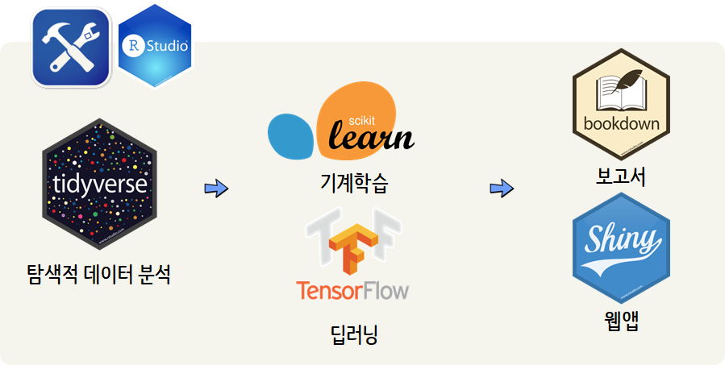

 
``` {r, include=FALSE}
# source("tools/chunk-options.R")

knitr::opts_chunk$set(echo = TRUE, message=FALSE, warning=FALSE,
                      comment="", digits = 3, tidy = FALSE, prompt = TRUE, fig.align = 'center')


```

# R 파이썬 작업흐름 [^bs-python-r] [^python-wine-machine-learning] {#python-r-biz-science}

[^bs-python-r]: [Matt Dancho (October 8, 2018), "R AND PYTHON: HOW TO INTEGRATE THE BEST OF BOTH INTO YOUR DATA SCIENCE WORKFLOW"](https://www.business-science.io/business/2018/10/08/python-and-r.html)

[^python-wine-machine-learning]: [EliteDataScience(2017), "Python Machine Learning Tutorial, Scikit-Learn: Wine Snob Edition"](https://elitedatascience.com/python-machine-learning-tutorial-scikit-learn)

CDO(Chief Data Officer)를 2019년까지 거의 90% 글로벌 조직에서 보유하게 될 것으로 예측[^cdo-forecasting]했는데 이유는 단순히, 고성능 데이터 과학팀에서 ROI를 잘 내기 때문이다.

[^cdo-forecasting]: [JEFF DESJARDINS(2018), "The Rise of the Chief Data Officer (CDO)"](http://www.visualcapitalist.com/the-rise-of-the-chief-data-officer-cdo/)

하지만, 데이터 과학에서는 두가지 강력한 언어 파이썬과 R의 전쟁이 한창이다. 하지만, "R Shop", "파이썬 Shop"으로 데이터 과학팀을 구축할 필요는 없다. 
왜냐하면 R과 파이썬 모두 그 자체로 장점이 있어 이를 조합하면 결국 원하는 데이터과학 목적을 달성하는데 큰 도움이 된다.

# R 파이썬 장점 {#r-python-strength}

R과 파이썬 장점을 살펴보자. R은 컴퓨터 과학 전문가나 소프트웨어 엔지니어가 개발한 언어가 아니라 과학자와 연구자가 개발한 도구로 
과학 기술 연구에 실험과 설계를 용이하게 하고 실험결과를 커뮤니케이션 하는데 초점을 맞춰 개발되었다.
이를 한단계 더 들어가면 통계학, 데이터 분석, 데이터 탐색, 데이터 시각화가 핵심적인 구성요소가 되고,
이를 만족시키기 위해서 `R마크다운`를 통해 보고서 작성, `Shiny`로 MVP와 유사하게 신속히 프로토타입 개발로 최종 산출물을 뽑아내기 유용하게 진화했다.
물론 `R마크다운`과 `Shiny`로 최종제품을 뽑아내기 위해서 앞단에 데이터 추출, 정제, 탐색, 모형 개발과정을 `tidyverse`로 묶어 그 어떤 
데이터 과학 언어보다 뛰어난 생산성을 자랑하게 되었다.

파이썬은 다양한 프로그래밍 패러다임을 포용하고 웹 프레임워크, 데이터베이스 연결, 네트워크, 웹 스크래핑, 과학 컴퓨팅,
텍스트 및 이미지 처리, 기계학습 등 한 언어로 다양한 작업을 수행할 수 있다는 점이 큰 장점이다.
파이썬은 컴퓨터 과학과 수학에 뿌리를 두고 있고 오픈 소스 라이브러리가 100,000개가 넘게 존재하고 건강한 프로그래밍 생태계를 보유하고 있다.
특히, `scikit-learn`, `tensorflow`라는 기계학습과 딥러닝의 핵심 라이브러리를 보유하고 있는 것은 커다란 장점이다.

# 데이터 과학 작업흐름 {#r-python-workflow}

탐색적 데이터 분석에 장점이 많은 R을 앞단에 배치하여 탐색적 데이터 분석을 수행하고 기계학습과 딥러닝은 파이썬에 맡기고 최종 
시각화를 포함한 보고서와 웹앱 개발은 R로 마무리하는 작업흐름이 이상적인 데이터과학 방법이 될 수 있다.



## 파이썬 환경구축 [^reticulate-python] {#r-python-workflow-environment}

[^reticulate-python]: [R Markdown Python Engine](https://rstudio.github.io/reticulate/articles/r_markdown.html)

[아나콘다](https://www.anaconda.com/download/)를 다운로드 받아 설치한 후에 `conda_list()` 함수로 
사용할 파이썬 환경을 지정한다. 

```{r setup-python-work-environment}
library(reticulate)
conda_list()
use_condaenv("anaconda3")
```

혹시 빠진 라이브러리가 있는 경우, 관리자 권한으로 윈도우 터미널(cmd.exe,쉘)을 실행하게 되면 `conda` 명령어를 통해서 `pandas`, `sklearn` 라이브러리를 설치하여 기계학습에 사용할 수 있다.
(예를 들어, `conda install pandas` 명령어를 관리자 권한으로 윈도우 터미널에서 실행)
RStudio에서 **컨트롤 + 엔터** 키를 쳐서 콘솔창에 직접 실행결과를 인터랙티브하게 확인하고자 한다면 `reticulate` 팩키지를 불러와서 `repl_python()` 명령어를 실행하면 콘솔창 프롬프트가 `>`에서 갈매기 3마리 `>>>`으로 변경된 것이 확인된다.

## 라이브러리와 데이터 {#r-python-workflow-library-data}

`from`, `import`를 사용해서 포도주 예측에 필요한 기계학습 라이브러리를 가져오고 포도주 데이터도 
데이터를 가져와서 포도두 품질 예측을 위한 데이터로 준비한다.

```{python import-python-library}
# 라이브러리 가져오기
import numpy as np
import pandas as pd
from sklearn.model_selection import train_test_split
from sklearn import preprocessing
from sklearn.ensemble import RandomForestRegressor
from sklearn.pipeline import make_pipeline
from sklearn.model_selection import GridSearchCV
from sklearn.metrics import mean_squared_error, r2_score
from sklearn.externals import joblib

# 포도주 데이터
dataset_url = 'http://mlr.cs.umass.edu/ml/machine-learning-databases/wine-quality/winequality-red.csv'
data = pd.read_csv(dataset_url, sep = ";")

print(data.head())
```


## 포도주 품질 예측모형 {#r-python-workflow-predictive-model}

포도주 품질 예측을 위한 예측모형 개발을 우선 `X` 모형설계행렬과 `y` 라벨 목표변수로 나누고,
다시 과적합 방지 및 예측모형의 일반화를 위해서 훈련, 시험데이터로 나눈다. 이때 `train_test_split()` 함수를 사용한다.

그리고 나서, 예측변수에 대한 전처리 작업을 수행하고 이를 파이프라인으로 구축해서 
초모수(Hyper-Parameter)도 함께 추정하여 최적의 예측모형을 개발한다.

```{python import-python-predictive-model}
# X, Y 데이터 분할
y = data.quality
X = data.drop("quality", axis=1)

# 훈련/시험데이터 분할
X_train, X_test, y_train, y_test = train_test_split(
  X, y,
  test_size    = 0.3,
  random_state = 123,
  stratify     = y
)

# 피처 공학
scaler = preprocessing.StandardScaler().fit(X_train)   
X_test_scaled = scaler.transform(X_test)

# 파이프라인 구축
pipeline = make_pipeline(
    preprocessing.StandardScaler(),
    RandomForestRegressor(n_estimators = 100)
)

# 초모수(Hyper-Parameter) 설정
hyperparameters = {
    "randomforestregressor__max_features" : ["auto", "sqrt", "log2"],
    "randomforestregressor__max_depth"    : [None, 5, 3, 1]
}

# 랜덤포레스트 기계학습
clf = GridSearchCV(pipeline, hyperparameters, cv = 10)
clf.fit(X_train, y_train)

print(clf.best_params_)

# 예측
y_pred = clf.predict(X_test)
```

## 예측모형 시각화 {#r-python-workflow-predictive-model-viz}

`py$`으로 파이썬 환경 데이터를 R환경으로 빼서 티블 데이터프레임을 생성시킨다. 그리고 나서 이를 ggplot으로 시각화한다.


```{r wine-python-pm-viz}
library(tidyverse)

results_tbl <- tibble(
    y_test = py$y_test,
    y_pred = py$y_pred
) 

# 시각화
results_tbl %>%
    ggplot(aes(y_test, y_pred)) +
    geom_jitter(alpha = 0.5) +
    geom_smooth() + 
    theme_minimal(base_family = "AppleGothic") +
    labs(
        title = "포도주 품질 예측값과 실제값",
        subtitle = "포도주 품질 수준",
        x = "실제 포도주 품질", y = "예측모형 포도주 품질"
    )
```


