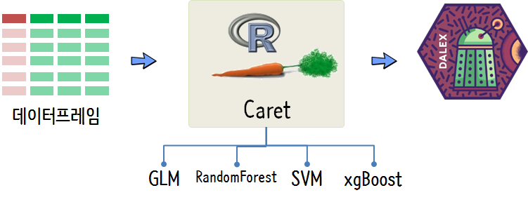
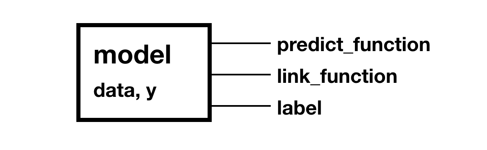
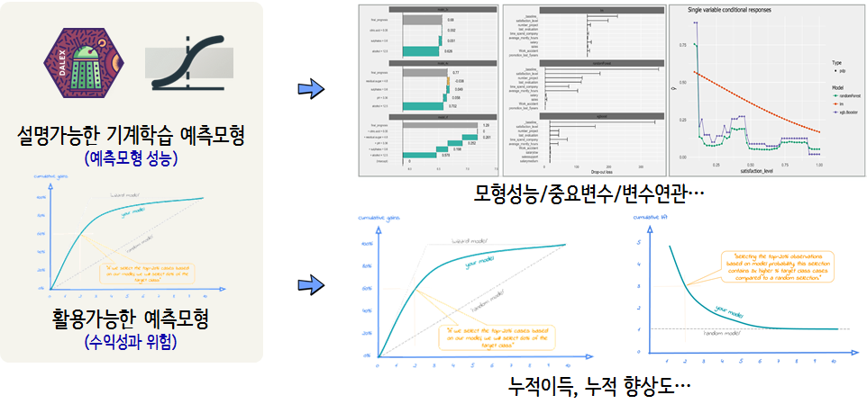

 
``` {r, include=FALSE}
# source("tools/chunk-options.R")

knitr::opts_chunk$set(echo = TRUE, message=FALSE, warning=FALSE,
                      comment="", digits = 3, tidy = FALSE, prompt =  FALSE, fig.align = 'center')

```


# `caret` + DALEX + 사업 예측모형 {#r2d3-dalex-caret}

[R2D3](http://www.r2d3.us/) 웹사이트에 기계학습에 대한 시각적 소개가 잘 정리되어 있다.
뉴욕과 샌프란시스코 두 도시의 부동산을 분류하는 데이터를 바탕으로 의사결정나무(Decision Tree) 기계학습 알고리즘이 동작하는 방식을 마우스 스크롤을 아래로 내리게 되면 시각적으로 확인할 수 있다.

[FAQ](http://www.r2d3.us/about/faqs/) 웹사이트에서 CSV 파일을 다운로드 받아 직접 기계학습 예측모형을 제작해보자.


[A Short Introduction to the caret Package](https://cran.r-project.org/web/packages/caret/vignettes/caret.html) 팩키지를 주된 예측모형 엔진으로 사용하고 블랙박스 예측모형을 이해하고 해석하는데 [DALEX: Descriptive mAchine Learning EXplanations](https://pbiecek.github.io/DALEX_docs/)를 사용한다.
즉, 데이터프레임을 받아 `caret` 예측모형을 생성하고 이를 `DALEX`를 통해 블랙박스 모형을 해석하고 이해하는 작업방식이 된다. 

예측성능이 뛰어난 블랙박스 예측모형은 모형 개발자를 위해서 설명가능한 형태로 제작하는 것과 함께 이를 활용할 수 있는 사업쪽에 설명하여 실제로 적용될 수 있도록 설명가능하고 활용가능한 형태로 제작되어야 한다. 

블랙박스 예측모형의 성능에 대한 다양한 지표(AUC 등)와 함께 예측모형이 활용가능한지에 대한 다양한 지표와 시각화(Lift, Gains)에 대한 정보를 함께 제공해야 비로서 예측모형을 통해서 예측이 가능하고 이를 통해 실제로 A/B 검정까지 확장하여 사업적 가치를 획득하게 된다.




# 데이터 {#r2d3-dalex-caret}

R2D3 뉴욕, 샌프란시스코 부동산 분류 데이터를 다운로드 받아 예측모형 적합을 위한 형태로 가공한다.

``` {r r2d3-caret-dataset}
# 0. 환경설정 -----
library(tidyverse)
library(caret)
library(recipes)
library(skimr)
library(DALEX)
library(randomForest)
library(e1071)
library(xgboost)
library(cowplot)

# 1. 데이터 -----
## 1.1. 데이터 가져오기
r2d3_df <- read_csv("https://raw.githubusercontent.com/jadeyee/r2d3-part-1-data/master/part_1_data.csv", skip=2)

## 1.2. X/Y 데이터 분할
x_train_tbl <- r2d3_df %>% select(-in_sf)
y_train_tbl <- r2d3_df %>% select(in_sf)   

## 1.3. X/Y 데이터 요리
rec_obj <- recipe(~ ., data = x_train_tbl) %>%
    # step_scale(all_numeric()) %>%
    prep(stringsAsFactors = FALSE)

x_train_processed_tbl <- bake(rec_obj, x_train_tbl) 

y_train_processed_tbl <- y_train_tbl

xy_train <- bind_cols(y_train_processed_tbl, x_train_processed_tbl) %>% 
    mutate(in_sf = as.factor(in_sf))

## 1.4. 훈련/시험 데이터 분할

train_idx <- createDataPartition(xy_train$in_sf, p = 0.7, list = FALSE, times = 1)
xy_train_df <- xy_train[ train_idx,]
xy_test_df  <- xy_train[-train_idx,]
```

# 모형 아키텍처 {#r2d3-dalex-caret-fit}

예측모형 아키텍처로 서로 다른 특징을 갖는 대표적인 예측모형을 선정한다. GLM, RandomForest, SVM, xgBoost 예측모형으로 부동산을 예측해본다.

``` {r r2d3-caret-fit}
# 2. 예측 모형 -----

tune_grid <- expand.grid(nrounds = 200,
                         max_depth = 5,
                         eta = 0.05,
                         gamma = 0.01,
                         colsample_bytree = 0.75,
                         min_child_weight = 0,
                         subsample = 0.5)

## 2.1. 모형 3종 세트 (GLM, Random Forest, SVM)

model_glm <- train(in_sf ~., data = xy_train_df, 
                   method="glm", family="binomial")

model_rf  <- train(in_sf ~., data = xy_train_df, 
                  method="rf", ntree = 100, tuneLength = 1)

model_svm <- train(in_sf ~., data = xy_train_df, 
                   method="svmRadial", prob.model = TRUE, tuneLength = 1)

model_xgb  <- train(in_sf ~., data = xy_train_df, 
                   method="xgbTree", tuneGrid = tune_grid)
```

# 설명가능한 예측모형 {#r2d3-dalex-caret-explainable-model}

## 비사업을 위한 예측모형 설명 {#r2d3-dalex-caret-explainable-model-non-biz}

### `explainer` 객체 생성 {#r2d3-dalex-caret-explain}

모형 이해와 해석을 위해서 `DALEX` 팩키지 `explain()` 함수를 통해 `explainer` 객체를 생성한다.
다음 그림에 정리된 것처럼 예측함수(`predict_function`), 라벨(`label`), 경우에 따라서 연결함수(`link_function`)을 적시해야 한다.



``` {r r2d3-caret-explain}
# 3. DALEX 설정 -----
## 3.1. explainer 사전 설정
prob_fun <- function(object, newdata) { 
    predict(object, newdata=newdata, type="prob")[,2]
}

y_test_v <- as.numeric(as.character(xy_test_df$in_sf))

## 3.2. explainer 실행
explainer_glm <- DALEX::explain(model_glm, label = "GLM", 
                                data = xy_test_df, y = y_test_v,
                                predict_function = prob_fun)

explainer_rf <- DALEX::explain(model_rf, label = "RF",
                               data = xy_test_df, y = y_test_v,
                               predict_function = prob_fun)


explainer_svm <- DALEX::explain(model_svm,  label = "SVM", 
                                data = xy_test_df, y = y_test_v,
                                predict_function = prob_fun)

explainer_xgb <- DALEX::explain(model_xgb,  label = "xgBoost", 
                                data = xy_test_df, y = y_test_v,
                                predict_function = prob_fun)
```


## 예측모형 이해와 설명 {#r2d3-dalex-caret-explain-do-it}

설명가능한 예측모형을 위해서 사업적인 측면과 알고리즘 모두를 고려한 지표 및 시각화 정보가 필요하다. 따라서 이를 설명가능한 기계학습 예측모형과 활용가능한 예측모형 두개로 나눠서 살펴보자. 예측모형에 대한 자세가 구축하는 입장과 이를 활용하는 입장에서 큰 차이가 나기 때문이다.




### 모형 성능평가 {#r2d3-dalex-caret-explain-do-it-performance}

GLM, RandomForest, SVM, xgBoost 예측모형의 성능 비교를 위해서 `model_performance()` 함수를 사용한다.
ECDF와 Boxplot을 활용하여 상대적인 모형의 성능을 비교할 수 있다.

``` {r r2d3-dalex-caret-explain-do-it-performance}
# 4. 예측 모형 이해와 설명 -----
## 4.1. 모형 성능
mp_glm <- model_performance(explainer_glm)
mp_rf  <- model_performance(explainer_rf)
mp_svm <- model_performance(explainer_svm)
mp_xgb <- model_performance(explainer_xgb)

ecdf_g <- plot(mp_rf, mp_glm, mp_svm, mp_xgb) +
    theme(legend.position = "top")

boxplot_g <- plot(mp_rf, mp_glm, mp_svm, mp_xgb, geom = "boxplot", show_outliers = 3) +
    theme(legend.position = "none")

plot_grid(ecdf_g, boxplot_g)
```

### 중요변수 {#r2d3-dalex-caret-explain-do-it-importance}

각 예측모형에서 중요한 역할을 수행하는 변수를 5개 뽑아 비교한다. `n_sample = -1`은 모든 관측점을 사용한다는 의미가 된다.

``` {r r2d3-dalex-caret-explain-do-it-importance}
## 4.2. 중요 변수 
vi_glm <- variable_importance(explainer_glm, n_sample = -1, loss_function = loss_root_mean_square, type = "raw")
vi_rf  <- variable_importance(explainer_rf,  n_sample = -1, loss_function = loss_root_mean_square, type = "raw")
vi_svm <- variable_importance(explainer_svm, n_sample = -1, loss_function = loss_root_mean_square, type = "raw")
vi_xgb <- variable_importance(explainer_xgb, n_sample = -1, loss_function = loss_root_mean_square, type = "raw")

plot(vi_glm, vi_rf, vi_svm, vi_xgb, max_vars = 6)
```


### 반응 변수 연관  {#r2d3-dalex-caret-explain-do-it-relation}

특정변수(`elevation`)가 각 예측모형에서 중요한 변수로 식별되어서 이변수가 부동산 분류에 어떤 관련이 있는 `pdp`로 살펴본다.

``` {r r2d3-dalex-caret-explain-do-it-pdp}
## 4.3. 변수 반응도

pdp_glm <- variable_response(explainer_glm, variable = "elevation", type = "pdp")
pdp_rf  <- variable_response(explainer_rf,  variable = "elevation", type = "pdp")
pdp_svm <- variable_response(explainer_svm, variable = "elevation", type = "pdp")
pdp_xgb <- variable_response(explainer_xgb, variable = "elevation", type = "pdp")

plot(pdp_glm, pdp_rf, pdp_svm, pdp_xgb) +
    scale_x_log10(labels=scales::comma) +
    scale_y_continuous(labels = scales::percent)
```


## 사업을 위한 예측모형 설명 {#r2d3-dalex-caret-explainable-model-for-biz}

설명가능한 예측모형 분석을 통해서 `xgboost`가 가장 적합한 최종 모형으로 선정이 되어 이를 사업에 활용가능한 형태로 작업을 수행한다.

### Lift와 Gain을 위한 데이터프레임 {#r2d3-dalex-caret-explainable-model-for-biz-df}

라벨(label)과 스코어 점수를 예측모형에서 추출하여 십분위수별 점수를 모아 놓은 데이터프레임을 생성한다.

```{r make-decile-dataframe}
# 4. 사업 평가 -----
score_df <- tibble(
            label = xy_test_df$in_sf,
            # score = predict(model_xgb, newdata=xy_test_df, type="prob")[,2]
            score = predict(model_xgb, newdata=xy_test_df, type="prob")[,2]
    )  %>% 
    mutate(label = ifelse(label == 0, "no", "yes") %>% factor(levels = c("no", "yes")))


score_decile_df <- score_df %>% 
    mutate(decile = ntile(score, 10)) %>% 
    count(decile, label) %>% 
    spread(label,n, fill=0)  %>% 
    mutate(decile = 11-decile) %>% 
    arrange(decile) %>% 
    mutate(total = no + yes, 
           cum_yes = cumsum(yes),
           cum_tot = cumsum(total)) %>% 
    mutate(gain = yes /sum(yes),
           cum_gains = cum_yes / sum(yes)) %>% 
    mutate(avg_resp = sum(yes)/sum(total)) %>% 
    mutate(lift = (yes/total) / avg_resp,
           cum_lift = (cum_yes/cum_tot) / avg_resp)
```


### Lift와 Gain 시각화 {#r2d3-dalex-caret-explainable-model-for-biz-viz}

예측모형 활용을 위해 사업에서 이해하기 쉬운 형태로 `lift`(향상도), `gain`(이득)을 시각화한다.

```{r make-decile-dataframe-score-viz}
cumulative_gain_g <- score_decile_df %>% 
    ggplot(aes(x=decile, y=cum_gains)) +
      geom_point() +
      geom_line() +
      scale_y_continuous(limits=c(0,1), labels = scales::percent) +
      scale_x_continuous(breaks = seq(1,10)) +
      labs(x="십분위수(Decile)", y="누적 이득(Cumulative Gains)", title="누적 이득(Cumulative Gains)") +
      theme_minimal(base_family="NanumGothic")

cumulative_lift_g <- score_decile_df %>% 
    ggplot(aes(x=decile, y=cum_lift)) +
      geom_point() +
      geom_line() +
      scale_x_continuous(breaks = seq(1,10)) +
      labs(x="십분위수(Decile)", y="누적 향상도(Cumulative Lift)", title="누적 향상도(Cumulative Lifts)") +
      theme_minimal(base_family="NanumGothic")

cowplot::plot_grid(cumulative_gain_g, cumulative_lift_g)
```

한장의 표로 만들어 시각적으로 파악한 내용을 실제 활용가능한 장표로 정리한다.

```{r make-decile-dataframe-score-tbl}
DT::datatable(score_decile_df)
```