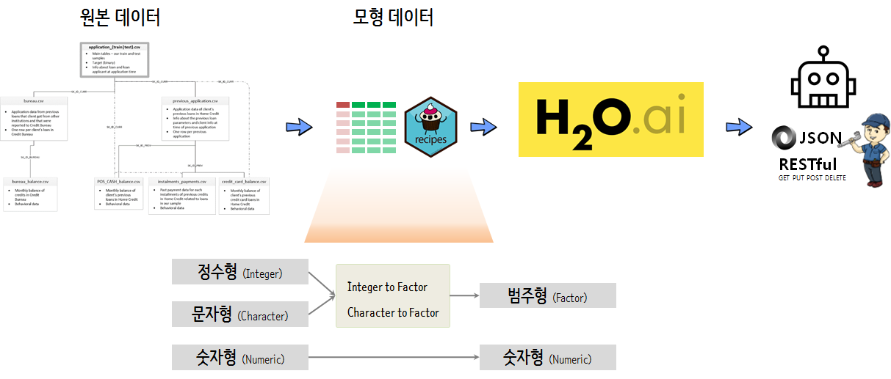

 
``` {r, include=FALSE}
source("tools/chunk-options.R")

knitr::opts_chunk$set(echo = TRUE, message=FALSE, warning=FALSE,
                      comment="", digits = 3, tidy = FALSE, prompt = TRUE, fig.align = 'center')

library(knitr)
library(kableExtra)

```

# 기계학습 모형 개발 30분 [^kaggle-credit-default] [^business-science-30-minutes] {#automl-within-30-minutes}

[^kaggle-credit-default]: [Kaggle - Home Credit Default Risk
Can you predict how capable each applicant is of repaying a loan?](https://www.kaggle.com/c/home-credit-default-risk/kernels?sortBy=hotness&group=everyone&pageSize=20&language=R&competitionId=9120)

[^business-science-30-minutes]: [Matt Dancho(August 7, 2018), "KAGGLE COMPETITION IN 30 MINUTES: PREDICT HOME CREDIT DEFAULT RISK WITH R" Business Science.](http://www.business-science.io/business/2018/08/07/kaggle-competition-home-credit-default-risk.html)

최적 기계학습 모형 아키텍처(GLM, NN, DL, SVM, GBM, xgBoost, Random Forest...)를 선택하고, 이에 대한 
모델 튜닝을 진행하여 최적모형을 개발하는 것도 중요한 일이지만, 사업분야에 적용하기 위해서는 
여러가지 제약조건을 따르고 주어진 제약조건에 최적화하는 것이 필요하다.

이러한 면에서 최고 성능의 기계학습 모형을 개발하는 것보다 "애자일 기계학습모형 개발(Agile ML development)" 개념을 접목하여 
극단적으로 최고성능의 90%를 내는 기계학습 예측모형을 30분내에 개발하는 것이 더 의미가 클 수 있다.

[Matt Dancho(August 7, 2018), "KAGGLE COMPETITION IN 30 MINUTES: PREDICT HOME CREDIT DEFAULT RISK WITH R" Business Science.](http://www.business-science.io/business/2018/08/07/kaggle-competition-home-credit-default-risk.html)에
제시된 사례를 바탕으로 30분 내에 기계학습 모형 구축 및 배포를 시연해 보자.

# 자동화 전략 {#automl-within-30-minutes-strategy}

기계학습 예측모형 개발 자동화 전략은 원본데이터를 있는 그대로 두고, 각 변수에 맞게 적절한 데이터 변형 전략을 구현하고 결측값에 대한 채워넣기를 
수행한 후에 $H_2O$ AutoML 모형을 개발하여 운영계에 배포하는 것으로 마무리한다.



가장 먼저 원본 데이터(`application_train.csv`)를 가져와서 `AutoML` 엔진인 $H_2O$에 넣기 전에 
결측값 처리 및 자료형 변수변환에 대한 사항을 적시한다.


## 데이터 가져오기 {#automl-within-30-minutes-strategy-dataset}

[Kaggle - Home Credit Default Risk 데이터셋](https://www.kaggle.com/c/home-credit-default-risk/kernels?sortBy=hotness&group=everyone&pageSize=20&language=R&competitionId=9120)을 다운로드 받아
`kable` 함수로 데이터가 원본 데이터에서 데이터프레임으로 제대로 변환이 되었는지 확인한다.

``` {r credit-automl-dataset}
# 0. 환경설정 -----
# General 
library(tidyverse)
library(skimr)

# Preprocessing
library(recipes)

# Machine Learning
library(h2o)

# 1. 데이터 -----
## 1.1. 데이터 가져오기 
application_train_tbl <- read_csv("data/application_train.csv")

## 1.2. 데이터 일별하기
application_train_tbl %>%
    slice(1:10) %>%
    kable() %>% 
    kable_styling() %>%
    scroll_box(width = "800px")

## 1.3. 훈련/시험 데이터 분할
x_train_tbl <- application_train_tbl %>% select(-TARGET)
y_train_tbl <- application_train_tbl %>% select(TARGET)   

# 메모리 절약을 위해서 불필요해진 객체 제거
rm(application_train_tbl)
```

## 데이터 변환 {#automl-within-30-minutes-strategy-transformation}

원본 데이터를 불러왔다면 다음 단계로 문자형 변수를 식별하여 `string_2_factor_names` 벡터로 준비하고,
숫자형 변수 중 범주형으로 코딩할 수 있는 것을 범주 수준이 7개를 기준으로 미만이면 범주 요인형변수로 식별하여 
`num_2_factor_names` 벡터로 준비한다. 
마지막으로 결측값은 숫자형 결측값은 평균으로, 범주형 결측값은 최빈치로 채워 넣도록 준비한다.

`recipe` 팩키지를 활용하여 변수변환 과정과 결측값 채워넣는 과정에 대해서 명세를 기록한다.

``` {r credit-automl-transformation}
# 2. 데이터 탐색 -----
## 2.1. 데이터 자료형 살펴보기
skim_to_list(x_train_tbl)

## 2.2. 전처리 전략
### 문자형 
string_2_factor_names <- x_train_tbl %>%
    select_if(is.character) %>%
    names()

# string_2_factor_names

### 숫자형 숫자
unique_numeric_values_tbl <- x_train_tbl %>%
    select_if(is.numeric) %>%
    map_df(~ unique(.) %>% length()) %>%
    gather() %>%
    arrange(value) %>%
    mutate(key = as_factor(key))

# unique_numeric_values_tbl

factor_limit <- 7

num_2_factor_names <- unique_numeric_values_tbl %>%
    filter(value < factor_limit) %>%
    arrange(desc(value)) %>%
    pull(key) %>%
    as.character()

# num_2_factor_names

### 결측값
missing_tbl <- x_train_tbl %>%
    summarize_all(.funs = ~ sum(is.na(.)) / length(.)) %>%
    gather() %>%
    arrange(desc(value)) %>%
    filter(value > 0)

# missing_tbl

## 요리법에 따른 데이터 전처리

rec_obj <- recipe(~ ., data = x_train_tbl) %>%
    step_string2factor(string_2_factor_names) %>%
    step_num2factor(num_2_factor_names) %>%
    step_meanimpute(all_numeric()) %>%
    step_modeimpute(all_nominal()) %>%
    prep(stringsAsFactors = FALSE)

# rec_obj

x_train_processed_tbl <- bake(rec_obj, x_train_tbl) 

### Y 변수 변환
y_train_processed_tbl <- y_train_tbl %>%
    mutate(TARGET = TARGET %>% as.character() %>% as.factor())
```


<div class = "row">
  <div class = "col-md-6">
**데이터 변환 전 **

``` {r credit-automl-dataset-before}
### 데이터 변환 전 
x_train_tbl %>%
    select(1:30) %>%
    glimpse()
```

  </div>
  <div class = "col-md-6">
**데이터 변환 후 **

``` {r credit-automl-dataset-after}
### 데이터 변환 후
x_train_processed_tbl %>%
    select(1:30) %>%
    glimpse()

# 메모리 절약을 위해서 불필요해진 객체 제거
rm(rec_obj)
rm(x_train_tbl)
rm(y_train_tbl)
```

  </div>
</div>


## 자동 기계학습 {#automl-within-30-minutes-strategy-automl}

자동 기계학습 과정은 $H_2O$를 활용하기 때문에 `h2o.init()`으로 $H_2O$ 클러스터를 띄워서 
준비를 하고 훈련, 교차검증, 시험 데이터로 나눠 데이터를 준비하고 `h2o.automl()`함수를 호출하여 
학습을 수행하여 최적 모형을 추출한다.

``` {r credit-automl-automl}
# 3. 모형 개발 ------
## 3.0. H2O 환경설정 -----
h2o.init()
h2o.removeAll()
h2o.no_progress()

## 3.1. 훈련/시험 데이터 -----
data_h2o <- as.h2o(bind_cols(y_train_processed_tbl, x_train_processed_tbl))

splits_h2o <- h2o.splitFrame(data_h2o, ratios = c(0.5, 0.3), seed = 1234)

train_h2o <- splits_h2o[[1]]
valid_h2o <- splits_h2o[[2]]
test_h2o  <- splits_h2o[[3]]

## 3.2. H2O 모형 -----

y <- "TARGET"
x <- setdiff(names(train_h2o), y)

automl_models_h2o <- h2o.automl(
    x = x,
    y = y,
    training_frame    = train_h2o,
    validation_frame  = valid_h2o,
    leaderboard_frame = test_h2o,
    max_runtime_secs  = 10
)
```

## 자동 기계학습 모형성능 {#automl-within-30-minutes-strategy-automl-performance}

자동 기계학습된 `automl_models_h2o` 객체의 성능을 살펴본다.

``` {r credit-automl-automl-performance, eval =FALSE}
## 3.3. H2O 모형 성능평가 -----
automl_leader <- automl_models_h2o@leader

performance_h2o <- h2o.performance(automl_leader, newdata = test_h2o)

performance_h2o %>%
    h2o.confusionMatrix()

# Confusion Matrix (vertical: actual; across: predicted)  for max f1 @ # threshold = 0.106174235650871:
#            0    1    Error         Rate
# 0      36250 6137 0.144785  =6137/42387
# 1       2347 1366 0.632103   =2347/3713
# Totals 38597 7503 0.184035  =8484/46100

performance_h2o %>%
    h2o.auc()

# 0.6962854

```


