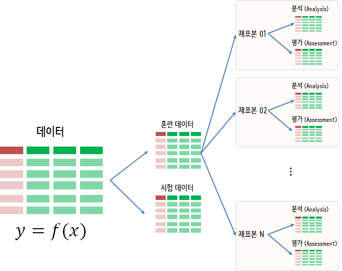

``` {r, include=FALSE}
source("tools/chunk-options.R")
knitr::opts_chunk$set(echo = TRUE, warning=FALSE, message=FALSE, fig.width=12)


```


# 모형을 위한 표본 인프라 {#rsampling-infra-for-model}

[rsample](https://topepo.github.io/rsample/) 팩키지가 모형개발과 통계분석을 위해서 별도 코드를 포함하지 않는 
진정한 모형을 위한 표본 인프라 팩키지로 개발되고 있다.



가장 큰 장점은 아마도 다음 부츠트랩 표본구성을 하는 코드에도 나타나지만 부츠트랩 표본을 10세트 만드면 
당연히 객체 크기가 10배 커져야 하나 `rsample` 팩키지가 효율적으로 작성되어 
크기를 상당히 줄일 수 있게 되었다.

자료구조도 티블(tibble) 리스트칼럼 형태로 함수형 프로그래밍에 익숙한 개발자면 쉽게 사용할 수 있을 것으로 보인다.

``` {r rsampling-infra-for-model}
# 0. 팩키지 -----
library(rsample) # devtools::install_github("topepo/rsample")
library(mlbench)

# 1. 데이터 -----
data(LetterRecognition)
pryr::object_size(LetterRecognition)

# 2. 부츠트랩 데이터 -----
boots <- bootstraps(LetterRecognition, times = 10)
pryr::object_size(boots)

# 3. 크기 계산 -----
pryr::object_size(boots)/nrow(boots)
as.numeric(pryr::object_size(boots)/pryr::object_size(LetterRecognition))

# 4. 부츠트랩 표본 -----
boots
```
