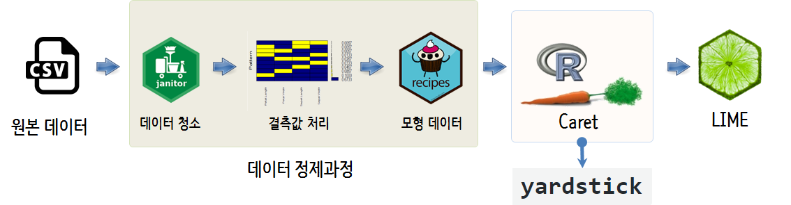

 
``` {r, include=FALSE}
source("tools/chunk-options.R")

knitr::opts_chunk$set(echo = TRUE, message=FALSE, warning=FALSE,
                      comment="", digits = 3, tidy = FALSE, prompt = TRUE, fig.align = 'center')


```

# LIME을 통한 기계학습 모형 시각화[^shirin-meetup] {#machine-learning-blackbox}

[^shirin-meetup]: [Shirin playgRound (2017-12-12), "Explaining Predictions of Machine Learning Models with LIME - Münster Data Science Meetup"](https://shirinsplayground.netlify.com/2017/12/lime_sketchnotes/)

UCI 기계학습 저장소(Machine Learning Repository)에서 [Chronic_Kidney_Disease Data Set](http://archive.ics.uci.edu/ml/datasets/Chronic_Kidney_Disease)을 
다운로드 받아 블랙박스 기계학습 모형을 LIME 방법론으로 시각화하는 방법을 살펴보자.

만성 신부전증 예측 데이터는 그 자체로 청소가 잘 되어 있어 `janitor`를 사용하는 데이터 정제과정이 필요하지 않지만,
결측값이 거의 모든 변수에 들어 있어 결측값 자동화에 대한 처리와 함께 `Random Forest` 모형에 넣을 수 있도록 
범주형 변수에 대한 가변수처리(One-hot)와 연속형 변수에 대한 표준화 작업이 필요하다.

기계학습 모형이 나오게 되면 `LIME`을 사용해서 오분류된 관측점을 파악하고 변수 8개를 통원해서 어떤 변수가 
오분류에 가장 큰 역할을 했는지 시각적으로 살펴본다.



# 결측데이터 [^lime-missing-vidhya] {#lime-bb-missing}

[^lime-missing-vidhya]: [ANALYTICS VIDHYA CONTENT TEAM, (MARCH 4, 2016), "Tutorial on 5 Powerful R Packages used for imputing missing values"](https://www.analyticsvidhya.com/blog/2016/03/tutorial-powerful-packages-imputing-missing-values/)

가장 먼저 불러온 데이터에 결측점에 대한 현상 파악이 우선되어야 한다. 
이를 위해서 `VIM` 팩키지 `aggr()` 함수를 사용해서 결측점이 많이 분포된 변수와 변수들간의 관계에 대해서 
시각적으로 이해한다.
어떤 변수에 어떤 관측점에 결측데이터가 위치해 있는지 파악해 두는 것은 다음 단계에서 
결측값을 채워넣는데 도움이 된다.

`missForest` 팩키지 `missForest()` 함수를 사용해서 결측값을 채워넣고 정도도 확인해 둔다. 
결측값을 채워넣는 팩키지는 5가지가 존재하는데 각 팩키지마다 용도를 확인하고 적절하게 사용한다.
실무에서 추천하는 것은 `Hmsic`와 `missForest`로 연속형 범주형 변수 유형에 구애받지 않고 
적은 코드량으로 양질의 결측값을 채워넣을 수 있다.

- `MICE`
- `Amelia`
- `missForest`
- `Hmisc`
- `mi`

``` {r lime-kidney-data}
# 0. 환경설정 -----
library(tidyverse)  
library(janitor)
library(farff)      
library(missForest) 
library(caret)      
library(lime)       
library(skimr)

# 1. 데이터 가져오기 -----

data_file <- file.path("data/chronic_kidney_disease_full.arff")

data <- readARFF(data_file)

# 2. 결측 데이터 -----
# 
## 2.1. 결측 데이터 확인 -----
# map(data, is.na) %>% 
#     map_df(., sum) %>% 
#     gather(variable, miss_num) %>% 
#     arrange(desc(miss_num))

## 2.2. 결측 현황 시각화 -----
missing_plot <- VIM::aggr(data, col=c('lightgreen','red'),
                  numbers=FALSE, sortVars=TRUE,
                  labels=names(data), cex.axis=.7,
                  combined = FALSE,
                  gap=3, ylab=c("Missing data","Pattern"))

## 2.3. 결측 현황 데이터 -----
missing_plot$missings %>% tbl_df %>% 
    clean_names() %>% 
    arrange(desc(count))

# 3. 결측 채워넣기 -----
data_imp_df <- missForest(data, ntree = 200, mtry=10)
data_imp_df$OOBerror
```

# 모형 데이터 생성 [^lime-modeling-data] {#lime-bb-modeling}

[^lime-modeling-data]: [Rahul Sangole hacking my way through stats and ml, (September 27, 2017), Performance Benchmarking for Dummy Variable Creation](https://www.analyticsvidhya.com/blog/2016/03/tutorial-powerful-packages-imputing-missing-values/)

`missForest()` 함수로 결측값을 채워넣은 객체를 뽑아내서 연속형인 경우 먼저 `scale()` 함수로 표준화를 하고,
`caret` 팩키지 `dummyVars()` 함수로 범주형 변수를 가변수(One-Hot) 처리한 후 예측변수(`class`)와 결합하여 모형 데이터프레임을 생성한다.

``` {r lime-bb-modeling}
# 2. 모형데이터 -----
## 2.1. 연속형 변수 표준화 -----
data_imp_df <- data_imp_df$ximp %>% 
    mutate_if(is.numeric, scale)

## 2.2. 가변수(dummy) 생성 -----
data_dummy <- dummyVars(class ~., data=data_imp_df)
data_dummy_df <- data.frame(predict(data_dummy, newdata = data_imp_df))    

## 2.3. X, Y 병합 -----

data_df <- data_imp_df %>% select(class) %>% 
    cbind(data_dummy_df) %>% 
    tbl_df
```

# Random Forest 예측모형 {#lime-bb-modeling-randomforest}

훈련데이터와 시험데이터로 나누고 `rf` 모형으로 최적 모형을 구축하고 나서, 모형의 성능을 시험데이터를 통해 파악한다. 

``` {r lime-bb-modeling-randomforest}
# 3. 모형 -----
set.seed(42)
index <- createDataPartition(data_df$class, p = 0.9, list = FALSE)
train_data <- data_df[index, ]
test_data  <- data_df[-index, ]

model_rf <- caret::train(class ~ .,
                         data = train_data,
                         method = "rf", # random forest
                         trControl = trainControl(method = "repeatedcv", 
                                                  number = 10, 
                                                  repeats = 5, 
                                                  verboseIter = FALSE))

# 4. 모형성능과 예측 -----
pred_df <- data.frame(sample_id = 1:nrow(test_data), 
                   predict(model_rf, test_data, type = "prob"), 
                   actual = test_data$class) %>% 
    tbl_df()

pred_df <- pred_df %>% 
    mutate(prediction = colnames(.)[2:3][apply(.[, 2:3], 1, which.max)], 
           correct = ifelse(actual == prediction, "correct", "wrong")) %>% 
    mutate(prediction = factor(prediction))

confusionMatrix(pred_df$actual, pred_df$prediction)
```

# 블랙박스모형 살펴보기 {#lime-bb-modeling-randomforest-lime}

`LIME` 방법론을 적용하기 위해서 우선 훈련데이터와 시험데이터를 분리한다.
그리고 나서 `lime()`을 호출하여 lime 객체를 만들고 이를 `explain()` 함수에 넣어 블랙박스 모형내부를 들여다 본다.


``` {r lime-bb-modeling-randomforest-lime}
# 5. 모형 설명(LIME) -----
## 5.1. 데이터셋 준비
train_x <- dplyr::select(train_data, -class)
test_x <- dplyr::select(test_data, -class)

train_y <- dplyr::select(train_data, class)
test_y <- dplyr::select(test_data, class)

## 5.2. 모형 설명자(Explainer) 
explainer <- lime(train_x, model_rf, n_bins = 5, quantile_bins = TRUE)

explanation_df <- lime::explain(test_x, explainer, 
                                n_labels = 1, 
                                n_features = 8, 
                                n_permutations = 1000, 
                                feature_select = "highest_weights")

## 5.3. 모형 신뢰성(Model Reliability)
explanation_df %>%
    ggplot(aes(x = model_r2, fill = label)) +
    geom_density(alpha = 0.5)
```

시험데이터에서 오분류된 사례를 찾아내어 이를 `plot_features()` 함수에 넣어 어떤 변수가 오분류에 기여를 했는지 
시각적으로 파악한다.

``` {r lime-bb-modeling-randomforest-lime-wrong}
## 5.4. 오분류 사례 
pred_df %>% 
    filter(correct=="wrong")

plot_features(explanation_df[c(97:104, 169:176),], ncol = 2)
```
