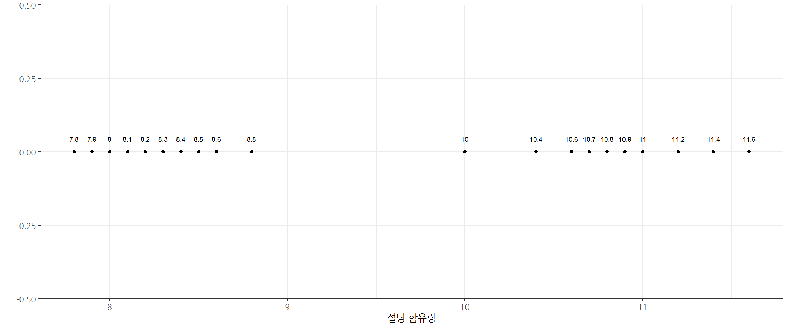
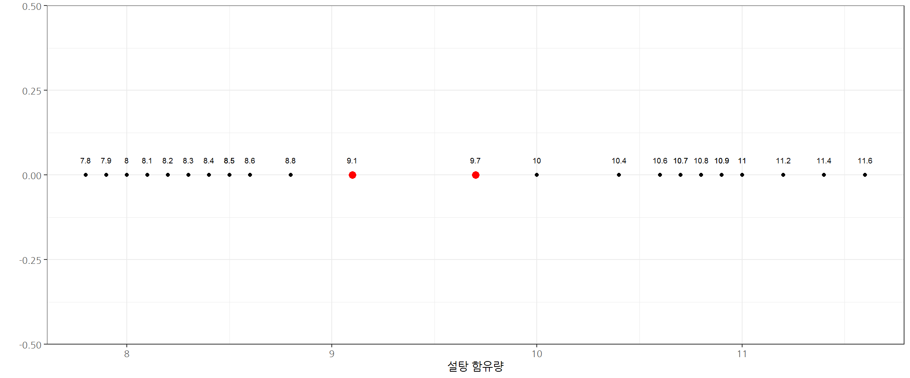
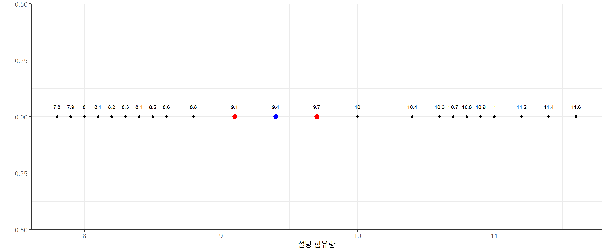

# 직관적인 SVM 설명 [^intuitive-svm-in-r] {#intuitive-svm}

[^intuitive-svm-in-r]: [Eight to Late - Sensemaking and Analytics for Organizations, "An intuitive introduction to support vector machines using R – Part 1"](https://eight2late.wordpress.com/)

**서포트 벡터 머신(support vector machine, SVM)**은 기계 학습의 분야 중 하나로 패턴 인식, 자료 분석을 위한 지도 학습 모델이며, 
주로 분류와 회귀 분석을 위해 사용한다. 
두 카테고리 중 어느 하나에 속한 데이터의 집합이 주어졌을 때, 
SVM 알고리즘은 주어진 데이터 집합을 바탕으로 하여 새로운 데이터가 어느 카테고리에 속할지 판단하는 비확률적 이진 선형 분류 모델을 제작하는데 유용하고 
회귀문제도 적용이 가능하다. [^svm-wiki]

[^svm-wiki]: [위키백과, 서포트 벡터 머신(SVM)](https://ko.wikipedia.org/wiki/서포트_벡터_머신)

["An intuitive introduction to support vector machines using R – Part 1"](https://eight2late.wordpress.com/)에 공개된 데이터를 다운로드 받아 
원본 데이터를 시각화한다.

~~~{.r}
# 0. 팩키지 -----
library(tidyverse)
library(readxl)
library(extrafont)
loadfonts()

# 1. 데이터 -----

# download.file("https://eight2late.files.wordpress.com/2018/06/sugar_content.xls", destfile="data/sugar.xls", mode = "wb")
drink_df <- read_excel("data/sugar.xls")

# 2. 원본 데이터 -----
drink_df %>% 
  ggplot(aes(x=sugar_content, y=c(0))) +
    geom_point() +
    theme_bw(base_family = "NanumGothic") +
    labs(x="설탕 함유량", y="") +
    geom_text(data=drink_df, aes(label = sugar_content), size = 2.5, vjust=-2)
~~~

## 1차원 의사결정 경계 {#one-dimension-decision-boundary}

1차원 공간에 나온 설탕이 많이 함유된 제품과 설탕이 적게 함유된 제품을 구분하는 의사결정 경계(deicion boundary)를 시각화해서 다음과 같이 
표현할 수 있다.

~~~{.r}
# 3. decision boundary -----

decision_bound_df <- tribble(
  ~sep,
  9.1,
  9.7
)

drink_df %>% 
  ggplot(aes(x=sugar_content, y=c(0))) +
  geom_point() +
  theme_bw(base_family = "NanumGothic") +
  labs(x="설탕 함유량", y="") +
  geom_text(data=drink_df, aes(label = sugar_content), size = 2.5, vjust=-2) +
  geom_point(data=decision_bound_df, aes(x=sep, y=0), color="red", size=3) +
  geom_text(data=decision_bound_df, aes(x=sep, y=0, label = sep), size = 2.5, vjust=-2) 
~~~

## 1차원 마진(margin) {#one-dimension-margin}

1차원 공간에 나온 설탕이 많이 함유된 제품과 설탕이 적게 함유된 제품을 구분하는 의사결정 경계(deicion boundary)는 다수 존재하지만,
마진(margin)을 최대화하는 의사결정 선은 아마도 두 의사결정 설탕 함유량 데이터를 평균내는 것이 합리적일 적이다.

~~~{.r}
# 4. 마진(margin) -----

mm_sep_df <- tribble(
  ~sep,
  (8.8+10)/2
)

drink_df %>% 
  ggplot(aes(x=sugar_content, y=c(0))) +
  geom_point() +
  theme_bw(base_family = "NanumGothic") +
  labs(x="설탕 함유량", y="") +
  geom_text(data=drink_df, aes(label = sugar_content), size = 2.5, vjust=-2) +
  geom_point(data=decision_bound_df, aes(x=sep, y=0), color="red", size=3) +
  geom_text(data=decision_bound_df, aes(x=sep, y=0, label = sep), size = 2.5, vjust=-2) +
  geom_point(data=mm_sep_df, aes(x=sep, y=0), color="blue", size=3) +
  geom_text(data=mm_sep_df, aes(x=sep, y=0, label = sep), size = 2.5, vjust=-2) 
~~~

