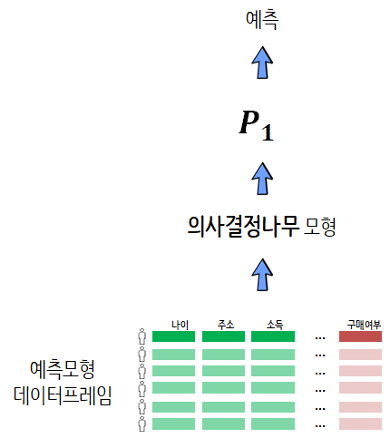
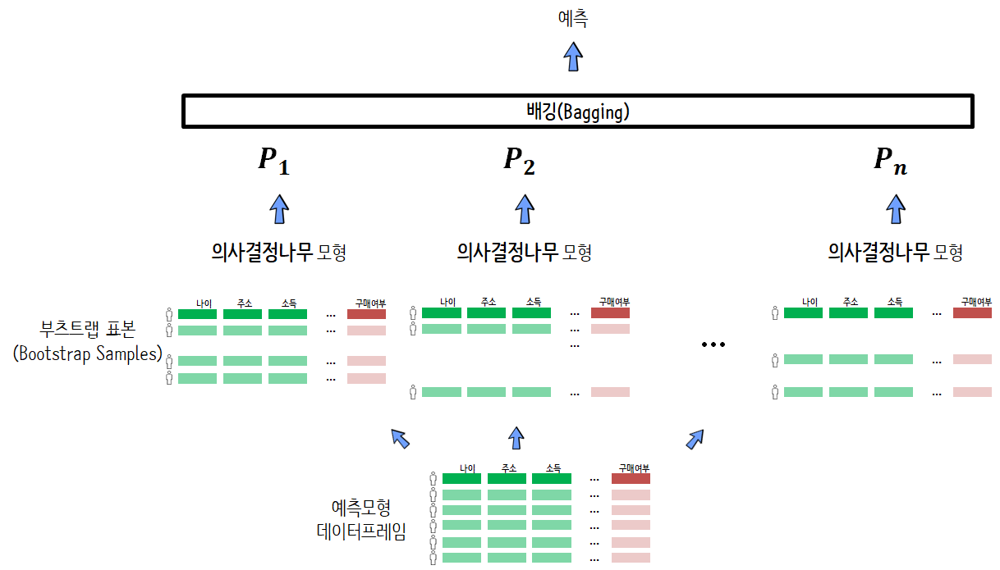
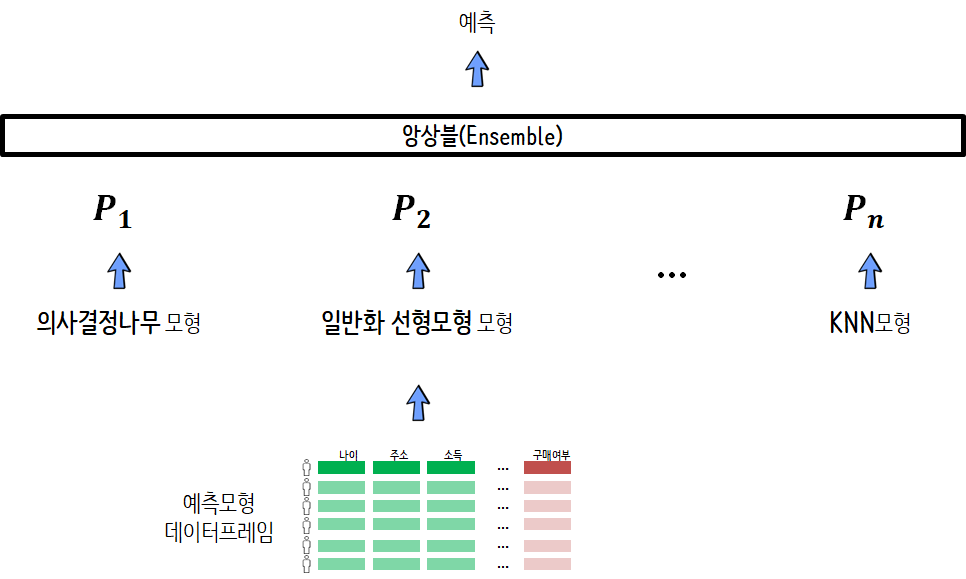
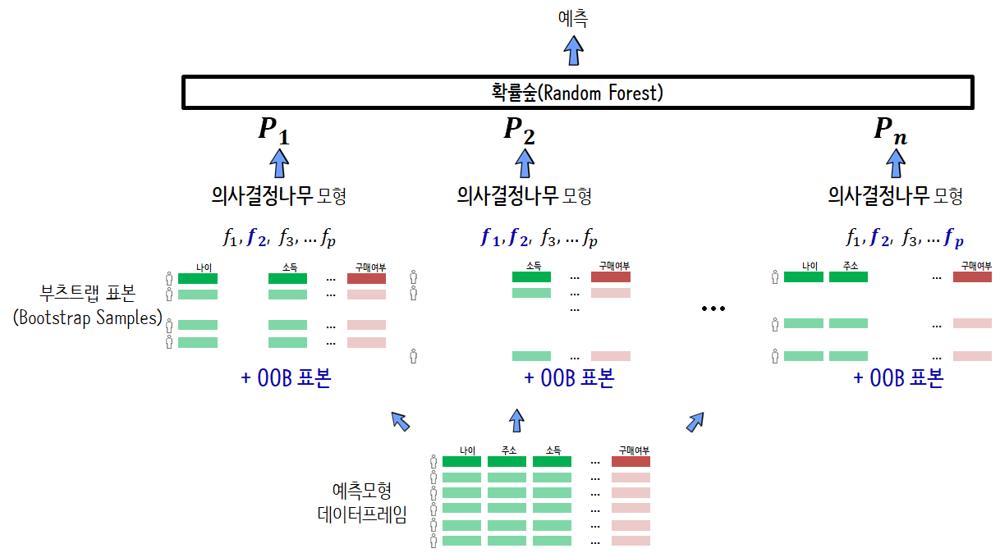
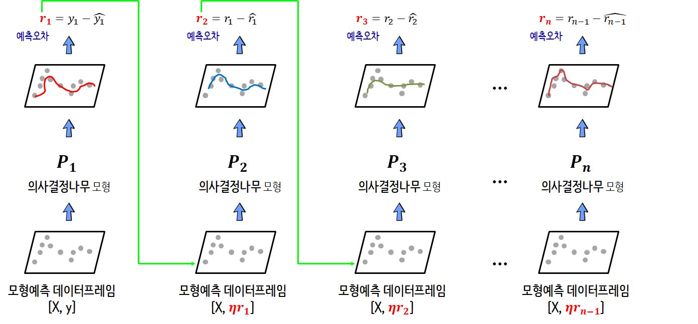

``` {r, include=FALSE}
# source("tools/chunk-options.R")
knitr::opts_chunk$set(echo = TRUE, warning=FALSE, message=FALSE,
                    comment="", digits = 3, tidy = FALSE, prompt = TRUE, fig.align = 'center')

library(here)
```


# 데이터셋  {#kaggle-liver-disease-data}

[캐글 간질환 데이터셋](https://www.kaggle.com/uciml/indian-liver-patient-records/home)은 오염된 음식, 마약, 오염된 공기, 음주 등 다양한 원인으로 간관련 질병에 대한 데이터를 담고 있다. 마지막 `dataset` 변수가 간질환이 있는지 없는지를 나타내고 있고 이를 예측하는 기계학습 모형을 구축하는 것이 목표가 된다.

```{r kaggle-dataset}
library(tidyverse)
library(janitor)

raw_data <- here("data", "indian_liver_patient.csv")

dat <- read_csv(raw_data) %>% 
  clean_names() %>% 
  rename(target = dataset) %>% 
  mutate(target = factor(2L - target)) %>% 
  filter(complete.cases(.)) %>% 
  mutate(gender=factor(gender))
```


<style>
div.blue { background-color:#e6f0ff; border-radius: 5px; padding: 10px;}
</style>
<div class = "blue">

**일반화 오차(Generalization Error)**

일반화 오차는 구축한 예측모형($\hat{f}$)이 모형구축에 사용되지 않는 데이터에 얼마나 일반화될 수 있는가를 나타내는 측도가 되고, 일반화 오차는 편이의 제곱, 분산, 줄일수 없는 오차로 구성된다.

$$\hat{f} \text{의 오차} = \text{편이}^2 + \text{분산} + \text{줄일 수 없는 오차}$$


</div>

# 나무모형 예측모형 {#kaggle-ml-model}

## CART 예측모형 {#kaggle-ml-model-cart}

캐글 간질환 데이터를 훈련/시험 데이터로 나눠서 훈련데이터로 예측모형을 구축하고 이에 대한 예측성능은 시험데이터를 통해서 수행한다.

 

예측모형 데이터프레임이 구성되면 이를 훈련 데이터프레임(`train_df`)과 시험 데이터프레임(`test_df`)으로 나누고 의사결정 나무모형(`rpart()`)으로 학습을 수행한다. 학습된 모형 성능을 `yardstick` 팩키지 `roc_auc()` 함수로 식별한다.

```{r cart-model, cache=FALSE}
library(caret)
library(rpart)

### 훈련 vs 검증/시험
in_train <- createDataPartition(dat$target, p = c(0.7, 0.3), list = FALSE)

train_df <- dat[in_train, ]
test_df <- dat[-in_train, ]

### CART 모형
liver_cart <- rpart(formula = target ~ ., 
              
                            data = train_df, 
                      method = "class")

### CART 모형 성능
library(yardstick)

test_df <- test_df %>% 
  mutate(cart_pred = predict(liver_cart, newdata=test_df)[,2])

(cart_auc <- roc_auc(test_df, target, cart_pred))
```


## 배깅(bagging) {#kaggle-ml-model-bagging}

앙상블 모형(Ensemble Model)과 비교하여 배깅(Bagging)모형은 예측모형 데이터프레임에서 부츠트랩 표본을 추출하여 이를 기반으로 의사결정모형(Decision Tree Model)을 적합시켜 예측값이 나오면 이를 투표를 통해서 예측값을 산출하는 방식을 취한다. 배깅으로 많이 사용되는 팩키지는 `ipred` 팩키지의 `bagging()` 함수다.

 


```{r liver-tree-bagging, cache=FALSE}
# 모형적합
library(ipred)
liver_bagging <- bagging(formula = target ~ ., 
                        data = train_df,
                        coob = TRUE)

# 모형성능평가
test_df <- test_df %>% 
  mutate(bagging_pred = predict(liver_bagging, newdata=test_df, type="prob")[,2])

(bagging_auc <- roc_auc(test_df, target, bagging_pred))

```


## 앙상블(ensemble) [^caret-ensemble] {#kaggle-ml-model-ensemble}

[^caret-ensemble]: [Sibanjan Das(2018), "Develop Custom Ensemble Models Using Caret in R"](https://dzone.com/articles/build-custom-ensemble-models-using-caret-in-r)

예측모형 데이터프레임을 변경시키지 않고 KNN, 일반화선형모형, 의사결정나무 모형을 적합시켜 다수결 원칙에 따라 예측값을 정한다. `caretEnsemble` 팩키지를 동원하여 예측작업을 수행한다.
비선형 앙상블 모형은 데이터가 많을 때, 유사한 정확도를 갖는 모형이 많을 때, 하지만 모형간의 상관이 작을 때 예측 정화성을 높일 수 있다. [^caret-ensemble-cran]

[^caret-ensemble-cran]: [Zach Mayer(2016-01-31, "A Brief Introduction to caretEnsemble"](https://cran.r-project.org/web/packages/caretEnsemble/vignettes/caretEnsemble-intro.html)



```{r liver-caret-ensemble, cache=FALSE}
# 모형적합
ensemble_glm   <- train(target ~ ., data = train_df, method = "glm", family=binomial)
ensemble_rpart <- train(target ~ ., data = train_df, method = "rpart")
ensemble_knn   <- train(target ~ ., data = train_df, method = "knn")

# 모형 앙상블
ensemble_df <- data.frame(
  glm        = predict(ensemble_glm,   newdata=test_df) %>% as.integer,
  rpart      = predict(ensemble_rpart, newdata=test_df) %>% as.integer,
  svm        = predict(ensemble_knn,   newdata=test_df) %>% as.integer,
  glm_prob   = predict(ensemble_glm,   newdata=test_df, type="prob")[,2],
  rpart_prob = predict(ensemble_rpart, newdata=test_df, type="prob")[,2],
  svm_prob   = predict(ensemble_knn,   newdata=test_df, type="prob")[,2],
  target = test_df$target
)

ensemble_df <- ensemble_df %>% 
  tbl_df %>% 
  mutate(voting = ifelse(glm + rpart + svm >= 5/3, 1, 0),
         vote_pred = (glm_prob + rpart_prob + svm_prob) /3)

# 모형 평가
test_df <- test_df %>% 
  bind_cols(ensemble_df %>% select(vote_pred))

(ensemble_auc <- roc_auc(test_df, target, vote_pred))
```


## 확률숲(Random Forest) {#kaggle-ml-model-randomForest}

Random Forest는 앞서 관측점을 무작위 표본추출하는 배깅을 한걸음 더 들어가 변수도 무작위로 선정하여 더욱 강건한 예측모형을 구축할 수 있도록 한다. 또한, 무작위 추출한 OOB(Out-of-Bag) 표본으로 따로 떼어내서 의사결정나무의 과적합을 판단하는 데이터로 사용된다.




```{r liver-tree-random-forest, cache=FALSE}
library(randomForest)

liver_rf <- randomForest(formula = target ~ ., 
                         data = train_df, ntreeTry = 500)

# 모형성능평가
test_df <- test_df %>% 
  mutate(rf_pred = predict(liver_rf, newdata=test_df, type="prob")[,2])

(rf_auc <- roc_auc(test_df, target, rf_pred))
```


## SGBM(Stochastic Gradient Boosting) {#kaggle-ml-model-randomForest}

adaBoost가 진화된 Gradiant Boosting Tree는 R에서 [GBM](https://github.com/gbm-developers/gbm), [xgBoost](https://cran.r-project.org/web/packages/xgboost/)으로 구현되어 있으며 캐글에서 예측모형의 끝판왕으로 유명하다. 기본적으로 의사결정나무모형을 기반으로 하고 있으며 Random Forest가 병렬 예측모형이라면 GBM은 순차 예측모형으로 앞선 의사결정나무에서 정확히 예측하지 못한 잔차를 다시 학습하여 보다 정교한 예측모형을 구축해 나간다.




```{r liver-tree-gbm, cache=FALSE}
# 모형적합
liver_ctrl <- trainControl(method="repeatedcv", number=10, repeats = 5)

liver_gbm <-train(target ~ . , data=train_df,
                  method = "gbm",
                  trControl=liver_ctrl,
                  verbose=FALSE
               )

# 모형성능
test_df <- test_df %>% 
  mutate(gbm_pred = predict(liver_gbm, newdata=test_df, type="prob")[,2])

(gbm_auc <- roc_auc(test_df, target, gbm_pred))

```


# 나무모형 성능평가 {#kaggle-ml-model-comparison}

의사결정나무를 시작으로 앙상블, 배깅, Random Forest, GBM 모형까지 모형튜닝은 최소화하면서 간질환 예측을 위한 예측모형을 구축해봤다. 이제 전반적인 성능을 시험데이터(`test_df`)를 통해서 모형성능을 비교해보자.

```{r tree-model-comparison}
library(extrafont)
loadfonts()
tree_perf_df <- data.frame(
  cart = cart_auc,
  bagging = bagging_auc,
  ensemble = ensemble_auc,
  rf = rf_auc,
  gbm = gbm_auc
)

tree_perf_df %>% 
  gather(model, auc) %>% 
    ggplot(aes(x=fct_reorder(model, auc), y=auc)) +
      geom_col(width=0.35) +
      labs(x="나무모형", y="AUC",
           title="나무모형을 활용한 간질환 예측모형 성능") +
      theme_minimal(base_family="NanumGothic") +
      geom_text(aes(label=round(auc,3)), position=position_dodge(width=0.9), vjust=-0.25) +
      scale_y_continuous(limits = c(0,0.8))

```

