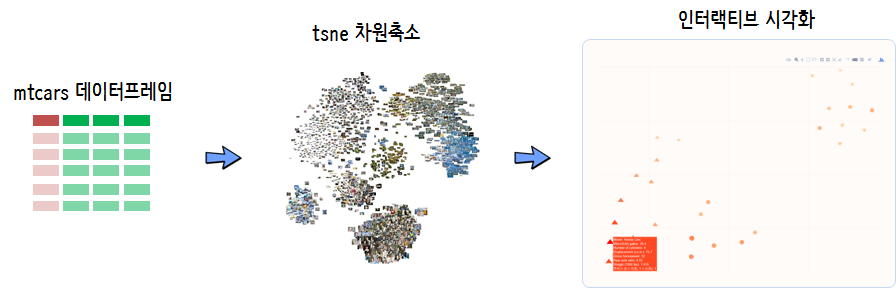

 
``` {r, include=FALSE}
source("tools/chunk-options.R")

knitr::opts_chunk$set(echo = TRUE, message=FALSE, warning=FALSE,
                      comment="", digits = 3, tidy = FALSE, prompt = TRUE, fig.align = 'center')

```

# `mtcars` 자동차 연비 {#mtcars-mpg-data}

`mtcars` 데이터는 R에 기본 내장되어 있는 데이터셋으로 자동차 연비 데이터를 포함하고 있다.
칼럼수는 `r ncol(mtcars)`, 관측점 행수는 `r nrow(mtcars)`로 구성되어 있는 다차원데이터다.

자동차 연비 데이터를 기계의 도움을 받아 유사한 특성을 갖는 자동차로 시각화를 통해서 살펴보자.

이를 위해서 [`Rtsne`](https://github.com/jkrijthe/Rtsne) 팩키지를 사용해서 차원축소를 하고 `plotly` 팩키지로 
인터랙티브하게 자동차 모델별로 특성을 살펴볼 수 있도록 시각화한다.



# `mtcars` 데이터셋 {#mtcars-mpg-dataset}

`mtcars` 데이터셋을 `Rtsne()` 함수에 넣으려면 행렬형태로 자료구조를 바꿔줘야 하고, 척도를 모두 동일하게 조정한다.

``` {r mtcars-dataset}
# 0. 환경설정 -----
library(tidyverse)
library(Rtsne)
library(plotly)
library(ggrepel)

# 1. 데이터 -----
mtcars_df <- mtcars %>% 
    rownames_to_column(var="model") %>% 
    as_tibble()

mtcars_mat <- mtcars %>% 
    mutate_all(scale) %>% 
    as.matrix()

DT::datatable(mtcars_df)
```

# `mtcars` tsne 차원축소 {#mtcars-mpg-dataset-tsne}

관측점이 많지 않아 `perplexity`를 최대가 되도록 조정해서 `Rtsne()` 함수에 넣어준다.

``` {r mtcars-dataset-tsne}
# 2. tsne 차원축소 -----
mtcars_tsne <- Rtsne(mtcars_mat, perplexity = 10)
```

# 시각화 {#mtcars-mpg-dataset-tsne-viz}
## 정적시각화  {#mtcars-mpg-dataset-tsne-static}

`ggplot()` 함수로 시각화하는데 자동차 모델도 차원축소 공간에 나타나게 정적 그래프를 그린다.

``` {r mtcars-dataset-tsne-static}
# 3. 시각화 tsne 군집분석 -------
## 3.1. 정적 시각화
mtcars_tsne_df <- mtcars_tsne$Y %>% 
    as_tibble() %>% 
    mutate(model = rownames(mtcars)) %>% 
    left_join(mtcars_df)

mtcars_tsne_g <- mtcars_tsne_df %>% 
    ggplot(aes(x=V1, y=V2, text=paste0("Model: ", model, "\n",
                                       "Miles/(US) gallon: ", mpg, "\n",
                                       "Number of cylinders: ", cyl, "\n",
                                       "Displacement (cu.in.): ", disp, "\n",
                                       "Gross horsepower: ", hp, "\n",
                                       "Rear axle ratio: ", drat, "\n",
                                       "Weight (1000 lbs): ", wt, "\n",
                                       "변속기 (0 = 자동, 1 = 수동): ", am, "\n"),
               color = mpg)) +
    geom_point(aes(size=mpg, shape = as.factor(am))) +
    theme_void() +
    scale_color_gradient(low = "wheat1", high = "red", name="Miles/(US) gallon") +
    geom_text_repel(aes(label=model)) +
    guides(shape = guide_legend("변속기"),
           size = FALSE)

mtcars_tsne_g
```

## 동적시각화  {#mtcars-mpg-dataset-tsne-interactive}

`plotly` 팩키지를 동원해서 ggplot 객체를 인터랙티브하게 변환시킨다.

``` {r mtcars-dataset-tsne-interactive}
## 3.2. 동적 시각화

ggplotly(mtcars_tsne_g, tooltip = "text")
```

