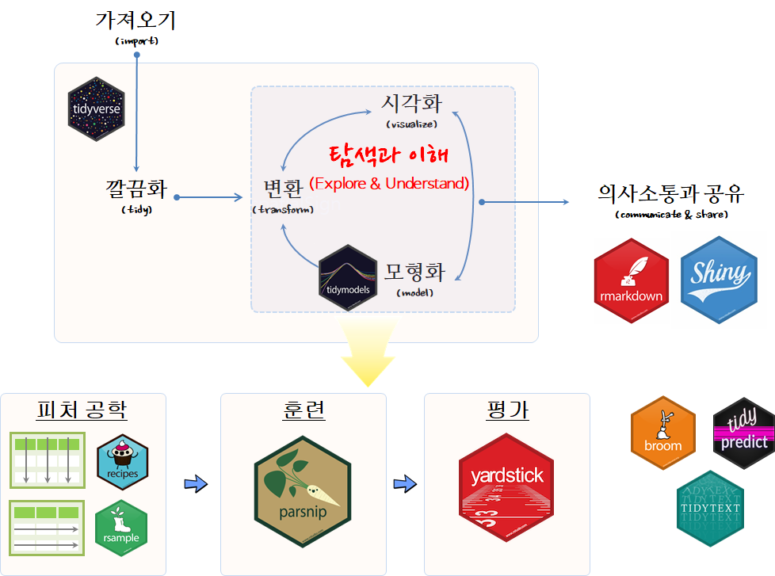
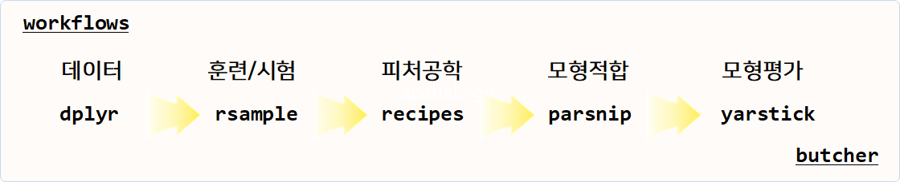

 

``` {r, include=FALSE}
knitr::opts_chunk$set(echo = TRUE, message=FALSE, warning=FALSE,
                      comment="", digits = 3, tidy = FALSE, prompt = FALSE, fig.align = 'center')

```

# `tidyverse` 성명서 [^tidyverse-manifesto] {#tidyverse-manifesto}

[^tidyverse-manifesto]: [Hadley Wickham (2017-11-13), "The tidy tools manifesto"](https://cran.r-project.org/web/packages/tidyverse/vignettes/manifesto.html)

2017-11-13일 위캠(Hadley Wickham)은 `tidyverse` 성명서(manifesto)를 발표하였다.
엉망진창인 R 도구상자(messyverse)와 비교하여 깔끔한 R 도구상자(tidyverse)는 깔끔한(tidy) API에 다음과 같은 4가지 원칙을 제시하고,
기본적으로 `tidy` API에 필수적인 다음 원칙에 대한 준수를 당부하고 있다.

1. Reuse existing data structures; 기존 자료구조 재사용.
1. Compose simple functions with the pipe; 파이프(pipe)를 사용해서 단순한 함수를 조합.
1. Embrace functional programming; 함수형 프로그래밍을 적극 포용.
1. Design for humans; 인간을 위한 설계

## 기존 자료구조 재사용 {#tidyverse-manifesto-reuse-data-structure}

`ggplot2`, `dplyr`, `tidyr`을 포함한 많은 R 팩키지는 관측점과 변수로 구성된 직사각형 데이터셋(rectangular dataset)을 기반으로 돌아간다.
그렇다면 데이터프레임 혹은 티블(tibble)에서도 문제가 없을 것이다.

직사각형 데이터셋 외에 문자열은 `stringr`, 날짜/시간은 `lubridate`, 요인(factor)은 `forcats`를 주요한 기본 자료구조를 구성하게 된다.

## 파이프(pipe)를 사용해서 단순한 함수를 조합 {#tidyverse-manifesto-pipe}

<style>
div.blue { background-color:#e6f0ff; border-radius: 5px; padding: 10px;}
</style>
<div class = "blue">

No matter how complex and polished the individual operations are, it is often the quality of the glue that most directly determines the power of the system.

- Hal Abelson 명언
</div>


파이프 연산자로 간단한 함수를 조합하여 시스템 전체의 힘을 극대화한다. 
복잡한 문제를 해결하는 강력한 전략은 단순한 많은 조각으로 나누고 이를 조합하는 것이다. 
단, 각 조각은 격리되어 쉽게 파악되고, 다른 조각과 조합할 수 있는 표준이 성립되어야 된다. 
R에 파이프 연산자를 사용하여 본 전략이 구현되어 있다. `%>%` 연산자는 많은 팩키지에 두루 걸쳐 동작되는 일반적인 결합 방식으로 이를 위해 함수를 작성할 때 다음 원칙을 갖고 작성한다.

- 함수를 가능하면 단순하게 작성한다. 일반적으로 각 함수는 한가지 작업을 매우 잘해야 되고, 한 문장으로 함수 존재목적을 기술할 수 있어야 된다.
- 변형(transformation)과 부작용(side-effect)을 뒤섞지 마라. 함수가 객체를 반환하거나, 부작용을 일으키거나 둘 중 하나만 동작하게 만든다.
- 함수명은 동사가 되어야 한다. 하지만, 예외로 대다수 함수가 동일한 동사를 사용한다. 예를 들어 `modify`, `add`, `compute` 등을 들 수 있다. 
이런 경우 반복되는 동사가 중복되지 않도록 명사에 집중한다. ggplot2가 좋은 예가 되는데 기존 플롯에 좌표, 점, 범례등을 거의 모든 함수가 추가하기 때문이다.

## 함수형 프로그래밍을 적극 포용 {#tidyverse-manifesto-functional-programming}


R은 함수형 언어라 객체지향언어나 다른 언어 패러다임과 싸우려고 하지 말고 받아들여라. 이것이 의미하는 바는 다음과 같다.

- 상태불변 객체: 작성된 코드에 대한 추론이 쉬움.
- S3, S4 에서 제공하는 제네릭 함수: 상태변형 가능한 상태가 필요하다면, 파이프 내부에서 구현.
- for 루프를 추상화한 도구: apply 함수 가족과 purrr 맵함수
- 데이터과학에서 병목점으로 문제가 발생되는 곳은 공통적으로 컴퓨터 실행시간(computing time)이 아니라 사람의 생각(thinking time)의 시간이다. 따라서, 함수명을 작성할 때 생각이 잘 연상되는 이름을 작명하는데 시간을 적절히 안분하고, 명시적이고 긴 명칭을 변수명, 함수명, 객체명에 사용하고, 짧은 명칭은 가장 중요한 이름으로 활용한다. RStudio 소스 편집기의 자동완성기능을 사용하는 경우 접두어가 접미어보다 중요하고, stringr,  xml2, rvest 팩키지를 살펴보면 접두어에 일관된 명칭을 부여한 장점을 알수 있다.

<style>
div.blue { background-color:#e6f0ff; border-radius: 5px; padding: 10px;}
</style>
<div class = "blue">

Programs must be written for people to read, and only incidentally for machines to execute.

- Hal Abelson 명언
</div>

## 인간을 위한 설계 {#tidyverse-manifesto-design-for-human}

API를 작성할 때 사람이 사용하기 쉽게 설계한다. 
데이터과학에서 병목점으로 문제가 발생되는 곳은 공통적으로 컴퓨터 실행시간(computing time)이 아니라 사람의 생각(thinking time)의 시간이다. 

- 함수명을 작성할 때 생각이 잘 연상되는 이름을 작명하는데 시간을 적절히 안분한다.
- 명시적이고 긴 명칭을 변수명, 함수명, 객체명에 사용하고, 짧은 명칭은 가장 중요한 이름으로 활용한다. 
- RStudio 소스 편집기의 자동완성기능을 사용하는 경우 접두어가 접미어보다 중요하고, stringr,  xml2, rvest 팩키지를 살펴보면 접두어에 일관된 명칭을 부여한 장점을 알수 있다.



# `tidyverse` 모형 - `tidymodels` {#tidyverse-modeling}

기존 10여년에 걸쳐 `catet` 팩키지가 담당했던 기능을 `tidyverse` 방식에 맞게 모형화도 깔끔(?)해지고 있다. 이를 위해서, 각각 기능별로 하나만 정말 잘 하는 팩키지들이 속속 출시되고 있다.
현재시점 기준 "2019-08-04" 몇몇 블로그를 통해서 개발되고 있는 최신 기능이 일부 소개되고 있다. [^blog-edgar] [^blog-datistics]

기계학습을 통한 일관된 인터페이스에 대한 요구는 파이썬 `scikit-learn`에 잘 나타나 있다. 어떻게 보면 R에서 파이썬 `scikit-learn`을 보면서 이에 대한 영감을 받아 시작되었는지도 모르겠다.

[^blog-edgar]: [Edgar Ruiz (2019-06-19), "A Gentle Introduction to tidymodels", R Views](https://rviews.rstudio.com/2019/06/19/a-gentle-intro-to-tidymodels/)

[^blog-datistics]: [datistics (December 29, 2018 ), "Tidymodels"](https://www.datisticsblog.com/2018/12/tidymodels/)

`tidymodels`은 통계검정과 모형 크게 두가지로 나눌 수 있는데 여기서는 우선 모형에 관련된 사항에 집중하기로 한다. 모형이 `tidyverse` 체계를 구성하는 핵심 사항임에도 불구하고 `dplyr`, `ggplot`과 비교하여 체계적으로 정리된 것이 없어 과거 `caret`이 했던 기능을 `tidymodels`를 통해 하나씩 채워나가고 있다. `tidymodels`를 구성하는 핵심 팩키지는 `rsample`, `recipes`, `parnip`, `yardstick`을 들 수 있다.

- [`tidymodels`](https://github.com/tidymodels/tidymodels)
    - 전처리와 피처 공학(Feature Engineering)
        - [`recipe`](https://github.com/tidymodels/recipes)(feature engineering): 모형 설계행렬 데이터를 생성하고 전처리하는 기능.
            - [`embed`](https://github.com/tidymodels/embed): 범주형 예측변수를 숫자 칼럼 예측변수로 담아내는 기능.
        - [`rsample`](https://github.com/tidymodels/rsample): 모형개발을 위한 표본추출 기능
        - [`themis`]()
    - 모형(Model)    
        - [`parsip`](https://topepo.github.io/parsnip/): 모형공식(formula) 표준화
    - 모형 미세조정(tuning)        
        - [`dials`](https://github.com/tidymodels/dials): 모형 초모수 튜닝 값 생성
        - [`tune`](https://github.com/tidymodels/tune): 모형 초모수 튜닝 도구
    - 성능평가(Evaluation)    
        - [`yardstick`](https://github.com/tidymodels/yardstick): 깔끔한 데이터(tidy data) 원칙에 따라 모형성능 추정.
    - 작업흐름(workflow)
        - [`workflows`](https://github.com/tidymodels/workflows)
    - 기타
        - `tidytext`
        - `broom`
        - `tidypredict`
        - `butcher`
        - `textrecipes`
        - `corrr`
- 통계 검정(Statistical Testing)        
    - [`tidyposterior`](https://tidymodels.github.io/tidyposterior/): 사후(post hoc) 모형 분석

# CART: `iris` 사례 {#iris-helloword}



