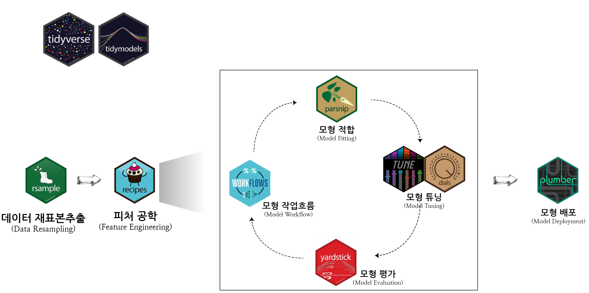

``` {r setup, include=FALSE}
knitr::opts_chunk$set(echo = TRUE, warning=FALSE, message=FALSE,
                    comment="", digits = 3, tidy = FALSE, prompt = FALSE, fig.align = 'center')

html_sticker <- function(x) {
  x <- rev(sort(x))
  bad_svg <- c("dplyr", "tidyr")
  x <- ifelse(x %in% bad_svg, paste0(x, ".png"), paste0(x, ".svg"))
  markup <- function(pkg) glue::glue('')
  res <- purrr::map_chr(x, markup)
  paste0(res, collapse = "")
}

# `r I(html_sticker('tidymodels'))`

r_sticker <- function(x) {
  x <- rev(sort(x))
  bad_svg <- c("dplyr", "tidyr")
  x <- ifelse(x %in% bad_svg, paste0(x, ".png"), paste0(x, ".svg"))
  x <- glue::glue("{here::here()}/images/{x}")

  pkgs <- purrr::map(x, magick::image_read) %>% 
    magick::image_join(.)
  
  pkg_list <- pkgs %>% 
    image_scale('150') %>% 
    image_append(stack = FALSE)  
  return(pkg_list)
}

# r_sticker(c('dplyr', 'tidymodels', 'purrr'))

```



# 펭귄 데이터셋 [^penguins-dataset] {#penguins-dataset}

[^penguins-dataset]: [Tidyverse Korea (2020-06-21), "펭귄 vs 붓꽃 데이터"](https://statkclee.github.io/data-science/ds-iris-penguin.html)

데이터 과학의 기본 데이터셋으로 인정받던 붓꽃(Iris) 데이터가 이제는 자리를 펭귄 데이터셋에게 자리를 물려주는 듯 싶다. 기초 통계학, 시각화 뿐만 아니라 `tidymodels`에도 이를 기본 데이터셋으로 활용하는 사례가 심심치 않게 보여주고 있다. 이런 추세는 최근 [TidyTuesday](https://github.com/rfordatascience/tidytuesday) 2020년 31번째 데이터셋(2020-07-28)으로 **팔머 팽귄(Palmer Penguins)**으로 당첨되면서 Iris 데이터를 대체하는 것은 기정사실화 된 듯 싶다.

```{r penguins-dataset}
library(tidyverse)
tuesdata <- tidytuesdayR::tt_load('2020-07-28')

penguin <- tuesdata$penguins

penguin
```


# 팩키지 [^rstudio-pkg]  {#tidymodels-packages}

[^rstudio-pkg]: [rstudio/hex-stickers](https://github.com/rstudio/hex-stickers)

## `tidymverse` 팩키지  {#tidymodels-packages-tidyverse}

데이터 팩키지와는 별도로 `tidymodels` 예측모형 개발에 간접적으로 사용된 팩키지는 다음과 같다.

```{r packages-for-demonstration}
library(magick)

pkgs <- c('tidyverse', 'tidymodels', 'parsnip', 'ggplot2', 'pipe', 'purrr', 'usethis')

pkgs_path <- glue::glue("https://raw.githubusercontent.com/rstudio/hex-stickers/master/SVG/{pkgs}.svg")

pkgs_img <- purrr::map(pkgs_path, magick::image_read) %>% 
  magick::image_join(.)

pkgs_img %>% 
  image_scale('150') %>% 
  image_append(stack = FALSE)  
```

## `tidymodels` 팩키지  {#tidymodels-packages-tidymodels}

`tidymodels`를 구성하는 핵심 팩키지는 다음과 같다.

```{r packages-for-demonstration-tidymodels}

tidymodels_pkgs <- c('rsample', 'recipes', 'parsnip', 'yardstick', 'tune', 'dials', 'workflows', 'plumber')

tidymodels_pkgs_path <- glue::glue("https://raw.githubusercontent.com/rstudio/hex-stickers/master/SVG/{tidymodels_pkgs}.svg")

tidymodels_pkgs_img <- purrr::map(tidymodels_pkgs_path, magick::image_read) %>% 
  magick::image_join(.)

tidymodels_pkgs_img %>% 
  image_scale('150') %>% 
  image_append(stack = FALSE)  
```


# 데이터 전처리 {#preprocessing-dataset}

나름 잘 정리되어 있어 결측값만 처리하고 연도와 펭귄이 거주하고 있는 섬만 제거한다.

```{r penguins-preprocessing}
penguin_df <- penguin %>%
  filter(!is.na(sex)) %>%
  select(-year, -island) %>% 
  mutate_if(is.character, as.factor)
```


# 성별예측 모형 [^julia-silge-ikea] {#predict-sex}

[^julia-silge-ikea]: [Julia Silge (2020-12-03), "Tune random forests for #TidyTuesday IKEA prices", https://juliasilge.com/blog/ikea-prices/](https://juliasilge.com/blog/ikea-prices/)

펭귄 데이터셋에서 성별(`sex`)을 예측하는 모형을 구축해본다.

## 훈련/시험 데이터셋 {#predict-sex-split}

`initial_split()` 함수로 훈련/시험 데이터셋으로 나누고, `training()`, `testing()` 함수로 훈련/시험 데이터를 기계학습을 위한 데이터로 준비한다.

```{r predict-sex}
library(tidymodels)

# 훈련 시험 데이터 분할
splits <- initial_split(penguin_df, prop = 0.8, strata = sex)
penguin_train <- training(splits)
penguin_test <- testing(splits)
```

## 모형 설정 {#define-model}

`parsnip` 팩키지를 사용해서 데이터를 학습할 혹은 데이터를 가장 잘 설명할 수 있는 모형을 구축한다.
분류 모형이냐 예측모형이냐에 따라 적합한 모형명세(Model Specification) 작업을 수행한다.
펭귄 성별 수컷과 암컷을 예측하는 문제는 분류문제이기 때문에 GLM 모형으로 모형을 선정한다.

```{r model-specification}
library(tidymodels)

glm_model <- logistic_reg() %>% 
  set_engine('glm') %>% 
  set_mode('classification')
```

## 모형 적합 {#fit-model}

`fit()` 함수를 통해 모형 공식을 작성하고 데이터에 적합시킨다.
모형공식은 `sex ~ .`으로 종속예측변수는 `sex`가 되고 나머지 모든 변수를 예측에 사용하도록 모형공식을 작성한다.

```{r model-fitting}
glm_fit <- glm_model %>% 
  fit(sex ~ ., data = training(splits))
```

## 모형 예측 {#predict-model}

`glm_fit` 예측모형이 준비되면 시험 데이터 `testing(splits)`을 준비하여 시험데이터에 대한 예측값을 뽑아낼 수 있다.
특히 `predict()` 함수의 인자값을 범주(`type = 'class'`)나 확률(`type = 'prob'`)로 지정함으로써 예측값을 정답과 편하게 비교할 수 있다.

```{r model-prediction}
class_pred <- glm_fit %>% 
  predict(new_data = testing(splits), type = 'class')

prob_pred <- glm_fit %>% 
  predict(new_data = testing(splits), type = 'prob')
  
evaluation_tbl <- testing(splits) %>% 
  select(sex) %>% 
  bind_cols(class_pred) %>% 
  bind_cols(prob_pred)

evaluation_tbl
```

## 모형 평가 [^yardstick-metrics] {#evaluate-model}

[^yardstick-metrics]: [Davis Vaughan (2021-01-04), "Metric types", `yardstick`](https://yardstick.tidymodels.org/articles/metric-types.html)

모형성능에 대한 평가는 `yardstick` 팩키지의 다양한 평가함수를 통해 수행한다.
이를 위해서 시험데이터에 대한 정답과 모형의 예측값과 예측확률이 함께 준비되어야 한다.
가장 먼저 정답과 모형의 성능을 평가하는 가장 일반적인 방식이 오차행렬(confusion matrix)을 사용하는 것이다.
이를 위해서 앞서 준비한 `evaluation_tbl` 데이터프레임을 정답과 모형 예측값과 관측점별로 비교하여 오차표를 작성한다.

```{r evaluate-model}
conf_mat(evaluation_tbl,
         truth = sex,
         estimate = .pred_class)
```

혹은 한 발 더 나아가 `conf_mat()` 함수와 `summmary()` 함수를 파이프로 조합시키게 되면 가능한 모형성능 측정지표를 얻을 수 있다.

```{r evaluation-metrics-prob}
conf_mat(evaluation_tbl,
         truth = sex,
         estimate = .pred_class) %>%
  summary()
```

범주 분류예측모형에서 가장 많이 인용되는 분류모형 측정지표(metric)을 사용해서 앞서 개발한 예측모형에 대한 성능을 파악해보자.

```{r evaluation-metrics}
penguin_metrics <- metric_set(accuracy, sens, precision, recall, f_meas)

penguin_metrics(evaluation_tbl,
                truth = sex,
                estimate = .pred_class)
```


`roc_auc()` 함수를 사용하게 되면 한계점(threshold) 별로 모형성능을 판단할 수 있다.
ROC AUC 값은 다음과 같은 모형성능 등급표가 많이 참고되고 있다.

- A: 0.9 ~ 1
- B: 0.8 ~ 0.9
- C: 0.7 ~ 0.8
- D: 0.6 ~ 0.7
- F: 0.5 ~ 0.6

```{r threshold-roc-auc}
roc_auc(evaluation_tbl,
        truth = sex,
        .pred_female)
```

이를 시각화하면 다음과 같다.

```{r threshold-roc-auc-viz}
roc_curve(evaluation_tbl,
          truth = sex,
          .pred_female) %>% 
  autoplot()
```

# 모형 구축 자동화 {#automate-model-building}

훈련/시험 데이터셋 구분부터 시작하여 예측모형 설정과 적합 및 평가과정을 자동화할 수 있다.
특히 마지막 `last_fit()`, `collect_metrics()`, `collect_predictions()`을 통해서 중간과정을 생략하고 Auto-ML에 한 걸음 다가설 수 있다. 

```{r automate-split-fit-evaluate}
# 훈련 시험 데이터 분할
splits <- initial_split(penguin_df, prop = 0.8, strata = sex)

# 모형상세
glm_model <- logistic_reg() %>% 
  set_engine('glm') %>% 
  set_mode('classification')

# 모형 최종적합
glm_last_fit <- glm_model %>% 
  last_fit(sex ~ ., split = splits)

# 모형 평가
glm_last_fit %>% 
  collect_metrics()

# 모형 예측
last_fit_tbl <- glm_last_fit %>% 
  collect_predictions()

last_fit_tbl

# 모형 평가 최종 지표 : https://github.com/tidymodels/yardstick/issues/128
# classification_metrics <- metric_set(accuracy, sens, spec, precision, recall, roc_auc)
# 
# classification_metrics(last_fit_tbl,
#                        truth = sex,
#                        estimate = .pred_female,
#                        .pred_class)
```


