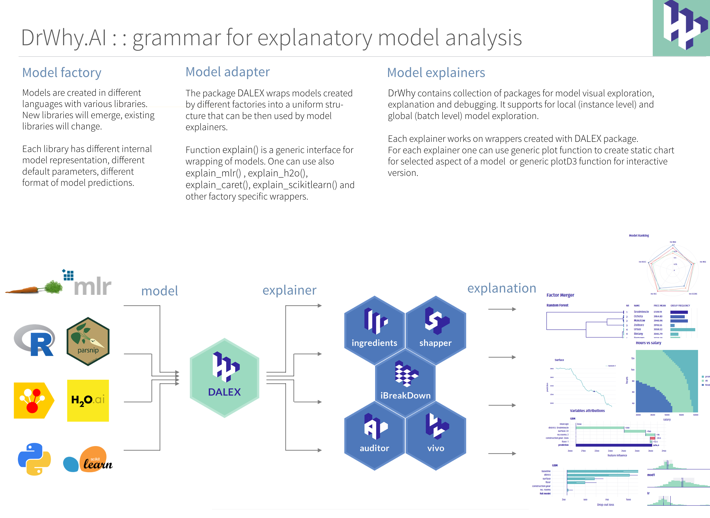
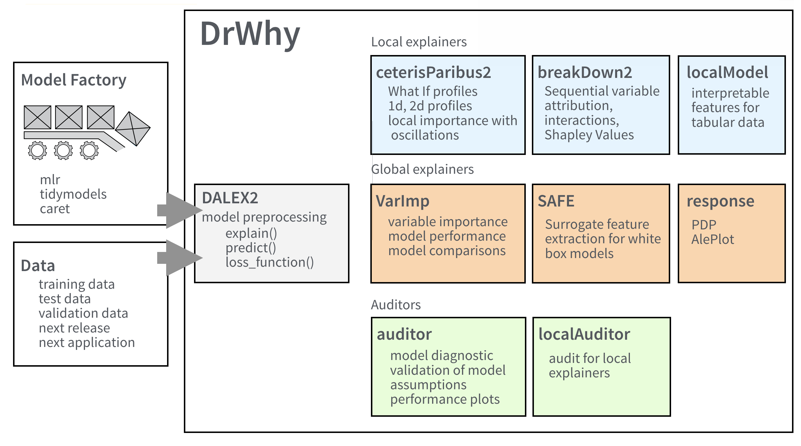
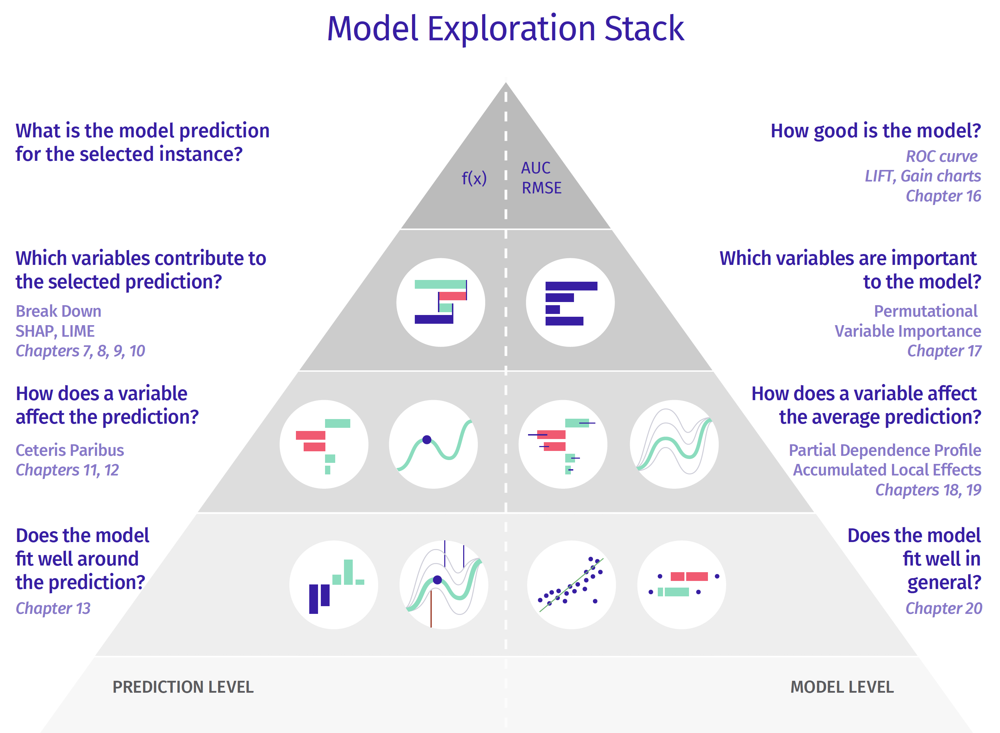

``` {r, include=FALSE}
# source("tools/chunk-options.R")
knitr::opts_chunk$set(echo = TRUE, warning=FALSE, message=FALSE,
                    comment="", digits = 3, tidy = FALSE, prompt = FALSE, fig.align = 'center')
```


# 모델 개발 프로세스 [^dr-why] {#DALEX-MDP}

[^dr-why]: [Collection of tools for Visual Exploration, Explanation and Debugging of Predictive Models](https://github.com/ModelOriented/DrWhy/blob/master/README.md)

RUP에서 영감을 받아 개발된 모형개발 프로세스(Model Development Process) [@biecek2019model]를 활용하여 예측모형 개발 전반 과정을 현대화시킬 수 있다.

```{r model-development-process}
library(tidyverse)
library(slickR)
library(pdftools)

MDP_pdf <- pdf_convert("data/ModelDevelopmentProcess.pdf", format = 'png',verbose = FALSE)
```

논문이 그리 길지 않기 때문에 전체 PDF 파일을 다운로드 받아 PNG 파일로 변환시키고 나서 이를 회전목마처럼 중요부분을 일별할 수 있게 만들어보자.

```{bash move-png-to-data-directory}
mv Model*.png data/
```

소프트웨어 개발 프로세스에서 많은 부분 차용을 해왔으며, 특히 예측모형 개발 전반을 다루는 거의 유일한 모형 개발 방법론이 아닐까 싶다.

```{r MDP-model-process}
MDP_pdf_df <- tibble(page = glue::glue("data/{MDP_pdf}") )
  
slickR(MDP_pdf_df$page, height = 800)
```

## `MDPverse` {#MDPverse}

모형 개발과정을 크게 4단계(Problem formulation, Crisp Modeling, Fine tuning, Maintaining and decommissioning)로 나누고 각 단계별로 총 5개의 세부 추진 업무(Data preparation, Data understanding, Model assembly, Model audit, Model delivery)를 나열하고 있다.


## 탐색적 모형 분석 문법(grammar) {#explanatory-model-analysis}

탐색적 데이터 분석(Explanatory Data Analysis, EDA)과 마찬가지로 탐색적 모형 분석(Explanatory Model Analysis, EMA)과정에 더해서 최근 각광받고 있는 문법(grammar)도 추가된 Dr Why가 제시되었다. 크게 다음과 같은 세가지 과정을 거치게 된다.

- 모형 공장 (Model Factory): tidymodels, mlr, caret, h2o 등에서 다양한 예측모형이 생성된다.
- 모형 어댑터 (Model Adapter): 탐색적 모형 분석을 위해서 모형공장에서 생성된 서로 다른 내부 모형 표현, 모수, 모형 예측 형태를 비교가능한 동일한 형태로 변환시키는 과정
- 모형 설명자 (Model Explainers): 시각적 모형 탐색, 설명, 디버깅을 지원하고 로컬(인스턴스 수준)과 글로벌(배치 수준) 모형 탐색도 가능하게 한다.



## 한걸음 더 들어가보자 {#explanatory-model-analysis-function}

한걸음 더 들어가게 되면 DrWhy 체계는 모형공장(Model Factory)와 데이터를 입력값으로 받아 DALEX2가 모형 어댑터로 다양한 예측모형을 `explain()`, `predict()`, `loss_function()`을 활용하여 표준화시켜 탐색적 모형 분석을 가능하게 한다. 




## 탐색적 모형 분석 책 [@biecek2020explanatory] {#EMA-book}

Przemyslaw Biecek 와 Tomasz Burzykowski이 저술한 Explanatory model analysis: Explore, explain and examine predictive models 책을 기준으로 펭귄 성별 예측을 시도해보자.





