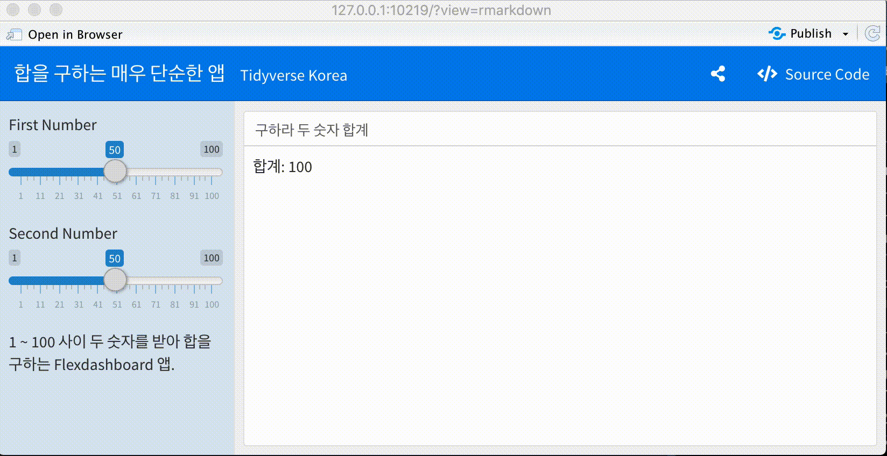
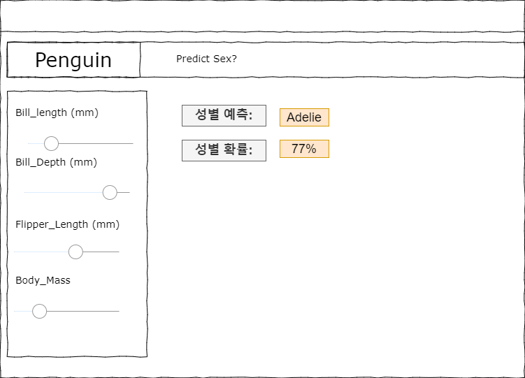
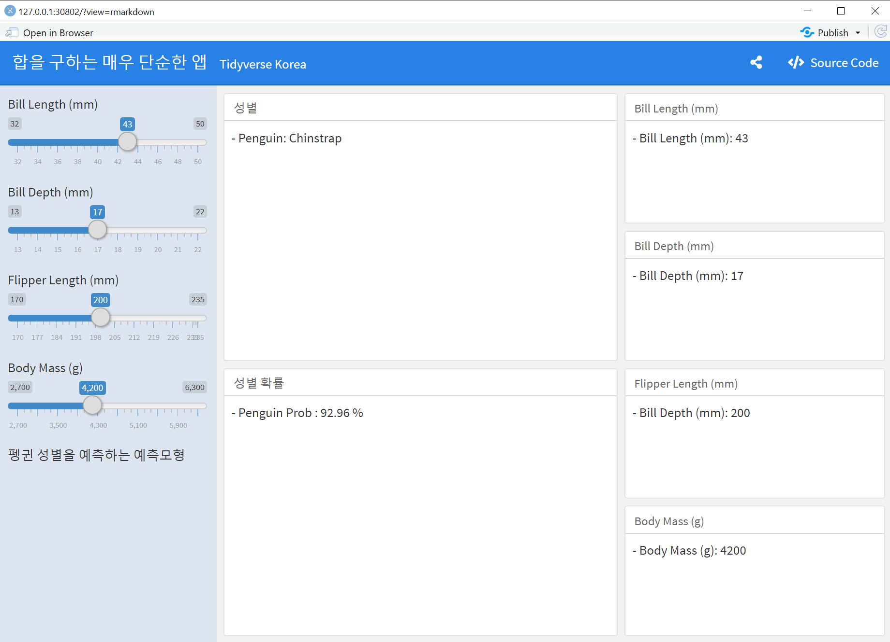
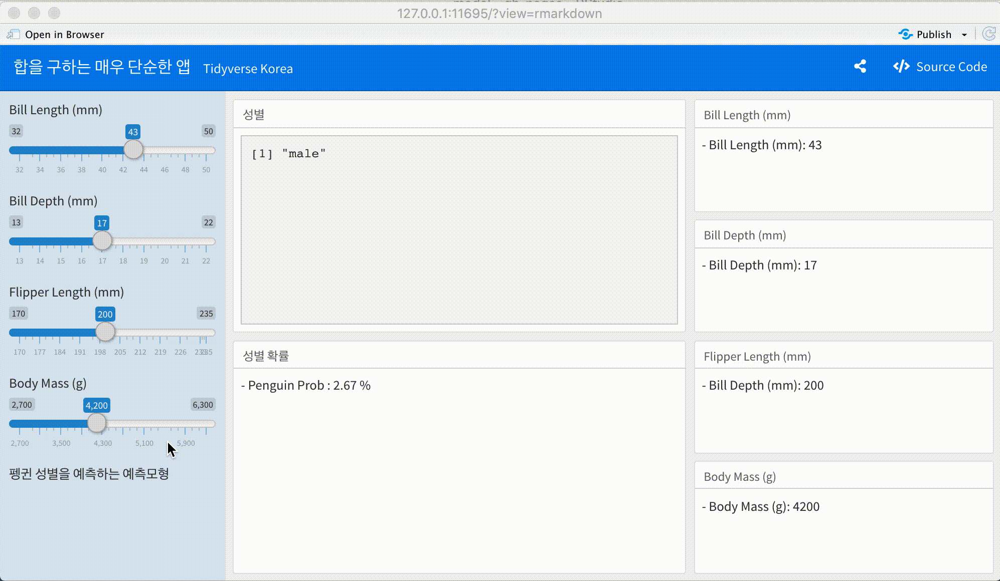

 
``` {r, include=FALSE}
knitr::opts_chunk$set(echo = TRUE, message=FALSE, warning=FALSE,
                      comment="", digits = 3, tidy = FALSE, prompt = FALSE, fig.align = 'center')
```

# 간단한 flexdashboard 앱 {#very-simple-flexdashboard-app}

대쉬보드 `shiny` 앱을 제작하는 방법 중 하나가 `flexdashboard` 팩키지를 사용하는 것이다. 
가장 기본적인 기능이 담긴 Simple Dashboard 앱을 제작해보자. 즉, 두개 입력을 받아 함수 연산을 한 후에 출력을 만들어내는 것이다.
두개의 입력은 숫자고 함수 연산은 덧셈이지만 이 기본적인 기능이 예측모형 출력결과를 나타내는데 큰 도움이 된다.

```{r download-simple-dashboard}
xfun::embed_file('penguin_shiny/simple_dashboard.Rmd')
```



# UI Wireframe {#dashboard-ui-wireframe}

[draw.io](https://app.diagrams.net/) 웹사이트에서 `wireframe` 템플릿을 활용하여 대쉬보드 UI wireframe을 작성한다.
예측모형 변수가 4개가 입력값으로 들어가고 출력값으로 펭귄 성별과 예측모형이 예측한 성별을 어느정도 지지하는지 확률값을 함께 출력한다.



# `flexdashboard` UI {#dashboard-ui-wireframe-flexdashboard}

`flexdashboard` UI를 앞서 정의한 `wireframe`에 맞춰 코딩한다. 
`flexdashboard` Layout 문법에 맞춰 4개의 입력값을 받아 이를 제대로 전달되는지 확인하다.
본격적으로 예측모형과 연결시키지 않고 단순히 펭귄 성별과 성별예측확률은 난수를 생성하여 기본 기능을 처리한다.

```{r download-penguin-ui}
xfun::embed_file('penguin_shiny/penguin_dashboard_ui.Rmd')
```





# 예측모형 서버 구현 {#dashboard-server-wireframe-flexdashboard}

`tidymodels`로 개발한 예측모형을 `flexdashboard`에 연결시키 위해서는 입력변수가 reactive 라는 특성을 갖기 때문에 이를 데이터프레임, 예측모형 추론, 성별 예측과 성별 예측확률에 쭉 연결시키는 점을 유념하여 개발한다.

```{r download-penguin-server}
xfun::embed_file('penguin_shiny/penguin_dashboard.Rmd')
```



