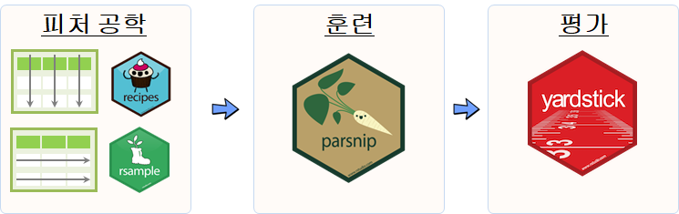

 
``` {r, include=FALSE}
# source("tools/chunk-options.R")

knitr::opts_chunk$set(echo = TRUE, message=FALSE, warning=FALSE,
                      comment="", digits = 3, tidy = FALSE, prompt = FALSE, fig.align = 'center')
```

# 파이썬 scikit-learn [^parsnip-medium] {#tidymodels-caret}

[^parsnip-medium]: [Diego Usai, "Modelling with Tidymodels and Parsnip - A Tidy Approach to a Classification Problem"](https://towardsdatascience.com/modelling-with-tidymodels-and-parsnip-bae2c01c131c)

기계학습 모형 개발을 위해서 전용 라이브러리 [`scikit-learn`](https://scikit-learn.org/stable/)이 잘 준비되어 있다. 물론 R에서 기계학습을 위해서 [The caret Package](http://topepo.github.io/caret/index.html) 팩키지가 있지만 개발된지 거의 20년이 되어가고 현재와 같은 상황을 반영하여 설계된 것이 아니라 RStudio로 자리를 옮긴 후에 본격적인 재설계와 새로운 바탕에서 새로 개발되고 있고 그 결과물 중 하나가 [`parsnip`](https://github.com/tidymodels/parsnip)이다.



# `tidymodels` &rarr; `parsnip` {#parsnip}

## 데이터 {#parsnip-dataset}

캐글 [hr-comma-sep, "HR Analytics for employee rentension"](https://www.kaggle.com/pankeshpatel/hrcommasep) 데이터셋을 가져와서 직원 이탈에 대한 예측모형을 개발한다.

```{r parsnip-dataset}
library(tidyverse)
library(tidymodels)
library(skimr)
library(janitor)

hr_dat <- read_csv("data/HR_comma_sep.csv") %>% 
  clean_names()

hr_dat %>% 
  skim()
```

## 데이터 전처리 {#parsnip-dataset-preprocessing}

범주형 변수를 명시적으로 정의한다. 대표적으로 `departments`, `left`, `work_accident`를 범주형 변수로 빼고 나머지는 숫자형이라 예측모형을 돌리기 위한 최소한의 기준을 만족시켰다.

```{r parsnip-dataset-preprocessing}
hr_df <- hr_dat %>% 
  mutate(left = factor(left, levels=c(0,1), labels=c("stay", "left"))) %>%
  mutate(departments = factor(departments),
         work_accident = factor(work_accident))

hr_df %>% 
  skim()
```

# `tidymodels` 예측모형 {#parsnip-modeling}

## 훈련/시험 데이터 구분 {#parsnip-modeling-split}

가장 먼저 훈련/시험 데이터 구분한다. 이를 위해서 `rsample` 팩키지를 사용하고 `initial_split()` 함수를 사용해서 7:3으로 훈련/시험 데이터로 쪼갠다.

```{r parsnip-modeling-split}
train_test_split <- rsample::initial_split(
  data = hr_df,     
  prop = 0.70)

train_test_split
```

훈련/시험 데이터프레임으로 `training()`, `testing()` 함수를 각각 사용해서 준비한다.

```{r parsnip-modeling-split-train-test}
train_df <- train_test_split %>% training() 
test_df  <- train_test_split %>% testing()
```

## 피처 공학(Feature engineering) {#parsnip-modeling-preprocessing}

예측모형을 개발할 때 피처 공학(Feature engineering)을 통해 예측모형 base table을 제작해야 한다. `tidymodels`에서는 이를 요리법(recipe)에 비유하여 요리 레시피를 준비해야 한다. 대표적인 요리법에는 결측값 제거, 이상점 처리, 다공선성을 갖는 변수 제거, 중심화와 척도 조정을 통한 정규화, 가변수 처리 등이 포함된다.

범주형변수는 가변수화(`step_dummy()`)하고 연속형 변수는 정규화하는 요리법을 `hr_recipe`로 준비한다. 그리고 이를 `prep()`으로 준비하여 `bake()`해서 예측모형에 넣을 수 있도록 구워둔다.

```{r parsnip-modeling-recipe}
hr_recipe <- function(df) {
  recipe(left ~ ., data = df) %>%
    step_dummy(all_nominal(), -all_outcomes()) %>%
    step_center(all_numeric()) %>%
    step_scale(all_numeric()) %>%
    prep(data = df)
}

recipe_prepped <- hr_recipe(df = train_df)

train_baked <- bake(recipe_prepped, new_data = train_df)
test_baked  <- bake(recipe_prepped, new_data = test_df)

train_baked
```

## 모형 적합 {#parsnip-modeling-fit}

드디어 `parsnip`의 가장 인기있는 부분을 살펴볼 수 있는데 앞서 준비한 `base table` 데이터프레임을 다음 3단계로 준비하여 훈련데이터를 예측모형에 적합시킨다.

- 예측모형 유형: 로지스틱 회귀모형(`logistic_reg`), 모드(`classification`)
- 엔진(`set_engine`): `glm`
- 적합(`fit`): `fit`

예를 들어, `logistic_reg`에 사용가능한 엔진은 `glm`, `glmnet`, `stan`, `spark`, `keras` 등이 있다.

```{r parsnip-modeling-fit}
hr_glm <-
  logistic_reg(mode = "classification") %>%
  set_engine("glm") %>%
  fit(left ~ ., data = train_baked)
```

## 모형 성능평가 {#parsnip-modeling-performance}

`yardstick` 팩키지를 사용하게 되면 예측모형의 성능을 수월히 평가할 수 있다.

### 시험데이터 예측 {#parsnip-modeling-performance-predict}

먼저 `predict()` 함수로 예측값을 뽑아내서 직원 잔존과 이탈여부를 데이터프레임으로 만들 수 있다.
 
```{r parsnip-modeling-performance}
hr_glm_pred_df <- hr_glm %>%
  predict(new_data = test_baked) %>%
  bind_cols(test_baked %>% select(left))

hr_glm_pred_df
```

### 모형성능 {#parsnip-modeling-performance-metrics}

`conf_mat()` 함수를 사용해서 이진 분류 성능예측모형을 확인할 수 있다.
물론, `yardstick` 팩키지 `metrics()` 함수를 사용해도 된다.

```{r parsnip-modeling-metrics}
hr_glm_pred_df %>%
  conf_mat(left, .pred_class) %>% 
  pluck(1) %>%
  as_tibble() %>%
  spread(Truth, n)

hr_glm_pred_df %>%
  metrics(left, .pred_class)
```

실제 예측모형을 현업에 적용시킬 때,
정확도(`accuracy`) 보다는 `precision`, `recall`, 혹은 `f1_score`가 더 적합한 측도가 될 수 있다.

```{r parsnip-modeling-metrics-precision}
clf_metric_df <- tibble(
  "precision" = 
     hr_glm_pred_df %>% precision(left, .pred_class) %>%
     select(.estimate),
  "recall" = 
     hr_glm_pred_df %>% recall(left, .pred_class) %>%
     select(.estimate),
  "f1_score" = 
     hr_glm_pred_df %>% f_meas(left, .pred_class) %>%
     select(.estimate)
) %>%
  unnest()

clf_metric_df
```


# `tidymodels` - `ranger` 예측모형 {#parsnip-modeling-ranger}

GLM 계열 예측모형은 2015년 전까지 가장 검증된 예측모형으로 자리를 잡았으나 그 후 random forest, xgboost 계열 앙상블 모형으로 대체되고 있지만, 기준 성능을 나타내는 지표를 제공한다는 점에서 나름 굳건히 자리를 지켜나가고 있다. 

random forest 예측모형을 C/C++로 성능을 대폭 향상시킨 `ranger` 팩키지를 많이 사용하는데 사용업은 크게 두가지를 추가로 설정해야 된다. 하나는 교차검증(CV, cross-validation), `set_engine`을 설정하는 부분이다.

## 교차검증(CV)  {#parsnip-modeling-ranger-cv}

`vfold_cv()` 함수를 사용해서 훈련데이터를 훈련/검증(train/validation) 데이터로 쪼갠다. CV를 10조각 내는 경우 훈련데이터를 9:1비율로 자동으로 쪼갠다.

<div class = "row">
  <div class = "col-md-6">
**훈련/시험 데이터 쪼개기**

```{r parsnip-ranger-full}
train_test_split
```

  </div>
  <div class = "col-md-6">
**훈련/교차검증 데이터 쪼개기**

```{r parsnip-ranger}
cross_val_df <- vfold_cv(train_df, v = 10)
cross_val_df

cross_val_df$splits %>% 
  pluck(7)
```

  </div>
</div>

## 피처 공학(feature engineering)  {#parsnip-modeling-ranger-cv-fe}

교차검증으로 준비된 훈련/검증 데이터셋에 대하여 피처 공학을 적용시키는데, 특별히 더 추가하지 않고 앞서 준비한 `hr_recipe`를 재사용한다.

```{r parsnip-ranger-fe}
hr_recipe
```

## `ranger` 예측모형 적합  {#parsnip-modeling-ranger-fit}

`fit_ranger()` 함수로 작성하고, 교차검정 데이터와 초모수 `mtry`와 `tree`를 넣어주는 함수를 작성시켜 적합시킨다.

```{r parsnip-ranger-fit}
fit_ranger <- function(split, id, mtry, tree) {
   
  analysis_set <- split %>% analysis()
  analysis_prepped <- analysis_set %>% hr_recipe()
  analysis_baked <- analysis_prepped %>% bake(new_data = analysis_set)
  
  model_rf <- rand_forest(
      mode = "classification",
      mtry = mtry,
      trees = tree) %>%
    set_engine("ranger",
      importance = "impurity") %>%
    fit(left ~ ., data = analysis_baked)
  
  assessment_set <- split %>% assessment()
  assessment_prepped <- assessment_set %>% hr_recipe()
  assessment_baked <- assessment_prepped %>% bake(new_data = assessment_set)
  
  tibble(
    "id" = id,
    "truth" = assessment_baked$left,
    "prediction" = model_rf %>%
      predict(new_data = assessment_baked) %>%
      unlist()
  )
}

pred_rf <- map2_df(
  .x = cross_val_df$splits,
  .y = cross_val_df$id,
  ~ fit_ranger(split = .x, id = .y, mtry = 3, tree = 200)
)

pred_rf
```

## `ranger` 예측모형 성능  {#parsnip-modeling-ranger-fit-performance}

`conf_mat()` 함수와 `summary()` 함수를 파이프로 연결시키면 예측모형 성능에 대한 모든 지표를 추출할 수 있다. 가장 많이 사용하는 "accuracy", "precision", "recall", "f_meas" 측도만 추출하여 향상된 성능을 파악한다.

```{r parsnip-ranger-fit-performance}
pred_rf %>%
  conf_mat(truth, prediction) %>%
  summary() %>%
  select(-.estimator) %>%
  filter(.metric %in% c("accuracy", "precision", "recall", "f_meas")) 
```


# `tidymodels` - `xgboost` 예측모형 {#parsnip-modeling-ranger}

## `XGBoost` 모형적합 {#parsnip-modeling-xgboost}

`fit_rf()` 함수에 `XGBoost` 팩키지 초모수 `learn_rate`, `tree_depth`, `sample_size`을 적용시키도록 예측모형을 `boost_tree`로 변경시키고, `set_engine`도 `xgboost`로 바꿔 훈련시킨다.

```{r parsnip-xgboost-fit}
fit_xgb <- function(split, id, learn_rate, tree_depth, sample_size) {
   
  analysis_set <- split %>% analysis()
  analysis_prepped <- analysis_set %>% hr_recipe()
  analysis_baked <- analysis_prepped %>% bake(new_data = analysis_set)
  
  model_xgb <- boost_tree(
      mode = "classification",
      learn_rate = learn_rate,
      tree_depth = tree_depth,
      sample_size = sample_size) %>%
    set_engine("xgboost") %>%
    fit(left ~ ., data = analysis_baked)
  
  assessment_set <- split %>% assessment()
  assessment_prepped <- assessment_set %>% hr_recipe()
  assessment_baked <- assessment_prepped %>% bake(new_data = assessment_set)
  
  tibble(
    "id" = id,
    "truth" = assessment_baked$left,
    "prediction" = model_xgb %>%
      predict(new_data = assessment_baked) %>%
      unlist()
  )
}

pred_xgb <- map2_df(
  .x = cross_val_df$splits,
  .y = cross_val_df$id,
  ~ fit_xgb(split = .x, id = .y, learn_rate=0.3, tree_depth=5, sample_size=1)
)

pred_xgb
```

`XGBoost` 예측모형 성능을 동일한 방식으로 확인한다.

```{r parsnip-xgboost-fit-performance}
pred_xgb %>%
  conf_mat(truth, prediction) %>%
  summary() %>%
  select(-.estimator) %>%
  filter(.metric %in% c("accuracy", "precision", "recall", "f_meas")) 
```

## 격자 탐색(grid search) [^dials-grid] {#parsnip-grid-search}

[^dials-grid]: [tidymodels, "Using Dials with Parsnip"](https://tidymodels.github.io/dials/articles/articles/Dials_and_Parsnip.html)

`XGBoost` 초모수 튜닝을 위한 격자탐색에 초모수 임의 탐색(random search)을 반영한 `model_xgb` XGBoost 모형과 `xgb_grid` 탐색 격자를 준비하여 이를 `merge` 시켜 `spec_df`를 준비시킨다.

더불어 `vfold_cv()` 함수를 통해 교차검증 데이터셋도 함께 준비시킨다.

```{r parsnip-xgboost-grid}
## 초모수 -----
xgb_grid <- grid_random(
  learn_rate  %>% range_set(c(0.1,  0.01)), 
  tree_depth  %>% range_set(c( 3,  10)), 
  sample_size %>% range_set(c(0.5, 1)), 
  size = 5)

xgb_grid

## XGBoost 모형 -----
model_xgb <- boost_tree(
    mode = "classification",
    learn_rate = varing(),
    tree_depth = varing(),
    sample_size = varing()) 

spec_df <- tibble(spec = merge(model_xgb, xgb_grid)) %>% 
  mutate(model_id = row_number())

spec_df

## CV 데이터셋 -----
cross_val_df <- vfold_cv(train_df, v = 3)
cross_val_df

spec_cv_df <- crossing(spec_df, cross_val_df)
spec_cv_df
```

## 격자 탐색(grid search) 적합 {#parsnip-grid-search-fit}

앞서 준비한 초모수 XGBoost 모형과 CV 교차검증 데이터셋에 대한 적합을 시도함.

```{r parsnip-xgboost-grid-fit, eval=FALSE}
fit_on_fold <- function(df) {
  fit(left ~ ., data=df)
}

spec_cv_fit <- spec_cv_df %>%
  mutate(
    analysis_set = map(splits, rsample::analysis),
    prepped = map(splits, hr_recipe),
    baked   = map2(prepped, analysis_set, bake)
  ) %>% 
  mutate(
    xgb_fit = map(baked, ~fit_on_fold)
  )

xgb_predict <- function(model, newdata) {
  predict(model, newdata)
}

spec_cv_pred <- spec_cv_fit %>% 
  mutate(
    assess_set = map(splits, rsample::assessment),
    assess_prepped = map(splits, hr_recipe),
    assess_baked   = map2(prepped, assess_set, bake)
  ) %>% 
  mutate(
    pred = map2(xgb_fit, assess_baked, ~xgb_predict)
  )

```