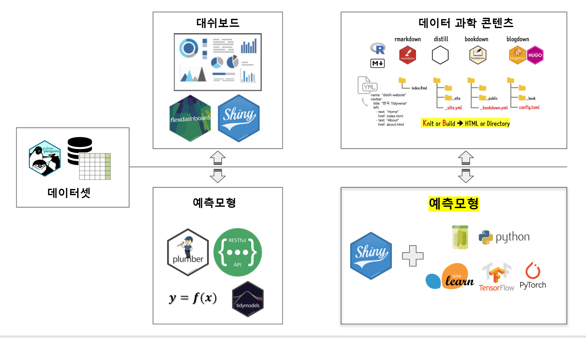

 
``` {r, include=FALSE}
knitr::opts_chunk$set(echo = TRUE, message=FALSE, warning=FALSE,
                      comment="", digits = 3, tidy = FALSE, prompt = FALSE, fig.align = 'center')
```

# `shiny`와 `scikit-learng` 만남 {#meet-shiny-scikit-learn}

풀고자하는 문제는 가능하면 적은 시간과 노력으로 데이터 과학 해결책을 제시하는 것이다. 몇가지 방식이 있지만, 여기서는 펭귄 성별예측문제를 `shiny` 웹앱으로 서비스를 제공하는데 펭귄 성별 예측모델은 `tidymodels`가 아니라 `scikit-learn`으로 구축한 것을 사용한다. 이러한 접근법은 딥러닝 모형으로 예측모형 서비스를 만들고 빠른 시간내에 MVP 제품을 제작할 경우 큰 효과를 발휘할 수 있다.



# 파이썬 예측모형 [^build-penguin-model] {#build-python-model}

[^build-penguin-model]: [Chanin Nantasenamat (Jul 16 2020), "How to Build a Data Science Web App in Python (Penguin Classifier) - Part 3: ML-Powered Web App in a Little Over 100 Lines of Code"](https://towardsdatascience.com/how-to-build-a-data-science-web-app-in-python-penguin-classifier-2f101ac389f3)

[Chanin Nantasenamat (Jul 16 2020), "How to Build a Data Science Web App in Python (Penguin Classifier) - Part 3: ML-Powered Web App in a Little Over 100 Lines of Code"](https://towardsdatascience.com/how-to-build-a-data-science-web-app-in-python-penguin-classifier-2f101ac389f3) 사례는 `shiny` 대신 [`streamlit`](https://www.streamlit.io/)을 사용해서 데이터앱(Data App)을 빠르게 개발한 사례가 있다.

[](fig/penguin_prediction_app.png)


## 환경설정 {#build-python-model-env}

펭귄 성별 예측을 위한 필요한 팩키지를 다운로드 받아 설치한다.

```{bash setup-python, eval = FALSE}
pip install pandas numpy scikit-learn
```

## 데이터 {#build-python-model-data}

[`penguins_cleaned.csv`](https://github.com/dataprofessor/data/blob/master/penguins_cleaned.csv) 데이터를 GitHub에서 받아 로컬 파일로 저장시킨다.

```{r get-penguin-data}
library(tidyverse)

download.file(url = "https://raw.githubusercontent.com/dataprofessor/data/master/penguins_cleaned.csv", destfile = "data/penguins_cleaned.csv")

penguin_df <- readr::read_csv("data/penguins_cleaned.csv")

penguin_df
```

## 모형 개발 {#build-python-model-build-model}

파이썬 판다스와 `sklearn` Random Forest 모형을 이용하여 펭귄 성별을 예측하는 모형을 제작한다. 그리고 나서 예측모형을 피클(`.pkl`) 파일로 떨어 뜨린다.

```{python build-model}
import pandas as pd
penguins = pd.read_csv('data/penguins_cleaned.csv')

# Ordinal feature encoding
# https://www.kaggle.com/pratik1120/penguin-dataset-eda-classification-and-clustering
df = penguins.copy()
target = 'sex'
encode = ['species','island']

for col in encode:
    dummy = pd.get_dummies(df[col], prefix=col)
    df = pd.concat([df,dummy], axis=1)
    del df[col]

target_mapper = {'male':0, 'female':1}
def target_encode(val):
    return target_mapper[val]

df[target] = df[target].apply(target_encode)

# Separating X and Y
X = df.drop(target, axis=1)
Y = df[target]

# Build random forest model
from sklearn.ensemble import RandomForestClassifier
clf = RandomForestClassifier()
clf.fit(X, Y)

# Saving the model
import pickle
pickle.dump(clf, open('data/penguins_clf.pkl', 'wb'))
```


# R 환경에서 테스트 {#build-python-model-test}

```{r }
library(reticulate)

source_python("code/read_pickle.py")
penguin_clf <- read_pickle_file("data/penguins_clf.pkl")

penguin_clf
```

